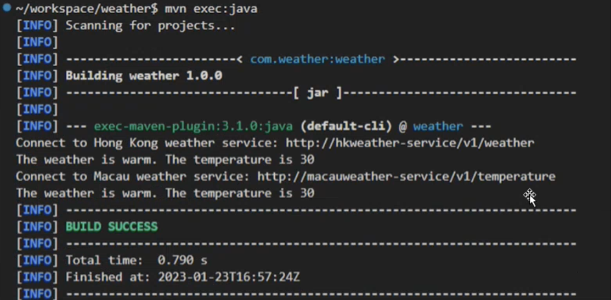
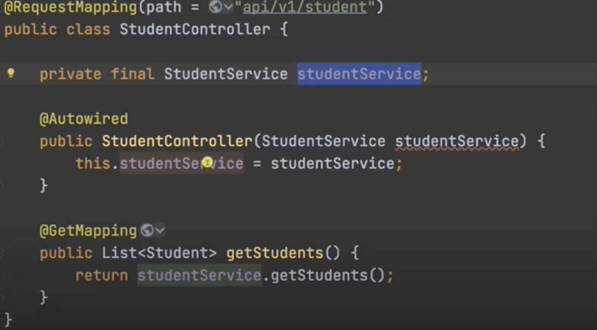

# Assignment 1

## Question 1 (40 marks)

Answer the following questions related to the Ripple learning platform used in the course.

(a) [24 marks] Define the functional requirements for the features related to creation, moderation, and practice of multiple-choice question (one of the learning resource types provided in the system) in the platform. You should focus on the features available to the students to perform create/moderate/practice and you don't need to consider the instructor related features. You should provide the requirements in the form of bullet list and organize your requirements according to the following areas. Try to be more specific and include the Ripple-specific requirements in your answer.

1. Multiple-Choice Question Creation
2. Moderation
3. Practice

(b) [16 marks] Consider the following classes: users, questions, review and question bank. Draw the UML class diagrams for the four classes to support the functional requirement in part (a) for the Ripple platform. Provide brief explanation of the classes.

*Remark: You can use software such as visual paradigm to draw the class diagram (https://www.visual-paradigm.com).*

## Question 2 (28 marks)

(a) [12 marks] Clone the sample Maven weather project from GitHub by using the VSCode terminal in the PolyU virtual lab platform.

```bash
git clone https://github.com/cswclui/weather.git
```

Enter the "weather" project folder and execute the following maven commands.

```bash
mvn compile
mvn exec:java
```
There are problems with the Maven project. Discuss how you may correct the errors in the project.

After correcting the problem, run your program using the maven command: `mvn exec:java`. Capture a screenshot when the command is run with the above command.


Note: When you execute the command the first time, the maven may need download the dependencies.

You should capture a screenshot without the downloading status outputs.

(b) [16 marks] During acceptance testing, the development team received feedback from the client that the service may need to support more weather stations from different countries (e.g. Taiwan, Tokyo, Bangkok) in the near future. Bob, one of the programmers in the developer team, has proposed to refactor the WeatherForecastService and WeatherForecastClient classes as follows. He claims that when compared with the current design, the refactored code has an improved OO design to support the new requirements as the WeatherForecastClient is less coupled to WeatherService class. Do you agree with Bob's claim? Why?

```java
class WeatherForecastService {
    private WeatherService weatherService;

    public WeatherForecastService(WeatherService weatherService){
        this.weatherService = weatherService;
    }

    public String getWeatherInfo(){
        int temperature = weatherService.getTemperature();
        if(temperature > 30){
            return "The weather is hot. The temperature is " + temperature;
        }else if (temperature > 20){
            return "The weather is warm. The temperature is " + temperature;
        } else if (temperature > 10){
            return "The weather is cool. The temperature is " + temperature;
        }else {
            return "The weather is cold. The temperature is " + temperature;
        }
        
    }
}

public class WeatherForecastService {
    public static void main(String[] args) {
        WeatherService hkWeatherService = new HKWeatherService("http://hkweather.service/v1/weather", "12345678");
        WeatherForecastService f1 = WeatherForecastService(hkWeatherService);
        System.out.println(f1.getWeatherInfo());

        WeatherService macauWeatherService = new HKWeatherService("http://macauweather.service/v1/weather", "12345678");
        WeatherForecastService f2 = WeatherForecastService(macauWeatherService);
        System.out.println(f2.getWeatherInfo());

    }
}
```

## Question 3 (32 marks)
Review the video "Spring Boot Tutorial | Full Course [2022]".

[https://www.youtube.com/watch?v=9SGDpanrc8U](https://www.youtube.com/watch?v=9SGDpanrc8U)

(a) [12 marks] What are the dependencies between the different classes in the project?

(b) [12 marks] In the project, how is the dependency injected into the StudentController class? Explainm with a screenshot for the relevant code from the video.

(c) [8 marks] Discuss how data are stored in the project.

## Marking Scheme
### Question 1
#### (a) Marking guideline (Max & mark for each part: (i), (i), (ili). Total: 24 marks).

- 8 marks: The requirements re well written, concise, easy to understand; The answer shows a good understanding of functional requirements specific to the ripple platform.
- 5 marks: The requirements cover the major basic requirements specific
- 2 marks: Requirements are general, vague or not in appropriate format.

1. Question Creation (max 8 marks)
   - Basic requirements
     - The author should provide a topic and difficulty level for each question.
     - Each multiple-choice question should have at least two options and only one option is correct.
     - The author should provide an explanation for each option in the multiple choices.
   - Others/ripple specific requirements
     - The author may edit his/her questions after question creation
     - The author should provide a self-evaluation of the created question.
     - The system should provide a "creation history" feature to show a list of resources created by a user and their status.
2. Question Moderation (max 8 marks)
   - Basic requirements
     - The reviewer should provide a rating and confidence level for the question.
     - The reviewer should provide written comments for the question and options.
     - The reviewer should provide rate the questions based on criteria such as correctness and precision, quality of the question, quality of options, and quality of explanation.
   - Reputation Score
     - Creating a review that agrees with the review outcome will increase the user's reputation score.
     - If a question is approved, the reputation score of the question author will be increased.
   - Anonymity
     - The author of a question should be hidden from the reviewers during the review.
     - The identity of the reviewer should be anonymized (e.g. Reviewer 1, Reviewer 2) to preserve their privacv.
   - Others
     - The moderator may skip the resource during review (e.g. the review does not understand the resource, can't make a good judgement, conflict of interest)
     - The system should provide a "moderation history" feature to show a list of resources that have been moderated and their status.
     - The reviewer can view the comments given by other reviewers after completing the review.
     - The author may view the comments by the moderator
     - The reviewer may report resource: Inappropriate content, incorrect answer, incorrect tag
3. Practice (max 8 marks)
   - Basic requirements
     - A question bank of all approved multiple-choice questions should be maintained.
     - Users can choose questions that have been approved to practice, search for questions, and filter the question based on the topic or question type.
     - A user can practice a question more than once.
   - Reputation Score
     - The user's reputation score will increase if he/she answers the question correctly the first time.
   - Others
     - The user can only view the question's answer after he has tried the question.
     - User can bookmark questions
     - User can report resource: Inappropriate content, incorrect answer, incorrect tag
     - User can view the question's answer and explanation only after he has answered the question
     - The user who has practice the question may provide comment or rating for the question.

### (b)  Classes Diagram (Max. 3 marks for the following class diagram with appropriate attributes and methods).
- Students are required to provide the class diagram (which shows the attributes and methods) only. The relationship between the classes are optional.
- The following example is just for reference. Marks/Partial Marks may be given if relevant attributes/methods are provided.

1. **User**
   - Attributes:
     - username: string
     - email: string
     - reputationScore: int
     - bookmarkedQuestions: List[Question]
   - Methods:
     - createQuestion(): create a new Question onject and add to the user "creation history"
     - viewCreationHistory: display a list of resources created by the user and their status
     - answerQuestion(questionId: int, option: string): check the users answer and update reputation score accordingly
2. **Question**
   - Attributes:
     - questionId: int
     - topic: string
     - difficultyLevel: int
     - options: a list of strings with one correct answer and explanation of each option
     - author: List[User]
     - reviews: List[Review]
   - Methods:
     - editQuestion(): allow the author to edit the question
     - viewReviews(): Array[Review]
     - addReview(reviewer: User, rating: int, confidenceLevel: int, comment: string): add a new Review to the question reviews list 
     - calculateAverageRating(): calculate the average rating of the question based on the reviews
     - approveQuestion(): add the question to the Question Bank if approved
     - getComments(): allow the author to view comments by the moderator
3. **Review**
   - Attributes:
     - reviewer: User
     - rating: int
     - confidenceLevel: int
     - comment: string
     - questionId: int
     - rating: a list of rating based on different criteria
   - Methods:
     - get_comments(): allow the reviewer to view comments by other reviewers
4. **Question Bank**
    - Attributes:
      - questions: List[Question]
    - Methods:
      - searchQuestions(topicL string, questionType: string): search for questions based on topic and question type
      - filterQuestions(difficultyLevel: int, rating:int): filter questions based on difficulty level and rating
      - viewBookmarks(username: string): display a list of questions bookmarked by the user


### Question 2
#### (a)
There is missing package in WeatherFirecast Client.java. We should add the package in the first line of `WeatherForcastClient.java`. 
```
package com.weather;
```
(4 marks)

In `pom.xml`, there is missing `<exec.mainClass>com.weather.WeatherForecastClient</exec.mainClass>`
(4 marks)

 
(4 marks)


#### (b)

The refactored design has a better 00 design but Bob's explanation is **incorrect**.

Each point below: 4 marks. Total: 16 marks

- In the new design, the WeatherForecastService is less coupled to the specific implementation of the WeatherService. (rather than the WeatherForecastClient is less coupled to WeatherService class)
- In the current design, the WeatherForecastService class depends on concrete classes (HKWeather5ervice and MacauWeatherService) as we create a new instance of the concrete classes inside the WeatherForecastService. The WeatherForecastService creates concrete implementation of the Weather service (e.g. HKWeatherService, MacauWeatheService). If we want to add new weather stations, we should add extra if-else and create the concrete implementation of the new weather stations. If a new weather service needs to be added, the WeatherForecastService class needs to be modified to handle the new service.
- The new design adopts the dependency injection pattern to achieve the dependency inversion principle. The WeatherForecastService no longer instantiates and depends on concrete implementation of the weather service. Instead, the WeatherService implementation is "injected" to the WeatherForecastService.
- The alternative design also conforms to the Open-closed principle. New weather services (e.g. TokyoWeatherService, TaiwanWeatherService) can be added by creating new classes that implement the WeatherService interface and passed to the WeatherForecastService class. There is no need to open the WeatherForecastService class for modification

## Question 3 (32 marks)

### (a) Each point 3 marks. Total: 12 marks
- `StudentController` depends on `Student` Service
- `StudentService` depends on `StudentRepository`
- `StudentConfig` class depends on `Student`
- `StudentRepository` depends on `Student` class

### (b)
Construvtor-based injection is used (4 marks)

When `StudentController` bean created, the `StudentService` bean is injected as dependency of the `StudentController` bean. (4 marks)

Screenshot of relevant code (4 marks)

Time in video: 30:34

### (c) Any TWO of the following points, each 4 marks. Total: 8 marks
- A brief discussion of the role of repository class in storing the data in databases.
- The project makes use of Postgres database to store the data.
- The data is stored in a table "student" in a database called "student". Each student is stored as a row in the table.