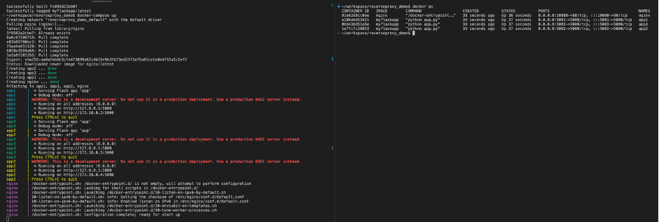
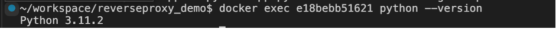
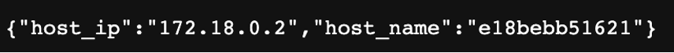
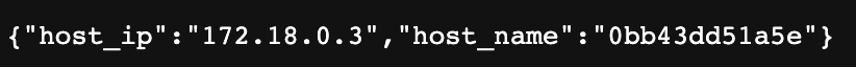
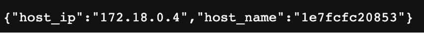

# Assignment 2

## Question 1 (34 marks)
The sample project used in this question is hosted in the following GitHub repository:
[https://github.com/cswclui/reverseproxy_demo](https://github.com/cswclui/reverseproxy_demo)

Open a terminal in VSCode the PolyU virtual lab platform (Note: you can also use your own machine to complete the tasks). Clone the project from Github and enter the project folder by using the following commands.

```bash
git clone https://github.com/cswclui/reverseproxy_demo
cd reverseproxy_demo
```
Follow the instructions in README to build the docker image and launch the docker-compose stack

(a)  [9 marks] By using an appropriate docker command, show the docker containers that are started up
by the docker-compose stack. Capture and paste a screenshot of the output of the docker command. With reference to your output, what are the container IDs of the myflaskapp’s containers launched by the docker-compose stack?

(b) [4 marks] What version of python interpreter is used inside the myflaskapp’s container to run the flask application?

(c) [10 marks] Access the `/about` endpoint multiple times through the reverse proxy (using the host port
10080). Capture the screenshots of the data returned and discuss the results.

(d) [11 marks] Describe how you can perform the following tasks.
1. Add the /me endpoint in app.py which will respond with your student ID and name in JSON format
2. Modify nginx.conf to proxy the request to /me endpoint to the backend containers. Capture and paste a screenshot of your application when the /me endpoint of the reverse proxy container is accessed.

Related References
- Docker Tutorial for Beginners: https://www.youtube.com/watch?v=zJ6WbK9zFpI
- Docker and Nginx Reverse Proxy: https://www.youtube.com/watch?v=hxngRDmHTM0

## Question 2 (21 marks)
Simpsyber is a game designed by the instructor in this course for students to learn about agile software development and DevOps. In the game, the software development team is adopting Kanban, a popular Agile methodology for software development and deployment.

- The game is available at https://cindymak-sy.github.io/SimPsyber/. 
- To login, input your student ID, e.g. 12345678G and your nickname to login (Note: You cannot use a username which has been used by others). 

(a) [5 marks] Complete the game at least once (completed week 6 in the game). For your first completed game in SimPsyber, capture two screenshots of your game result page (with your Student ID) in jpg format (click the right arrow to check the second page) and included in your submitted assignment answer.

(b) [16 marks] Why is it important to optimize “the mean time to recover metric” in the game? Discuss the game options which can be used optimize the “mean to time recover metric” in the game. Provide relevant screenshots of the game to support your answer.

## Question 3 (45 marks)

(a) Complete the labs 3.1, 5.1, 6.1 and 7.1 in the course “AWS Developing - 2223Sem2” in the AWSAcademy platform. (https://www.awsacademy.com). 

Notes: 
- *After completing each lab, you should click the Submit button in the AWSAcademy platform
before you end your lab session. Only the last submission will be counted.*
- *You can view the mark for each lab under Grades in the AWSAcademy platform. The score for this question will be based on the percentage of completion of the labs as indicated in the platform.*

(b) With reference to the screenshots of your complete tasks in lab 7.1, discuss how the AWS API Gateway and the AWS Lambda services are used in the café’s web application. Be specific in your answer.

## Marking Scheme
### Question 1

#### (a)


Screen capture (3 marks)

Student should provide an appropriate screen capture related to “docker ps” command. The student should provide the container ID for the containers app3, app2, and app1 as shown in the student’s
provided screenshots. 

Each correct container ID: 2 marks, Total: 6 marks. If no screenshot is provided: 0 mark 

```
e18bebb51621
0bb43dd51a5e 
1e7fcfc20853
```

#### (b)

Python 3.11.2 (4 marks)


```
Command used: docker exec -it [Container ID] python --version
```

#### (c)

Three screenshots with three IP address should be provided (note the IP address provided by the student may not be the same as the one shown below). 

Each 2 marks. Total: 6 marks





When we access the `/about` endpoint, the Nginx reverse proxy server will forward the request to one of the three Flask application containers. The Flask application will respond with a JSON object containing the hostname and IP address of the corresponding container which will handled the request. (4 marks)

#### (d)

Add the `/me` endpoint in nginx.conf to proxy to the backend containers.

```
location /me {
 proxy_pass http://app_servers;
 proxy_set_header X-Forwarded-For $remote_addr;
} 
```
(4 marks)

Add the following function in app.py. Note that the student ID and name should be included in the
code. (4 mark)

```python
@app.route('/me')
def get_me():
 student_id = "12345678"
 name = "Student name"
 return jsonify({"student_id": student_id, "name": name})
```
Rebuild the docker image with the updated `app.py` and relaunch the docker-compose stack

Screenshot (Note that the student ID and name should be included in the screenshot) (3 marks)

Related References
- Docker Tutorial for Beginners: https://www.youtube.com/watch?v=zJ6WbK9zFpI
- Docker and Nginx Reverse Proxy: https://www.youtube.com/watch?v=hxngRDmHTM0

### Question 2

#### (a)
Appropriate screen capture with student ID (5 marks)

#### (b)
In the game, there are deployment failure and this may result in application down-time. Lowering the mean time to repair decreases the application down time, and hence increases user satisfaction. (6 marks)

We may improve the lead time in the bug fixing by using the following options (Any TWO of the following points: Any two of the following options: each 5 marks. Total 10 marks)
- Test automation
- Assign better staff to perform the task to increase the task completion speed during bug fixing.
- If there are deployment failure, assign higher priority in bug fix rather than creating new
features

### Question 3
#### (a)
The student should show a screenshot of the 4 complete lab.

5 marks for completing each lab.

Total : 20 marks

#### (b)
API Gateway is used to expose REST API (5 marks) which is called by the café web application store in AWS s3. (5 marks)

The API gateway exposes three resources (5 marks)
- products: Accept HTTP GET request and products/on_offer: Accept HTTP GET request
- create_report: Accept HTTP POST request from the client. 

When the endpoints of the API gateway are accessed, it will send an event to invoke the lambda function for processing the request. (5 marks)

There are two lambda functions (5 marks)

- get_all_products () which is invokved by /products and products/on_offer endpoints
- create_report() which is invokved by /create_report endpoint


Brief description of how the lambda function access the data from DynamoDB (e.g. product information) (5 marks)

At least one screenshots showing the lambda function or API gateway created in AWS academy platform (5 marks)

There are 7 points above with 5 marks each student can get a max. of 25 marks