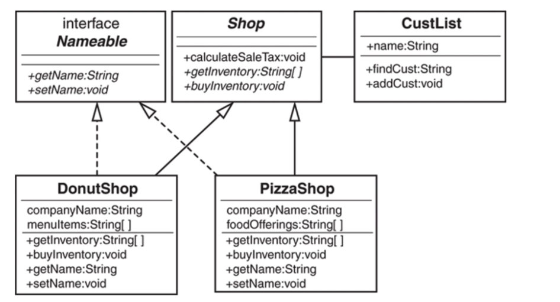
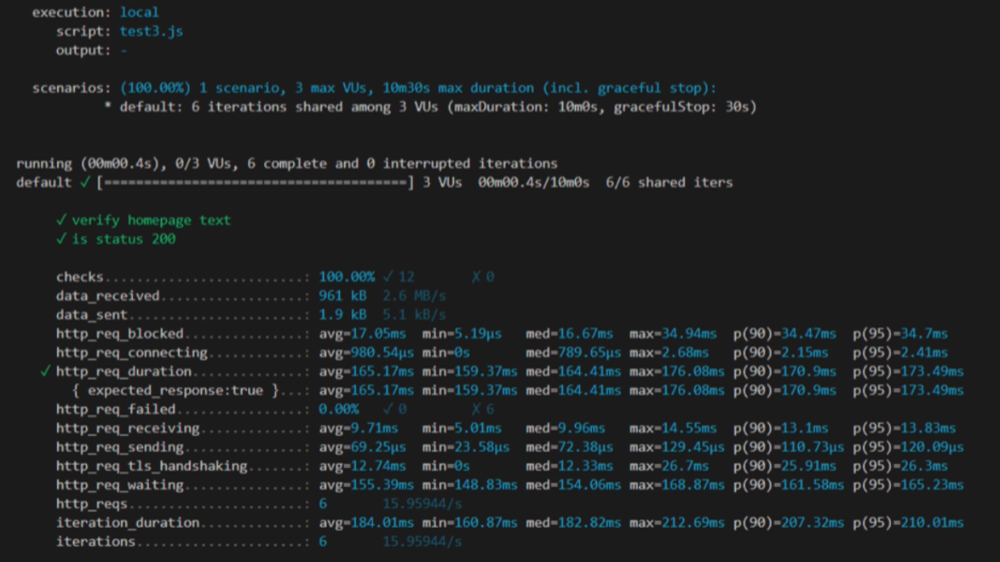
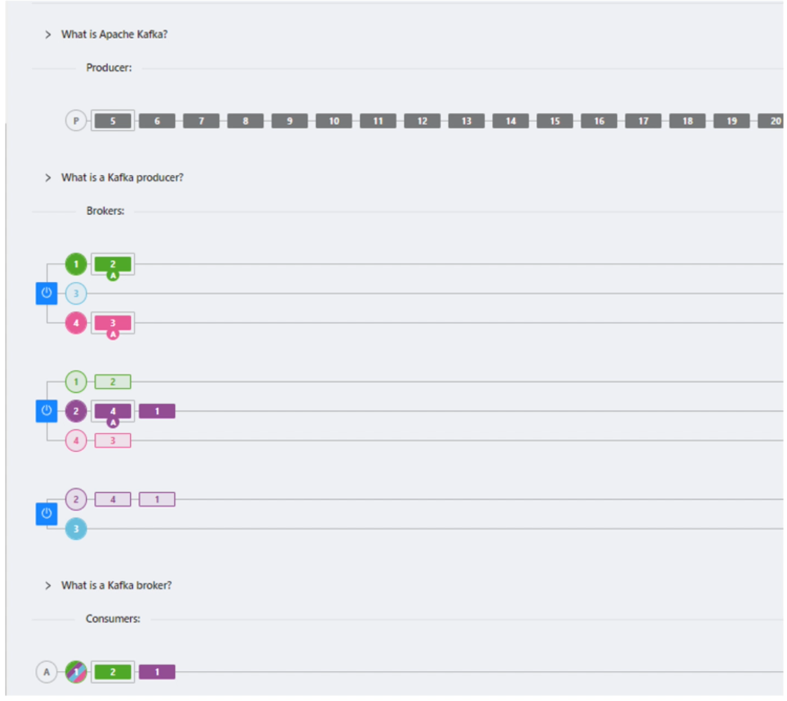

# COMP5241 Exam

## Question 1
Which of the following services was NOT used in assignment 2?
- [ ] API gateway
- [ ] Application Load balancer 
- [ ] S3
- [ ] Lambda 

## Question 2
Which of the following correctly describes the relationship between the different types of code coverage? 
- [ ] A test set which achieves 100% path coverage achieves 100% multiple condition coverage 
- [ ] A test set which achieves 100% condition coverage achieves 100% decision coverage 
- [ ] A test set which achieves 100% decision coverage achieves 100% condition coverage 
- [ ] A test set which achieves 100% multiple condition coverage achieves 100% MC/DC coverage 

## Question 3
Software crisis refers to the difficulties and challenges associated with developing software that meets user requirements. Which of the following is correct about how using Agile development to address the software crisis? 

- [ ] A comprehensive product requirement and design documents should be created. 
- [ ] Agile focuses on collaboration and feedback from stakeholders. The major stakeholders should review and sign off the requirements to ensure it is correct before coding is started. 
- [ ] Write detailed, unambiguous user stories to capture the user requirement so to obtain early feedback from the stakeholders. 
- [ ] None of the other options accurately describes how Agile development addresses the software crisis. 

## Question 4
Consider the following code for calculating the exam grade and determining if a student is eligible for honors. 

```java
String grade = Input_Grade();
float average_score = (examl_score + exam2_score + exam3_score) / 3; 
if (average_score >= 90) { 
    grade = "A"; 
} else if (average_score >= 80) { 
    grade = "B"; 
} else if (average_score >= 70) { 
    grade = "C"; 
} else if (average_score >= 60) { 
    grade = "D"; 
} else { 
    grade = "F"; 
} 
boolean honors_eligible = false; 
if ("A".equals(grade) 11 "B".equals(grade)) { 
    if (examl_score >= 90 && exam2_score >= 90 && exam3_score >= 90) {  honors_eligible = true; 
    } 
} else { 
    honors_eligible = false; 
} 
System.out.println("The student's grade is " + grade); 
if (honors_eligible) { 
    System.out.println("The student is eligible for honors."); 
} else { 
    System.out.println("The student is not eligible for honors."); 
} 
```

a) [8 marks] Calculate the statement coverage of the following test set. Your answer should be expressed as a percentage (rounded to 1 decimal place). 

| exam1_score | exam2_score | exam3_score |
| -- | -- | -- |
| 100 | 100 | 100 |
| 100 | 100 | 50 |
| 80 | 80 | 75 |
| 40 | 50 | 45 |

b)  [10 marks] What is the minimum number of test cases required to achieve 100% path coverage? Briefly explain your answer 


## Question 5

Answer the questions related to the following UML class diagram.



a) [8 marks] How many attributes and methods are available in an object instantiated from the DonutShop class? 

b) [8 marks] Based on the following code and the class diagram, state the line number of the code with coding fault and briefly explain about the coding fault. 

```java
Shop s = new PizzaShop(); 
Nameable n = new PizzaShop (); 
PizzaShop ps = new PizzaShop();
String namel = n.getName(); 
String name2 = s.getName(); 
String [] inventoryl = s.getInventory(); 
String [] inventory2 = ps.getInventory(); 
```

## Question 6
The following diagram shows the output of a tool we haved used in our lecture/lab.



a) [8 marks] What is the purpose of using the tool? 

b) [4 marks] What is the maximum total time for completing an HTTP request? 

c) [8 marks] What types of assertion checking are performed in the example? 

d) [6 marks] What is the total number of HTIP requests sent to the server during testing? State the assumptions in your answer. 

## Question 7
According to the lecture slides, which of the following is the major purpose of stress testing? 

- [ ] Testing the software for prolonged period of time with unexpectedly high workload 
- [ ] Testing the software unexpectedly high workload beyond peak workload 
- [ ] Testing the software at peak and unexpectedly high workload 
- [ ] Testing the software at normal, peak and unexpectedly high workload 

## Question 8
An agile team is developing a new customer engagement platform for an eCommerce company. During a meeting between the product owner and the CEO of the company, the stakeholder hopes that a certain set of AI related features should be deployed to the production by the end of December as the competitor has launched similar features recently. After initial estimation, the agile team expects that it requires three more months to complete the related user stories. According to the video "Agile Product Ownership in a Nutshell", which of the following is the BEST option to be adopted? 


- [ ] The team should negotiate with the stakeholder to delay the release of the system by three months to deliver the required features without compromising quality 
- [ ] The team should set a more aggressive target to release the system in December with the required features. The team should recruit more team members to deliver the required features on time. 
- [ ] The team should set a more aggressive target to release the system in December with the required features. By setting a more aggressive target, the productivity of the team members will be increased. 
- [ ] The team should target to release the system in December and negotiate with the stakeholders with reduced scope so that the system can be delivered on time. 

## Question 9
Consider the WeatherService exercise in assignment 1. Which of the following statements correctly describe the best practice in OO design? 

- [ ] The HKWeatherService should NOT depend on WeatherService. 
- [ ] None of the other options follows the best practice int00 design. 
- [ ] The WeatherForecastService should NOT depend on HKWeatherService. 
- [ ] The WeatherForecastService should NOT depend on WeatherService. 

## Question 10
Consider the following Kaflca simulation for an event driven microservice application below. What is the optimal number of consumers in consumer group A such that the throughput of the consumers is maximized? 



- [ ] 3
- [ ] 6
- [ ] 4
- [ ] 8

## Question 11
Which of the following is not TRUE about testing the usability of a software? 

- [ ] When there are more and more participants in Guerrilla testing, there is a diminishing return in the insights we may get from the additional participants. 
- [ ] The Think Aloud protocol can be used during Guerrilla testing. 
- [ ] Usability testing should be conducted as early as possible, preferably right after the coding phase, as it is cheaper the problems if the usability problem is found earlier 
- [ ] We can conduct Guerrilla testing in coffee shops. 

## Question 12
CloudShifters Inc. is a startup in Hong Kong and the company has recently migrated its workload to AWS. The Lambda service is used to handle the backend processing tasks. Recently, the company has experienced rapid growth and its Lambda functions have become an essential part of its infrastructure. The company hopes to study how changing memory allocated to the Lambda functions in the allowed range may affect the cost. Which of the following statements BEST describes what will happen if the memory allocated to the lambda functions are increased? 

- [ ] More hardware resources will be consumed which leads to increased cost. 
- [ ] The cost of the Lambda service is not related to the memory allocated. 
- [ ]  We cannot change the memory allocated to the lambda functions as Lambda is a managed service. 
- [ ] The cost of the Lambda service may increase or decrease. 

## Question 13
In the Scrum game, which of the following tasks is NOT performed during the sprint planning of sprint 1? 

- [ ] Select the story in the backlog to be done during the upcoming sprint. 
- [ ] The user stories are broken down to smaller tasks to be performed by the team members. 
- [ ] Brainstorm the user stories and acceptance criteria in the product backlog. 
- [ ] Decide which tasks are to be done by each team member in the upcoming sprint. 


## Question 14

A software development team working on a mission critical web application has to automate the process of building, testing, and deployment. When a developer makes a code change, it is pushed to the version control system, which triggers an automated deployment pipeline. The pipeline first runs automated unit tests to ensure that the code change does not introduce any new bugs or issues. If the tests pass, the code change is built and packaged into a deployable software package. The package is then automatically deployed to a production-like testing environment where it undergoes further testing and validation. 

According to the video "Martin Fowler — Continuous Delivery", which of the following is involved in the scenario above? 


- [ ] Continuous integration, Continuous deployment 
- [ ] Continuous integration, Continuous delivery 
- [ ] Continuous delivery, Continuous deployment 
- [ ] Continuous integration, Continuous delivery and Continuous deployment 


## Question 15
According to the video "Agile Product Ownership in a Nutshell", which of the following statements BEST describes the different roles in an Agile team? 

- [ ] The Product owner represents the stakeholders and ensure the right software is built; The development team ensures the software is being developed correctly. 
- [ ] The Scrum master ensure the team to work effectively towards the goal and make sure that the right software is built; The development team ensures the software is being developed correctly. 
- [ ] The Development team ensure the right software is built; The product owner represents the stakeholders ensures the software is being developed correctly. 
- [ ] The Development team ensure the right software is built; The scrum master ensure the team to work effectively towards the goal and the software is being developed correctly 


## Question 16
Which of the following tool have been used in our lab exercise for measuring the statement coverage of our Java Sample application? 

- [ ] Jacoco 
- [ ] Java Code Coverage Plugin for VSCode 
- [ ] Cobertura 
- [ ] Clover 

## Question 17
John is leading a project to develop a microservice-based application with a web portal and two backend microservices (Customer service and Order service). The application can only function correctly if the web portal, at least one instances of Customer service and at least one instance of Order service is available. John is now working with his team and stakeholders to define the Service Level Agreement (SLA) requirements. From historical data, the availability of Customer service, Order service and web portal is 90%, 85% and 93% respectively. Assuming that three instances of Customer service and two instances of Order service are running in the production environment. What is the expected overall availability of the microservice-based application? Express your answer as a percentage and round your answer to 1 decimal place. 

## Question 18
In the Microsoft Visual Studio Team Services (VSTS) project teams, who has the major responsibility to ensure the developed features are of good quality? 

- [ ] DevOps Engineer in the DevOps team 
- [ ] Test Engineer in the QA Team 
- [ ] Software Tester in QA Team 
- [ ] Developer 

## Question 19
Consider the IEEE Std 830-1998 - IEEE Recommended Practice for Software Requirements Specifications. Which of the following describes the consequence if the "Verifiable" characteristic is not satisfied? 

- [ ] The requirement specification does not reflect the actual needs of the users. 
- [ ] The requirement specification may be interpreted in different ways by different users. 
- [ ] None of the other options correctly describes the consequence if the "Verifiable" characteristics is not satisfied. 
- [ ] The requirement specification is more difficult to understand. 
