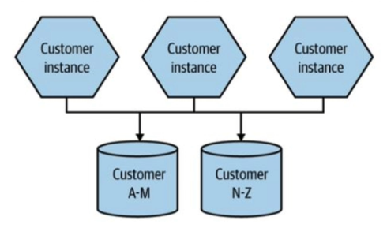
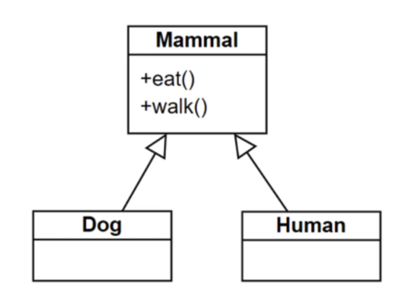
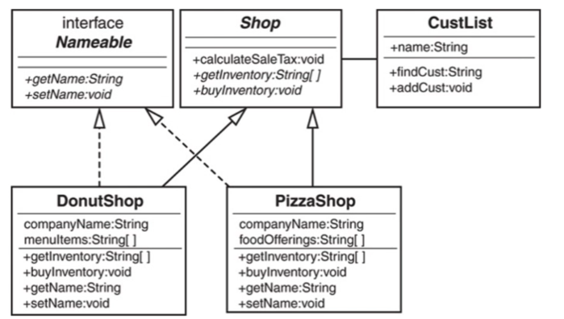

# COMP5241 Quiz


## Question 1
Answer the question related to the following Kafka visualization


a) What is the replication factor used in this scenario? 

b) How many Kafka brokers are there? 

c) How many partitions are handled by consumer 1? 


## Question 2

Consider the following microservice architecture. Which options of microservice scaling are adopted?




- [ ] Scale by cloning and data partitioning 
- [ ] Database replication and data partitioning 
- [ ] Database replication 
- [ ] Scale by cloning, database replication and data partitioning 

## Question 3
According to the video "The Many Meanings of Event-Driven Architecture", which of the following statements is NOT TRUE about event-notification in event driven architecture? 

- [ ] The sequence of events should be stored In a log file 
- [ ] The size of the event is generally less than "Event-carried State Transfer" 
- [ ] An event can be consumed by multiple consumers 
- [ ] It is easy to add new services to the application 


## Question 4
Which of the following is NOT correct about the SOLID principles in Object Oriented Design? 

- [ ] All of the other options are correct about the SOLID principles 
- [ ] High-level modules should not depend on low-level modules. 
- [ ] Low-level modules should depend on abstraction 
- [ ] The internal representation of an object should be hidden from the outside 


## Question 5
Which of the following statements are NOT TRUE about using Docker-compose for deploying a stack of event-based microservices? 

- [ ] It allows the deployment of multiple applications and services in a docker-compose stack 
- [ ] It automates the microservice deployment process 
- [ ] It supports load balancing of the containers running in multiple hosts. 
- [ ] It supports horizontal scaling by running multiple instances of docker images 


## Question 6
Suppose that class A extends class B and class B extends C. Which of the following is NOT legal in Java? 

- [ ] Define an interface D and let class A implements class D. 
- [ ] Define a class D and let class D extends class A. 
- [ ] Define a class D and let class A extends class D. 
- [ ] Define an interface D and let class D implements class A. 

## Question 7
Among the four phases shown in the following options, which of the following is the earliest phase in the Maven's default lifecycle? 

- [ ] test 
- [ ] compile 
- [ ] Package 
- [ ] clean 


## Question 8
According to Donovan Brown. what is the most important in DevOps? 

- [ ] Continuously deliver software that people are satisfied with 
- [ ] Deliver code changes frequently and reliably. 
- [ ] Continuous integration and continuous delivery 
- [ ] Good collaboration between the software development and operation teams. 


## Question 9
Briefly describe is the relationship netween Dog and Human as shown in the following class diagram?



## Question 10
Which of the following BEST describe the use of feature flags in the Microsoft Visual Studio Team Services (VSTS) project teams? 

- [ ] When there is deployment failure, the software is rolled back to the previous version of the software. After that, a new fix will be developed to patch the software. A new version of the software will then be deployed to production. O 
- [ ] When there is deployment failure, the feature flag should be turned off to disable the new feature. The software is then rolled back to the previous version of the software. After that, a new fix will be developed to patch the software. A new version of the software will then be deployed to production. 
- [ ] When there is deployment failure, the feature flag should be turned off to disable the new feature. The software is then rolled back to the previous version of the software. After that, a new fix will be developed to patch the software. A new version of the software will then be deployed to production. The feature flag will be turned on to enable the new feature. 
- [ ] When there is deployment failure, the feature flag can be turned on to disable the new feature. A new fix will then be developed and push to production. The feature flag will be turned on to enable the new feature. 


## Question 11
In the Microsoft Visual Studio Team Services (VSTS) project teams, who has the major responsibility to test the application? 

- [ ] DevOps Engineer in the DevOps team 
- [ ] Software Tester in QA Team 
- [ ] Test Engineer in the QA Team 
- [ ] Developer 


## Question 12
Suppose we want to build a docker image for a Python flask application which make use of a Redis database for caching frequently used data. Which of the following statement correctly BEST describe the tasks to be performed when building the docker image for flask application? 

- [ ] Copy the python flask application into the image. Install the python flask libraries in the image. 
- [ ] Install the guest operating system in the image. Copy the python flask application into the image. Install the python flask libraries in the image. Install the Redis database in the application docker image 
- [ ] Copy the python flask application into the image. Install the python flask libraries in the image. Install the Redis database in the application docker image 
- [ ] Install the guest operating system in the image. Copy the python flask application into the image. Install the python flask libraries in the image 

## Question 13
Consider classes A, B, C, D and E. 

Suppose class A extends C, class C extends class B. Which of the following is NOT correct? 

- [ ] C obj = new A() 
- [ ] B obj = new C
- [ ] B obj = new A() 
- [ ] A obj = new B() 


## Question 14
Answer the following questions based on the following class diagram 

a) How many attributes are available in the PizzaShop class? 

b) How many methods are available in the PizzaShop class? 

c) What is the type of data returned by the fmdCust method in the CustList class? 

d) What is the Access Modifier of the fmdCust method in the CustList class? 



## Question 15
Which of the following is the most important to improve software quality in the Microsoft VSTS project teams? 

- [ ] Code Review 
- [ ] QA department with good software testers 
- [ ]  Automated unit testing 
- [ ] All of the other options are important in the Microsoft VSTS project teams 

## Question 16
Consider a social media platform which is using even-driven architecture to process user-generated content. Currently. the comment service receives comments from users and sends them to the comment analysis service which is responsible for analyzing user comments and flagging any inappropriate content. However, there are times when the service experiences a sudden surge in incoming comments. e.g. during a major news event or a celebrity scandal. During these times, the service can become overwhelmed and unable to keep up with the volume of comments being produced. To address the issue, the comment analysis service is horizontally scaled by running four instances of the comment analysis in docker containers to handle the increased workload. Kaflca is used as the event broker to distribute the incoming comments across multiple instances of the comment analysis services running in different hosts. 
Which of the following options is the BEST option to be adopted? 

- [ ] Create four partitions for a Kafka topic in three Kafka brokers. Assign the comment analysis service instances in the same consumer group. 
- [ ] Create three partitions for a Kafka topic in four Kafka brokers. Assign the comment analysis service instances in different consumer groups. 
- [ ] Create three partitions for a Kafka topic in four Kafka brokers. Assign the comment analysis service instances in the same consumer group. 
- [ ] Create four partitions for a Kafka topic in three Kafka brokers. Assign the comment analysis service instances in different consumer groups. 


## Question 17
Consider a small e-commerce store that is hosted on a shared hosting platform, where multiple websites share a single server and its resources. The website has poorly optimized code and inefficient website design. which cause slow loading times and increase the servers resource usage. As the website contains large images and videos that take a long time to load, it put a hemy strain on the server's resources and slow down the website for all users. The hosting platform does not provide the necessary resources to handle high traffic or sudden spikes in demand (e.g. during promotion). Customers become frustrated and abandon their shopping carts, leading to lost sales and a negative impact on the store's reputation. 

Which of the following are the most critical issue to be addressed by the e-commerce store? 

- [ ] The system availability should be improved 
- [ ] The system scalability should be improved 
- [ ] The system availability and scalability should be improved 
- [ ] None of the other options is correct. 


## Question 18

A company is developing an online food ordering application which requires high availability for processing the orders during the peak hours. The chief software engineer hopes to improve the mean time to repair by improving the mean time to failure. State whether you agree or disagree with the chiefs engineering proposal with brief explanation. 


# Quiz Answer
## Q1
```
a)
1 (4 marks)
b)
2 (4 marks)
3 (4 marks)
```
## Q2
```
Scale by cloning and data partitioning
```

## Q3
```
The sequence of events should be stored in a log file
```

## Q4
```
The internal representation of an object should be hidden from the outside
```


## Q5
```
It supports load balancing of the containers running in multiple hosts.
```

## Q6
```
Define an interface D and let class D implements class A.
Define a class D and let class A extends class D
```

## Q7
```
compile
```

## Q8
```
Continuously deliver software that people are satisfied with
```

## Q9
```
Any one points below (5 marks)
 • Both Dog and human classes extend the Mammal class/ Both Dog and human are the subclass of (or inherits from)
Mammal class
 • Both Dog and human is-a Mammal/Both classes can eat() and walk()

Note: Simply stating “inheritance” or “is-A relationship” doesn’t address the question about the relationship of “Dog” and
“Human” ( 0 mark)
```

## Q10
```
When there is deployment failure, the feature flag can be turned on to disable the new feature. A new fix will then be
developed and push to production. The feature flag will be turned on to enable the new feature.
```

## Q11
```
Developer
```

## Q12
```
Copy the python flask application into the image. Install the python flask libraries in the image.
```

## Q13
```
A obj = new B()
```


## Q14
```
a) 2 (3 marks)
b) 5 (4 marks)
Pizzashop inherits 3 methods from Shop class, define two additional methods (getName and setName). Total: 5
c) String (3 marks)
d) Public (5 marks)
```

## Q15
```
Automated unit testing
```

## Q16
```
Create four partitions for a Kafka topic in three Kafka brokers. Assign the comment analysis service instances in the same consumer group. 
```

## Q17
```
The system scalability should be improved
```

## Q18
```
Disagree. (3 marks)
Student should point out that improving the mean time to failure for a software project would not necessarily improve the mean time to repair as they are affected by different factors. (5 marks)
```