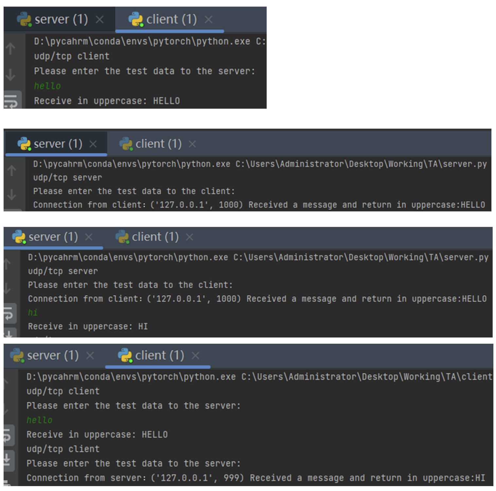

# COMP5311 Assignment 1

## Project Description
1. Write a two-way communication program in python, which can support UDP and TCP connections. Both sides can send messages to each other. The receiver receives the message and converts them to uppercase letters, and then replies to the sender. The sender displays the message on the desktop.
2. Reliable data transfer is required when sending UDP messages and transfer again if not sent successfully.

## Sample Output

## Grading Criteria

The grading criteria is as follows: 

1. Correctness of the program (90%) 
2. Code Design, style, comments (10%) 

## Submission
1. Create a folder and name it as A1__<student no>_<your name> E.g., A1_0123456d_Jack 
2. Put the source code file(s) into the folder. 
3. Compress the folder to (.zip, .7z, .rar or .jar)
4. Submit the zipped file to Blackboard. 

## Friendly Tips
1. Any wrong file naming and submission will be given a ZERO mark. 
2. If your program cannot be compiled, ZERO mark will be given, so make sure you submit the correct source code.
3. This assignment is individual work. All work must be done on your own. Plagiarism is a serious offense. Submissions with high similarity, in terms of code patterns and structures, in addition to direct-copy-and paste, will be treated as plagiarism. Copying code from web resources is prohibited as well. Any plagiarism cases (both copier and copies) will be given a ZERO mark in this assignment