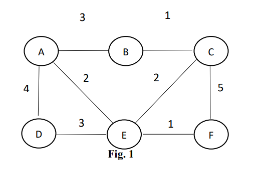
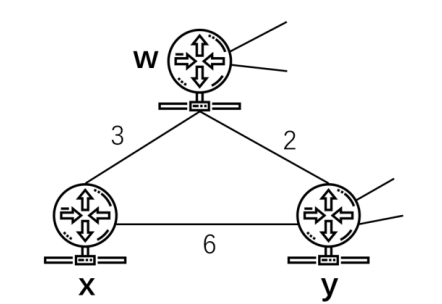

# COMP5311 Exam

## Section A Choice Questions (20 Marks)
(For each question (2 marks), there is only ONE CORRECT answer)

### 1. Which of the following methods aims to tackle the IPv4 address shortage?
a) XDP

b) AIMD

c) NAT

d) DHCP

### 2. Which of the following statements is incorrect for symmetric and asymmetric encryptions?
a) The speed of symmetric encryption algorithm is faster than that of asymmetric encryption.

b) Key storage and remote transmission are difficult for symmetric encryption.

c) Asymmetric encryption algorithm has a public-private key pair.

d) DES is an asymmetric encryption method.

### 3. Which of the following statements is incorrect?
a) HTTP protocol belongs to the application layer protocols.

b) ARP belongs to the network layer protocols.

c) TCP protocol belongs to the application layer protocols.

d) RIP belongs to the network layer protocols.

### 4. A TCP sender sends 5 segments to the receiver, each segment contains 1000 bytes data. The first segment has a sequence number of 1500. What will be the sequence number of the fourth segment?
a) 3500

b) 4500

c) 5500

d) 6500

### 5. Senders access to channel in time “rounds” in TDMA protocols. Which broad class of
the MAC protocols does TDMA belong to?

a) Random access

b) Channel partitioning

c) Taking turns

d) Carrier sense multiple access

### 6. Which of the following IP addresses does NOT belong to the subnet 192.168.1.0/24?

a) 192.168.1.10

b) 192.168.1.255

c) 192.168.2.1

d) 192.168.1.128

### 7. Host A is communicating with Host B using the TCP protocol. The current congestion window of Host A is 8000 bytes, and the maximum segment length is 1500 bytes. Host A sends two segments of 1200 bytes each to Host B. Host B confirms receipt of the first segment and announces a receiving window of 5000 bytes. What is the maximum number of bytes that Host A can send to Host B at this time?

a) 1200 bytes

b) 2400 bytes

c) 3600 bytes

d) 3800 bytes


### 8. Which of the following is not a mechanism used by TCP congestion control to manage network congestion?

a) Stop-and-wait

b) Fast retransmission

c) Congestion avoidance

d) Slow start

### 9. Which of the following is not a valid HTTP response status code?
a) 200

b) 300

c) 404

d) 503

### 10. Which layer is the hardware address, i.e., the MAC address, mainly used in? 
a) Network layer

b) Link Layer

c) Application Layer

d) Physical Layer


## Section B Answer Questions (80 Marks)

**(10 marks for each question)**

### 11. Describe how the tunneling process works for connecting IPv4 networks with IPv6 networks.

### 12. Consider a datagram network using 32-bit host addresses. Suppose a router has four links, i.e., from 0 through 3, and packets are to be forwarded to the link interfaces as follows:

| Destination Address Range | Link Interface |
| -- | -- |
| `11110010 00000000 00000000 00000000` to `11110010 00111111 11111111 11111111` | 0 |
| `11110010 01000000 00000000 00000000` to `11110010 01000000 11111111 11111111` | 1 |
| `11110010 01000001 00000000 00000000` to `11110011 01111111 11111111 11111111` | 2 |
| otherwise | 3 |

#### (12.1) Provide a forwarding table that has five entries, uses longest prefix matching, and forwards packets to the correct link interfaces

#### (12.2) Describe how your forwarding table determines the appropriate link interface for datagrams with the following destination addresses:

| address | 
| -- |
| 11001010 10010001 01010001 01010101 |
| s11110011 01000000 11000011 00111100 |
| s11110011 10000000 00010001 01110111 |
| s11110010 01000000 00010001 01110111 |
| s11110010 00110011 00010001 01110111 |

### 13. The previous EstimatedRTT is 10ms and the current SampleRTT is 20ms. If we use the EWMA method and set α=0.125, please show how to update the EstimatedRTT. What are the consequences when we set the TCP timeout value too large or too small?

### 14. Given Dijkstra’s link-state routing in Fig. 1, please compute least cost path from node A to all other nodes and give detailed pseudo code and calculation process



### 15. Why four-step handshakes are needed when closing a TCP connection? Please give detailed explanations.

### 16. Briefly describe the functions, advantages and disadvantages of NAT.

### 17. What is the difference between routing and forwarding? What is the difference between traditional routing algorithms and software-defined networking (SDN)?

### 18. The network fragment depicted in the following diagram has three nodes: x, w, and y. Node x is connected to two neighboring nodes, w and y. Node w has a minimum-cost path of 4 to the destination node u. Node y, on the other hand, has a minimum-cost path of 8 to u. The complete paths from w and y to u, as well as the link costs between nodes, are not displayed in the diagram. All link costs in the network have strictly positive integer values.



#### （18.1）Give x’s distance vector for destinations w, y, and u.
#### （18.2）If there is a link-cost change (increase and decrease) for either c(x,w) or c(x,y), analyze whether x will inform its neighbors of a new minimum-cost path to u as a result of executing the distance-vector algorithm. Discuss for the changes of c(x,w) and c(x,y) independently.


## My Answer
### Section A

| 1 | 2 | 3 | 4 | 5 | 6 | 7 | 8 | 9 | 10 |
| -- | -- | -- | -- | -- | -- | -- | -- | -- | -- |
| c | d | c | b | b | c | d | a | b | b |

### Q11

It is included 3 process such as Encapsulation, Transit and Decapsulation. Encapsulation is a process in which an IPv6 packet is encapsulated within an IPv4 packet by a dual-stack router or device to be transmitted over an IPv4 network. The packet is treated as payload, and a new IPv4 header is created with source and destination addresses of the tunnel entry and exit points. Intermediate IPv4 routers only process the IPv4 header during transit. Once the encapsulated packet reaches the tunnel exit point, the IPv6 packet is decapsulated by removing the outer IPv4 header, and the original IPv6 packet is forwarded to its final destination within the IPv6 network.

Several tunneling mechanisms are available for connecting IPv4 and IPv6 networks, including manual tunnels, automatic tunnels, and 6to4 tunnels and so on.


### Q12
#### Q12.1
|  longest prefix matching | interface |
| -- | -- |
| 11110010 00******* ********** **********	| 0 |
| 11110010 01000000 ********** **********	| 1 |
| 11110010 ********* ********** **********	| 2 |
| 11110011 0******* ********** **********	| 2 |
| otherwise	| 3 |

#### Q12.2
1.	`11001010 10010001 01010001 01010101`: No matching prefix in the forwarding table, so the link interface is 3 (otherwise).
2.	`11110011 01000000 11000011 00111100`: Matches the prefix 11110011 0******* **********, so the link interface is 2.
3.	`11110011 10000000 00010001 01110111`: : This address also does not fall into any of the specific ranges mentioned in the table. Therefore, it should be forwarded to link interface 3.
4.	`11110010 01000000 00010001 01110111`: Matches the prefix 11110010 01000000 **********, so the link interface is 1.
5.	`11110010 00110011 00010001 0111011`1: Matches the prefix 11110010 00******* **********, so the link interface is 0.


### Q13
EstimatedRTT = (1 - 0.125) * 10 + 0.125 * 20

EstimatedRTT = 0.875 * 10 + 0.125 * 20

EstimatedRTT = 8.75 + 2.5

EstimatedRTT = 11.25ms

If the TCP timeout value is set too large, the sender will wait for a longer period before considering a packet lost and retransmitting it. This can result in lower throughput and increased latency, as the sender is not reacting quickly enough to potential packet loss. Additionally, it can cause congestion within the network, as the sender might continue sending more packets without realizing that some of them are lost. However, If the TCP timeout value is set too small, the sender may consider packets lost even when they are just delayed due to network conditions. This can lead to unnecessary retransmissions, increasing the overall load on the network and reducing the efficiency of the connection. The sender may also incorrectly assume that the network is experiencing congestion, triggering congestion control mechanisms and reducing the sending rate, which can lead to reduced throughput.


### Q14
```

Create set of unvisited nodes and initialize it with all nodes in the graph.

Set the distance to the source node (A) as 0 and the distance to all other nodes as infinity.

While unvisited nodes:
	CurrentNode = Select the node with the smallest 
	CurrentNode.isvisited()
	For each neighbor of the current node
		distance = current + edge length from current to neighbor
		if this distance is <  CurrentNode.distance to the neighbor
			update the neighbor's distance
When all nodes are visited, the shortest path to each node is found

```

```
Initial state:
A: 0 (source)
B: ∞
C: ∞
D: ∞
E: ∞
F: ∞
Unvisited: {A, B, C, D, E, F}

Iteration 1 (current = A):
A: 0 (visited)
B: 3 (0 + 3)
C: ∞
D: 4 (0 + 4)
E: 2 (0 + 2)
F: ∞
Unvisited: {B, C, D, E, F}

Iteration 2 (current = E):
A: 0 (visited)
B: 3
C: 4 (2 + 2)
D: 4
E: 2 (visited)
F: 3 (2 + 1)
Unvisited: {B, C, D, F}

Iteration 3 (current = B):
A: 0 (visited)
B: 3 (visited)
C: 4
D: 4
E: 2 (visited)
F: 3
Unvisited: {C, D, F}

Iteration 4 (current = F):
A: 0 (visited)
B: 3 (visited)
C: 4
D: 4
E: 2 (visited)
F: 3 (visited)
Unvisited: {C, D}

Iteration 5 (current = C):
A: 0 (visited)
B: 3 (visited)
C: 4 (visited)
D: 4
E: 2 (visited)
F: 3 (visited)
Unvisited: {D}

Iteration 6 (current = D):
A: 0 (visited)
B: 3 (visited)
C: 4 (visited)
D: 4 (visited)
E: 2 (visited)
F: 3 (visited)
Unvisited: {}

All nodes are visited, so the algorithm ends.

Final distances from A to all other nodes:
A: 0
B: 3
C: 4
D: 4
E: 2
F: 3

```

### Q15

When establishing a TCP connection, the three-way handshake is used to synchronize the sequence numbers and exchange information about the connection. when closing a TCP connection, a four-way handshake is used because both the client and the server need to ensure that all data has been transmitted before terminating the connection. When the client wants to close the connection, it sends a FIN message to the server, indicating that it has no more data to send. The server responds with an ACK message, indicating that it received the client's FIN message. However, the server may still have data to send, so it cannot immediately close the connection. Therefore, it sends its own FIN message to the client, indicating that it has no more data to send. Finally, the client responds with an ACK message, indicating that it received the server's FIN message and agrees to close the connection.

Therefore, four-step handshakes are needed when closing a TCP connection

### Q16
NAT is a technology used to convert private network addresses to public network addresses. NAT is typically implemented on the border router, and it modifies the source IP address in data packets when traffic goes from inside to outside (internal local to internal global) and modifies the target IP address when traffic goes from outside to inside (external global to external local). NAT technology is also used to alleviate the problem of insufficient IPV4 addresses.
Advantages:
Share public IP address to save money: NAT allows multiple hosts to share a single public IP address, which can save money on internet connectivity.
The public address is not involved when extending the host: NAT allows hosts on a private network to be extended without affecting the public IP address.

Better isolation: NAT can be used to isolate hosts on a private network from the external network. it may better security: NAT provides better security because external network services cannot actively access internal network services

Disadvantages:

Complex network management: NAT can be complex to manage, especially in large networks.
Performance degradation: NAT requires modification of the source/destination IP port of each packet, which can degrade performance.


### Q17

Forwarding refers to the process of sending data packets from one network interface to another within the same LAN, while routing involves transferring data packets between different networks. Forwarding is a relatively simple process performed by a node locally, whereas routing requires multiple routers to select the best path according to their routing tables and forward the data packets until they reach the destination network.

Traditional routing algorithms are based on fixed and dedicated hardware devices such as routers and switches, and their behavior is controlled by firmware that is installed on the devices. These algorithms are distributed in nature, with each device making its own routing decisions based on its own routing table.

On the other hand, SDN is a new approach to network architecture that uses software applications to control and manage the network behavior in a centralized manner. With SDN, the network is virtualized, and the devices are programmable using open APIs, enabling greater flexibility and control over the network. In SDN, the data plane and control plane are decoupled, allowing for more dynamic control and management of the network.

SDN offers many advantages over traditional routing algorithms, including a lower cost of implementation, greater flexibility and scalability, and improved performance through network virtualization. Additionally, SDN enables easier troubleshooting and reporting due to its centralized control, and it has a lower maintenance cost compared to traditional networks.

### Q18
#### Q18.1
Node w: c(x,w)= 3

Node y: min{c(x,w)+c(w,y), c(y)} = 5

Node u: 
```
c(x, w) + minimum-cost path from w to u = 3 + 4 = 7
Through node y: c(x, y) + minimum-cost path from y to u = 6 + 8 = 14 
```

Therefore, w = 3, y = 5, u = 7 


#### Q18.2
(18.2)

Case 1 change in c(x,w)

Increase in c(x, w):
If the cost of the link between x and w increases, it will not result in a new minimum-cost path to node u from x. Since the current cost from x to u is 7 (going through node w), even if the cost of the link between x and w increases, x will still have a cheaper path to u through node y with a cost of 5 + 8 = 13. In this case, x will not inform its neighbors of a new minimum-cost path to u.

Decrease in c(x, w):
if the cost of the link between x and w decreases, it could potentially create a new minimum-cost path to node u. However, this will only happen if the new cost of c(x, w) plus c(w, u) is less than the current cost of c(x, u), which is 7. If the new cost of c(x, w) plus c(w, u) is less than 7, x will inform its neighbors of a new minimum-cost path to u. Otherwise, x will not inform its neighbors.

Case 2: Change in c(x, y)

Increase in c(x, y):
If the cost of the link between x and y increases, it will not result in a new minimum-cost path to node u from x. Since the current cost from x to u is 7 (going through node w), even if the cost of the link between x and y increases, x will still have a cheaper path to u through node w with a cost of 3 + 4 = 7. In this case, x will not inform its neighbors of a new minimum-cost path to u.

Decrease in c(x, y)
If the cost of the link between x and y decreases, it could potentially create a new minimum-cost path to node u. However, this will only happen if the new cost of c(x, y) plus c(y, u) is less than the current cost of c(x, u), which is 7. If the new cost of c(x, y) plus c(y, u) is less than 7, x will inform its neighbors of a new minimum-cost path to u. Otherwise, x will not inform its neighbors.


All in all, x will inform its neighbors of a new minimum-cost path to u only if the link cost changes lead to a new path with a cost less than the current cost of c(x, u), which is 7. This can happen if there is a decrease in c(x, w) or c(x, y) that makes the new path cost to u less than 7.

