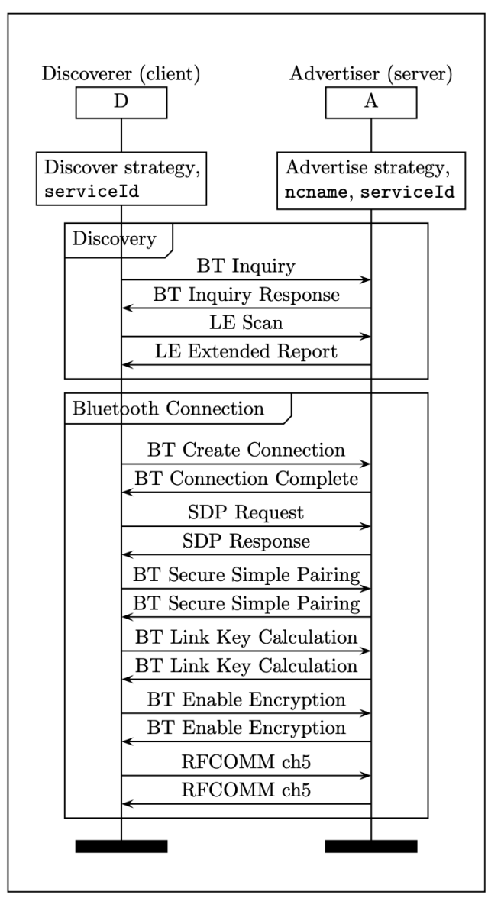
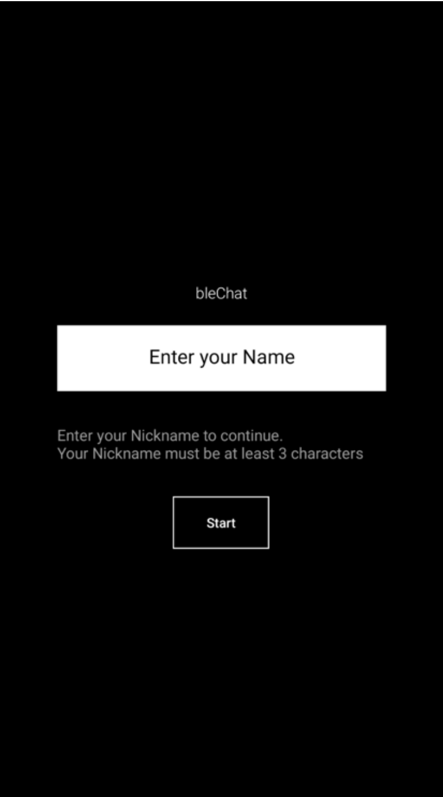
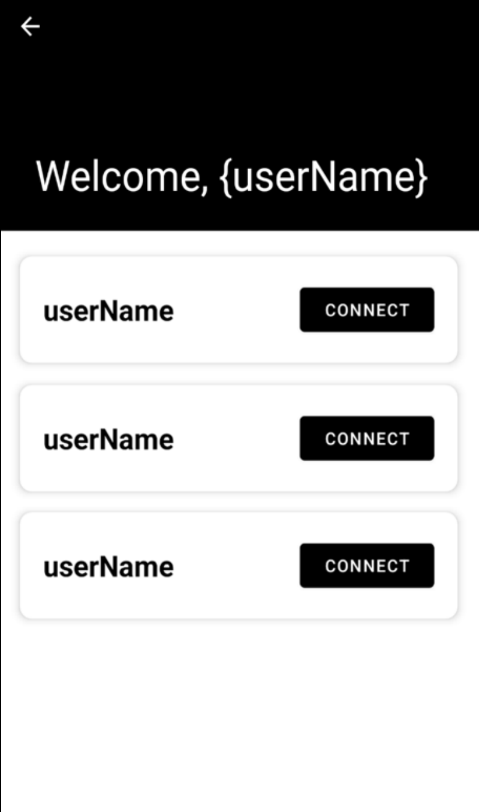
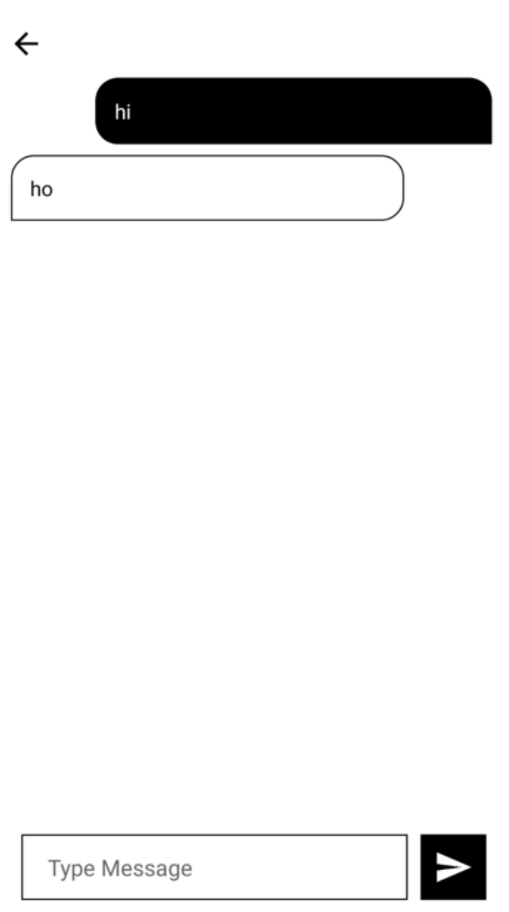
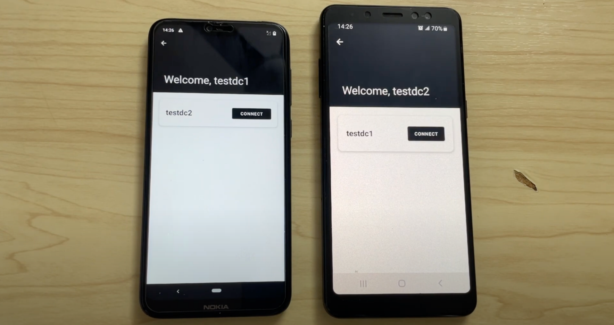

# COMP5311 Project

The following is a project topic chosen and group formation:

Topic: Mobile App for instant messaging using Bluetooth Mesh

Group: 
Only My :)

## Report
### Abstract
Bluetooth Mesh, based on the BLE standard, provides a highly resilient and scalable solution for communication infrastructure in large-scale IoT networks. This paper discusses the fundamentals of Bluetooth Mesh communication and Google Nearby API, and presents an experiment involving the development of a Message Chat app using Bluetooth Mesh, facilitating communication without Wi-Fi or cellular networks. The app demonstrates the potential of Bluetooth Mesh and Google Nearby API to maintain communication even when traditional networks are down, such as during natural disasters. However, further testing with more devices and extended range is required to fully explore the capabilities of the application.

### Introduction
The development of the Internet of Things (IoT) has brought a revolution in the communication field. It needs scalable, reliable, and efficient communication networks. In addition, with the growing number of connected devices, traditional communication methods are facing challenges in providing a seamless communication infrastructure. Bluetooth Mesh network technology provides a highly resilient and scalable solution for communication infrastructure.

Bluetooth Mesh is a wireless communication technology based on the BLE standard. It extends the classic Bluetooth communication network. It allows for large-scale IoT networks, enabling communication between Bluetooth devices. In addition, it discusses the basics of Bluetooth Mesh communication and Google Nearby API, including its working principle, technology and forth.

For an experiment to validate its functionality, the Message Chat app is developed using Bluetooth Mesh to implement commutation with no Wi-Fi and Cellular network.

### Overview
The Mesh network is made up of nodes, which are individual devices that are capable of sending and receiving messages. In the network, the node can also relay and forward messages from one node to another. It can ensure the message reaches its intended destination, even if sometimes the nodes are unavailable.

Bluetooth Low Energy (BLE) wireless technology offers ultra-low power consumption and low latency (Heydon & Hunn, 2012). With Bluetooth Core v4.1, a BLE device can act as an master or slaver in network, enabling the possibility of forming a mesh network.

Bluetooth Mesh is a wireless communication technology based on the BLE standard. It is specifically designed to provide a reliable and scalable communication infrastructure for largescale Internet of Things (IoT) networks. In traditional Bluetooth networks, there is a one-toone or one-to-many relationship between devices. On the other hand, Bluetooth Mesh allows for many-to-many communication. As a result, any device in the network can communicate with any other device, allowing for much larger and more complex networks.

### Background and method

#### Bluetooth Low Energy (BLE)
According to Baert et al. (2018), the low-power version of Classic Bluetooth operates in the 2.4 GHz ISM band with frequencies between 2402 and 2480 MHz. BLE uses 2 MHz spaced channels, leading to 40 usable channels, divided into three advertisement channels and 37 connection-oriented channels. BLE offers two modes of communication between devices: advertising and connection-oriented. In advertising mode, one or more devices advertise information while others scan for it, while in connection-oriented mode, one device acts as the master managing connections to multiple slaves. Both modes can be used to realize BLE mesh networking, with the Bluetooth SIG choosing to use the advertising mode as the core underlying technique for the Bluetooth Mesh Standard. The choice between the two modes depends on the specific use case, each having its advantages and disadvantages.

#### Bluetooth Mesh
According to Baert et al. (2018), Bluetooth Mesh is a publish/subscribe model as a standard where nodes can publish to a specific address and subscribe to one or more addresses of interest. Each node has a unique unicast address and can join a group by adding the corresponding group address to its subscriber list. A mesh topology is created to connect the publishers and subscribers, using BLE advertising and scanning as an underlying technology. The flooding mechanism is used for communication but can be improved through the relay, proxy, and friendship features. The relay feature ensures efficient communication by only allowing nodes with the relay feature enabled to forward messages. In contrast, the proxy feature allows nonBluetooth Mesh devices to connect to the network. The friendship feature helps power-limited devices become part of the network by establishing friendships with a friend node.

Regarding the Basics of Bluetooth Mesh Communication, Figure 1 shows the communication flow between two connected mesh nodes. The flow starts with an event on the application layer of the sending node, which triggers the need to send a message. The message is processed and sent from top to bottom in the stack. A random back-off mechanism is used before the message is broadcasted over the air via BLE advertising on channels 37, 38, and 39. The receiving node scans for packets, and depending on which channel it is listening to, it takes a specific amount of time for the packet to be received. After receiving the message, the receiving node passes it up to the application layer and sends an acknowledgement back to the sending node. The acknowledgement follows the same pattern as the original message. The communication flow concludes when the sending node processes the acknowledgement.


<table>
    <tr>
        <td>
        
        </td>
    </tr>
    <tr>
        <td>
        <span>Figure 1, sample of communication between two connected mesh nodes (Baert et al., 2018)</span>
        </td>
    </tr>
</table>

#### Google Nearby Connection API

Google's Nearby Connections API is implemented as part of Google Play Services and allows developers to create nearby services on their Android devices. Utilize Bluetooth BR/EDR, Bluetooth LE and Wi-Fi technologies to offer proximity-based services such as file, content streaming, etc. There are three strategies, including the P2P_POINT_TO_POINT, P2P_STAR and P2P_CLUSTER connection strategies. 

Regarding the details of the Nearby Connections, according to Rasmussen et al. (2019), the nearby connection request will initiate by an advertiser (server) and a discoverer (client). Both parties must search for the same serviceId and use the same strategy to find each other. Bluetooth inquiries and scanning are used to discover the server and establish a Bluetooth connection. Once the Bluetooth connection is established, the client sends a Service Discovery Protocol (SDP) request with a custom UUID derived from the serviceId to retrieve information about the service. Finally, the client establishes a link-layer encrypted RFCOMM connection with the server. Show the overview of the connection in Figure 2. As for the payloads, Connected Nodes can exchange three types of payloads in the same transport layer, such as BYTE, FILE, and STREAM. Each payload generates a minimum of two packets containing a directional counter value appropriate to its direction. The nodes can send and receive payloads independently, with the exchange of payloads helping to maintain the connection's vitality.

<table>
    <tr>
        <td>
        
        </td>
    </tr>
    <tr>
    <tr>
        <td>
            <span>
            Figure 2, Nearby Connections Request (Rasmussem et al, 2019)
            </span>
        </td>
    </tr>
</table>

### Experiment
#### Background
Natural disasters can devastate communities and disrupt communication networks, making people challenging to stay in touch with loved ones, get information, or even get help. Therefore, an app's goal is to solve this problem by allowing people to communicate even when traditional communication networks are down. The app can create a mesh network of devices used for communication without an internet connection.

#### Implementation
<table>
    <tr>
        <td>
            
        </td>
        <td>
            
        </td>
        <td>
            
        </td>
    </tr>
    <tr>
        <td colspan='3'>
            Figure 3, overview of the application
        </td>
    </tr>
</table>

First of all, the user needs to enter their nickname. Then, the application will advertise and discover nearby scanning devices and show the scanned user's nickname in the list. The confirm connection dialogue will show to both users when the user clicks the connect button. After the acceptance of the connection, the message chatroom will start. Figure 3 shows the overview of the design of the application.

The following GitHub Repository provided some connectivity samples using the Google Nearby Connection API but did not contain the Message chat sample based on the multiple activities. Just reference how to interact with the nearby API and the Connection lifecycle. (android/connectivity-samples): https://github.com/android/connectivity-samples

The simple Android Native app is developed, named "blechat". Following are more details about the Configurations.

<table>
<tr>
    <td>variables</td>
    <td>value</td>
</tr>
<tr>
    <td>Strategies</td>
    <td>P2P_CLUSTER</td>
</tr>
<tr>
    <td>SERVICE_ID</td>
    <td>comp5311-blechat</td>
</tr>
<tr>
    <td>name</td>
    <td>{usernameInput}</td>
</tr>
</table>

Permission

<table>
<tr>
    <td colspan='3'>
        Build.VERSION.SDK_INT
    </td>
</tr>
<tr>
    <td>>=31</td>
    <td>>=29</td>
    <td>Default</td>
</tr>
<tr>
    <td>
    <code>BLUETOOTH_SCAN,
BLUETOOTH_ADVERTISE,
BLUETOOTH_CONNECT,
ACCESS_WIFI_STATE,
CHANGE_WIFI_STATE,
ACCESS_COARSE_LOCATION,
ACCESS_FINE_LOCATION,</code>
    </td>
        <td>
    <code>BLUETOOTH,
BLUETOOTH_ADMIN,
ACCESS_WIFI_STATE,
CHANGE_WIFI_STATE,
ACCESS_COARSE_LOCATION,
ACCESS_FINE_LOCATION</code>
    </td>
        <td>
    <code>BLUETOOTH,
BLUETOOTH_ADMIN,
ACCESS_WIFI_STATE,
CHANGE_WIFI_STATE,
ACCESS_COARSE_LOCATION</code>
    </td>
</tr>
</table>

Dependencies
<table>
<tr>
<td>
<code>
implementation 'com.google.android.gms:play-services-nearby:18.3.0'
implementation 'com.intuit.sdp:sdp-android:1.1.0' // for responsive design
</code>
</td>
</tr>
</table>

### Evaluate
Two devices will be used to evaluate the application. Detail as follow:

<table>
    <tr>
        <td> Device 1</td>
        <td> Device 2 </td>
    </tr>
    <tr>
        <td>Nokia 6.1 Plus</td>
        <td>Samsung Galaxy A8+ (SM-A730F)</td>
    </tr>
        <tr>
        <td>Android 10</td>
        <td>Android 9</td>
    </tr>
        <tr>
        <td>Bluetooth V5.0</td>
        <td>Bluetooth V5.0</td>
    </tr>
</table>
The android emulator cannot search nearby devices using this application because Bluetooth is not supported



The application is tested in case of No Wi-Fi and no Cellular network. Two devices can send and receive messages using the application. The demonstration video and source codes about the application is attached to the submission file.

Furthermore, there are some limitations to the application. For example, it is not tested in 3 or more devices due to the limited number of devices, and the cluster range is limited to around 100m.

### Conclusion
In conclusion, communication in Bluetooth Mesh follows a publish/subscribe model and is achieved through advertising and scanning. Google Nearby Connections API allows developers to create proximity-based services in Android devices and uses a combination of Bluetooth BR/EDR, BLE, and Wi-Fi technologies. The Nearby Connections API relies on Bluetooth inquiries and scanning to discover nearby devices and establish a secure connection. These communication technologies are essential for ensuring reliable and efficient communication, especially in the case of natural disasters where communication networks can be disrupted.

### Reference
```
Baert, M., Rossey, J., Shahid, A., & Hoebeke, J. (2018). The Bluetooth mesh standard: An
overview and experimental evaluation. Sensors, 18(8), 2409.
Heydon, R., & Hunn, N. (2012). Bluetooth low energy. CSR Presentation, Bluetooth SIG
https://www.bluetooth.org/DocMan/handlers/DownloadDoc.ashx.
Rasmussen, K., Antonioli, D., & Tippenhauer, N. (2019). Nearby threats: Reversing,
analyzing, and attacking Google’s ‘nearby connections’ on android. Network and
Distributed System Security Symposium (NDSS).
```

### Appendix
Some Source code not show it here :P