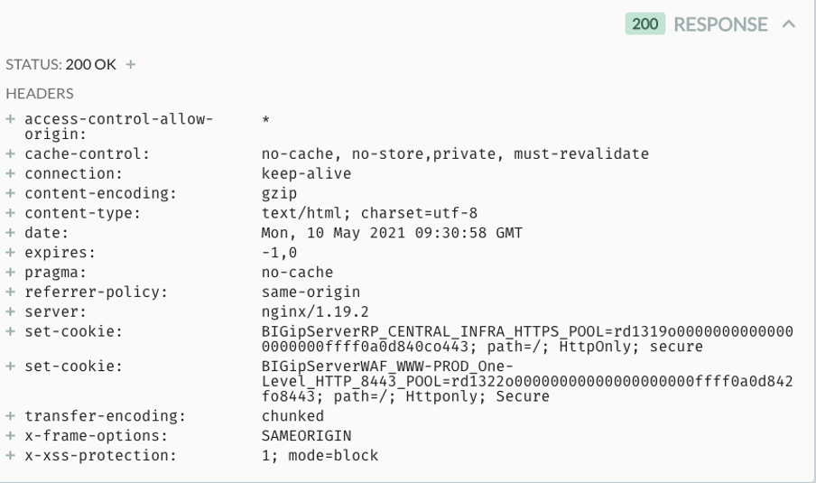
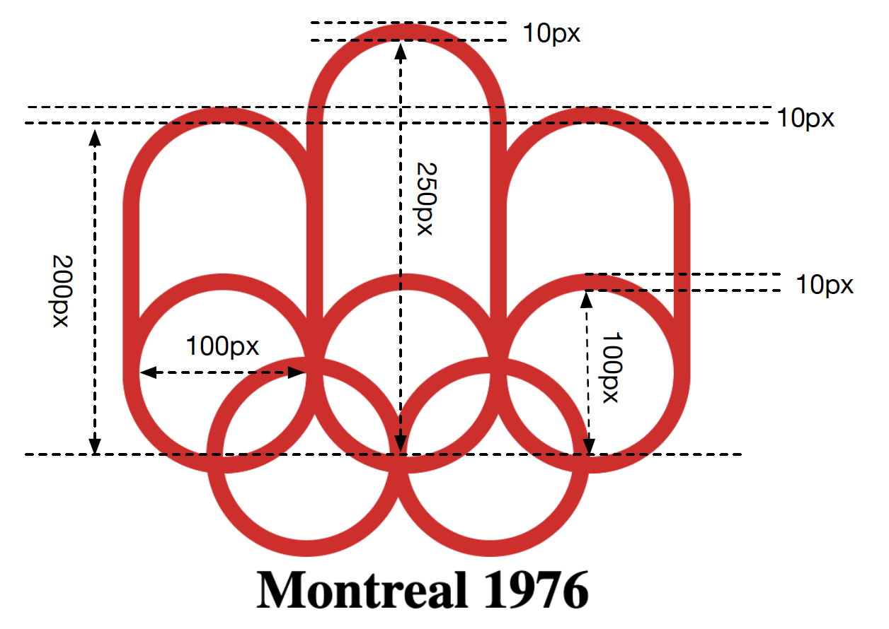

# COMP5322 EXAM

## Question 1 (15 marks)

CSS is the language we use to style an HTML document. Please write the appropriate CSS code to accomplish the following tasks.

1. Make the PolyU official homepage grayed for collective mourning. (3 marks)
2. Select all \<h1\> elements that are the next sibling of \<div\> elements; meanwhile, the \<div\> elements are immediately after \<p\> elements; and show them in red. (3 marks)
3. Attaching a small image named “ext.png” after external hyperlinks that are linked to the resources deployed in other web servers. (3 marks)
4. Position the section belonging to the class of “.sidebar” on the rightmost and the topmost of the
viewport. (3 marks)
1. Attach “double underlines” for all list items. (3 marks)

## Question 2 (18 marks)

JavaScript is the programming language of HTML and the Web. A JavaScript function is a block of code designed to perform a particular task. Please write JavaScript code to accomplish the following tasks:

1. Print out all global functions prefixed with “add” in the console. (3 marks)
2. Use the function to define a class named “**INumber**”. This class contains a property “**value**” to keep an input number; and a method “**toString()**”, which returns the “**value**” in the format of a string. This function can be used to create instances or be called as a normal function as follows. (6 marks)

```javascript
var obj = new INumber(123);
// print out “123”
console.log(obj.toString());
//convert string “123” to a number 123.
var num = INumber(“123”);
//print out 123.
console.log(num);
```

3. Print out the year, month, day, hour, minute and second for the Unix time of “1651987116” in the console. (3 marks)
4. Please create a JavaScript closure named “Authentication” to control the access of the variable named “passcode”. Any code outside this closure cannot directly change the passcode. The passcode can only be updated and verified through two functions: “update (oldCode, newCode)” and “verify (passcode)”. If the input passcode (including update and verify) is wrongly input over three times, the passcode cannot be updated over 24 hours. (6 marks)

## Question 3 (5 marks)
Referring to the following HTTP response message from the PolyU web server, how can we show the PolyU webpage inside an iframe element?


## Question 4 (6 marks)
Figure 1 shows a screenshot of the network data captured by Chrome when accessing the COMP website. Referring to the acquired network data, please answer the following questions:

1. What is the average response time? (2 marks)
2. What is the peak response time? (2 marks)
3. What advice do you have to optimize the website? (2 marks)

Figure 1: Network Data (only shows a part of HTTP requests and responses)


## Question 5 (20 marks)
Similar to the Bootstrap grip system, please develop your own simplified grid system with the following requirements: (a) it allows up to **SIX columns** across the page; (b) it only considers **THREE** types of screens for the responsive web design:

<table>
<tr>
    <td>Small (<300px)</td>
    <td>Medium (>=300px & < 500px)</td>
    <td>Large (>=500px)</td>
</tr>
<tr>
    <td>.col-sm-x</td>
    <td>.col-md-x</td>
    <td>.col-lg-x</td>
</tr>
</table>

where “x” means the column number from 1 to 6. Please implement the following CSS classes and the necessary code to achieve responsible web design. (20 marks, 1 mark for each)

```css
.container{
}
.row {
}
.column-sm-1{
}
.column-sm-2{
}
.column-sm-3{
}
.column-sm-4{
}
.column-sm-5{
}
.column-sm-6{
}
.column-md-1{
}
.column-md-2{
}
.column-md-3{
}
.column-md-4{
}
.column-md-5{
}
.column-md-6{
}
.column-lg-1{
}
.column-lg-2{
}
.column-lg-3{
}
.column-lg-4{
}
.column-lg-5{
}
.column-lg-6{
}
```

## Question 6 (22 marks)
Please implement a simplified jQuery framework called mQuery with the following requirements.
*TIP: jQuery framework is not allowed to use. Please use the built-in JavaScript functions.*
```
1. Please implement the query function “$$(selector)” to find an or multiple element nodes when given an ID selector, tag selector, or class selector. Please use the original query functions provided by JavaScript and do not consider the combined CSS selectors. For example, $$(“h1”), $$(“myId”), and $$(“myClass”) return all H1 elements, the elements whose ID is “myId” or “myClass”, respectively. (4 marks)
2. Please implement the “click(callback)”, “hide()”and “css(property,value)” functions to the selected nodes. These functions are used as follows. (18 marks for each function)
```

```javascript
//Binding click events to all button elements.
$$(“button”).click(function(){
    //hide all H1 elements
    $$(“h1”).hide();
    //make myClass elements in red.
    $$(“myClass”).css(“color”,”red”);
})
```

## Question 7 (14 marks)

You are required to create the 45th Olympic logo by using CSS. The logo is composed of five rings and three rectangles with rounded corners. The HTML code has been given. It is not allowed to add, edit, or delete any HTML elements.


```html
<!DOCTYPE html>
<html>
<head>
<style>
.container{
position: fixed;
top: 200px;
height: 500px;
width: 500px;
}

<!--- Your code here ---->

</style>
</head>
<body>
<div class="container">
    <div class="circle ring1"></div>
    <div class="circle ring2"></div>
    <div class="circle ring3"></div>
    <div class="circle ring4"></div>
    <div class="circle ring5"></div>
    <div class="rect ring6"></div>
    <div class="rect ring7"></div>
    <div class="rect ring8"></div>
    <h1 class="heading">Montreal 1976</h1>
</div>

</body>
</html>
```

TIP: The sies and offsets are given as follows:


## My Answer
### Question 1
```css
/* 1. */
body {
    filter: grayscale(100%);
}

/* 2. */
div+ h1 ~ p {
    color: red
}

/* 3. */
a:after{
   background-image: 
       url("ext.png"),
   background-repeat: no-repeat;
}

/* 4. */
.sidebar{
    position: fixed;
    top: 0;
    right: 0;
}

/* 5. */
li { 
    border-bottom: 4px double; 
}
```

### Question 2

```javascript
// 1.
for(let prop in window){
    if(prop.indexOf('add') == 0)
        console.log(prop)
}

// 2.
function INumber(value) {
    this.value = value;

    if (typeof this.value === 'string')
        return Number.parseInt(this.value);

    this.toString = function () {
        return `${this.value}`;
    }

    return this.INumber;
}

// 3.
const date = new Date(1651987116 * 1000);
console.log(`${date.getFullYear()} ${date.getMonth()} ${date.getDate()} ${date.getHours()} ${date.getMinutes()} ${date.getSeconds()}`)

// 4.
function Authentication () {
    let passcode;
    let fail = 0;
    let datetime = null;
    function update(oldCode, newCode){

        if(datetime != null){
            if(new Date() > datetime){
                datetime = null; 
                // fail = 0;
            }
        }

        if(datetime == null){
            if(oldCode == passcode)
                passcode = newCode;
        }

    }

    function verify(passcode) {
        const result =  passcode == this.passcode;
        if(!result){
            fail++;
            if(fail >= 3)
                datetime = new Date(new Date.now.getTime() + 60 * 60 * 24 * 1000);
        }
        return result;
    }
            
}
```

### Question 3 
X-FRAME-OPTIONS: SAMEORIGIN
IT CAN ONLY BE EMBEDDED IN THE SAME WEBSITE (SCHEME, HOST, PORT MUST BE THE SAME)

### Question 4

1. The ART is the
average of multiple response time
Finish (2.45s) / 226 request = 0.010840708s
2. 455ms
3. Deploy the js/ static file to CDN such as image, css, js, etc.

### Question 5
```css
.container {
width: 100%;
padding-right: 15px;
padding-left: 15px;
margin-right: auto;
margin-left: auto;
}

.row {
display: -webkit-box;
display: -ms-flexbox;
display: flex;
-ms-flex-wrap: wrap;
flex-wrap: wrap;
margin-right: -15px;
margin-left: -15px;
}

@media (max-width: 300px) {

.column-sm-1 {
-webkit-box-flex: 0;
-ms-flex: 0 0 16.6666667%;
flex: 0 0 16.6666667%;
max-width: 16.6666667%;
}

.column-sm-2 {
-webkit-box-flex: 0;
-ms-flex: 0 0 33.3333333%;
flex: 0 0 33.3333333%;
max-width: 33.3333333%;
}

.column-sm-3 {
-webkit-box-flex: 0;
-ms-flex: 0 0 50%;
flex: 0 0 50%;
max-width: 50%;
}

.column-sm-4 {
-webkit-box-flex: 0;
-ms-flex: 0 0 50%;
flex: 0 0 50%;
max-width: 50%;
}

.column-sm-5 {
-webkit-box-flex: 0;
-ms-flex: 0 0 66.6666667%;
flex: 0 0 66.6666667%;
max-width: 66.6666667%;

}

.column-sm-6 {
-webkit-box-flex: 0;
-ms-flex: 0 0 100%;
flex: 0 0 100%;
max-width: 100%;

}
}

@media (min-width: 300px) and (max-width: 500px) {
.column-md-1 {
-webkit-box-flex: 0;
-ms-flex: 0 0 8.3333333333%;
flex: 0 0 8.3333333333%;
max-width: 8.3333333333%;
}

.column-md-2 {
-webkit-box-flex: 0;
-ms-flex: 0 0 33.3333333%;
flex: 0 0 33.3333333%;
max-width: 33.3333333%;
}

.column-md-3 {
-webkit-box-flex: 0;
-ms-flex: 0 0 50%;
flex: 0 0 50%;
max-width: 50%;
}

.column-md-4 {
-webkit-box-flex: 0;
-ms-flex: 0 0 50%;
flex: 0 0 50%;
max-width: 50%;
}

.column-md-5 {
-webkit-box-flex: 0;
-ms-flex: 0 0 66.6666667%;
flex: 0 0 66.6666667%;
max-width: 66.6666667%;

}

.column-md-6 {
-webkit-box-flex: 0;
-ms-flex: 0 0 100%;
flex: 0 0 100%;
max-width: 100%;

}
}

@media (min-width: 500px) {
.column-lg-1 {
-webkit-box-flex: 0;
-ms-flex: 0 0 8.3333333333%;
flex: 0 0 8.3333333333%;
max-width: 8.3333333333%;
}

.column-lg-2 {
-webkit-box-flex: 0;
-ms-flex: 0 0 33.3333333%;
flex: 0 0 33.3333333%;
max-width: 33.3333333%;
}

.column-lg-3 {
-webkit-box-flex: 0;
-ms-flex: 0 0 50%;
flex: 0 0 50%;
max-width: 50%;
}

.column-lg-4 {
-webkit-box-flex: 0;
-ms-flex: 0 0 50%;
flex: 0 0 50%;
max-width: 50%;
}

.column-lg-5 {
-webkit-box-flex: 0;
-ms-flex: 0 0 66.6666667%;
flex: 0 0 66.6666667%;
max-width: 66.6666667%;

}

.column-lg-6 {
-webkit-box-flex: 0;
-ms-flex: 0 0 100%;
flex: 0 0 100%;
max-width: 100%;

}
}
```

## Question 6
```javascript

// 1.
function $$(selector) {
    // it need to use .class #id
    //document.querySelectorAll(selector); 

    const selectors = [null, null, null];

    selectors[0] = (document.getElementsByTagName(selector).length == 0) ? null : document.getElementsByTagName(selector);
    selectors[1] = document.getElementById(selector);
    selectors[2] = (document.getElementsByClassName(selector).length == 0) ? null : document.getElementsByClassName(selector);
    for (const sel of selectors) {
        console.log(sel)
        if (sel !== null)
            return sel;
    }
    return null;
}

// 2.
function $$(selector) {
    // it need to use .class #id
    //document.querySelectorAll(selector); 

    const selectors = [null, null, null];
    let idElement = false;

    selectors[0] = (document.getElementsByTagName(selector).length == 0) ? null : document.getElementsByTagName(selector);
    selectors[1] = document.getElementById(selector);
    selectors[2] = (document.getElementsByClassName(selector).length == 0) ? null : document.getElementsByClassName(selector);
    this.element = null;

    for (let i = 0; i < selectors.length; i++) {
        if (selectors[i] != null) {
            this.element = selectors[i];
            if (i == 1)
                idElement = true;
            break;
        }
    }
    if (this.element !== null) {
        if (!idElement) {
            this.element.click = (callback) => {
                for (const ele of this.element) {
                    callback();
                }
            }
            this.element.hide = () => {
                for (const ele of this.element) {
                    ele.style.visibility = "hidden";
                }
            }

            this.element.css = (style, value) => {
                for (const ele of this.element) {
                    ele.style[style] = value;
                }
            }
        } else {

            this.element.click = (callback) => {

                callback();

            }
            this.element.hide = () => {
                ele.style.visibility = "hidden";
            }

            this.element.css = (style, value) => {
                ele.style[style] = value;
            }
        }

    }

    return this.element;
}

```

## Question 7
```css
.container {
    position: fixed;
    top: 200px;
    height: 500px;
    width: 500px;
}

.circle {
    height: 100px;
    width: 100px;
    border-radius: 50%;
    border: 10px solid red;

    padding: 0;
    margin: 0;
    border-radius: 50%;
    position: absolute;
}

.ring2 {
    margin-left: 100px;
}

.ring3 {
    margin-left: 200px;
}

.ring4 {
    margin-top: 50px;
    margin-left: 50px;
}

.ring5 {
    margin-top: 50px;
    margin-left: 150px;
}

.rect {
    width: 100px;
    height: 200px;
    border: 10px solid red;
    position: absolute;
    border-radius: 50% / 50%;
    margin-top: -100px;
}

.ring7 {
    margin-left: 100px;
}

.ring8 {
    margin-left: 200px;
}

.heading {
    width: 300px;
    text-align: center;
    margin-top: 200px;
}
```