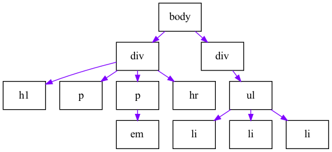
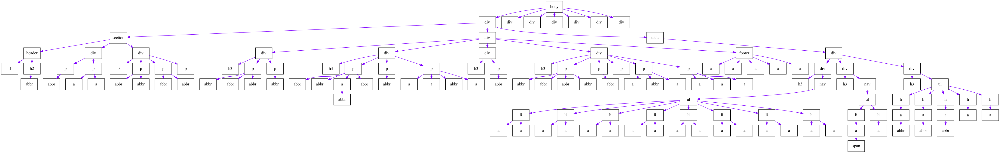

# COMP5322 HW1
COMP 5322 Internet Computing and Applications: Building the HTML DOM Tree

Each HTML document can actually be referred to as a DOM tree. We describe the elements in the tree like we would describe a family tree. It is important to understand the DOM tree because CSS selectors use the DOM tree. Here, we use the sample HTML document below to show you how to build the DOM tree:

```
<body>
    <div>
        <h1></h1>
        <p></p>
        <p><em></em></p>
        <hr>
    </div>
    <div>
        <ul>
            <li></li>
            <li></li>
            <li></li>
        </ul>
    </div>
</body>
```
A diagram of the above HTML document tree would look like this: 


Now, you are asked to create the DOM tree for the following html
1. Download the HTML from <a href='http://www.csszengarden.com/examples/index'>http://www.csszengarden.com/examples/index</a>
2. Draw the DOM tree for the <body> element of the HTML as the picture above. You can develop a program or use a DOM tree tool to draw the DOM tree. It is also okay to draw it manually. However, We strongly encourage you to develop your own program to analyse the HTML document and then outpu the DOM tree. The programming language is arbitrary, e.g., Python, Java, C++. Any text analysis library is allowed. 
3. Please submit your source code (if finished by programming) and the pdf of the DOM tree via Blackboard system. 
4. Regarding the workload, the results are marked as follows: 

| finished by | mark |
| -- | -- |
| Drawing by programming | <= 100 points |
| DDrawing manually | <= 85 points |
| Drawing by a DOM tool  | <= 70 points |
| Not submitted | 0 points |

# Installation

### Requires:
- Python (version 3.8, 3.9, or 3.10)
- Graphviz (version 2.42 or later)
- C/C++ Compiler

Please following the pygraphviz to install the Graphviz
<a href='https://pygraphviz.github.io/documentation/stable/install.html'>https://pygraphviz.github.io/documentation/stable/install.html</a>

# Usage

```
usage: dom.py [-h] -html HTML [-output OUTPUT]

Draw the DOM tree for the <body> element of the HTML

optional arguments:
  -h, --help      show this help message and exit
  -html HTML      html file path
  -output OUTPUT  Path of file (optional)

Example: python dom.py -html test.html
```

Output:
```
body
  -> div
    -> h1
    -> p
    -> p
      -> em
    -> hr
  -> div
    -> ul
      -> li
      -> li
      -> li
/Users/jerrykwok/dev/polyu/comp5322/hw1/6ca21cbf.png saved
```
0eefd8e3.png


Output of index.html from http://www.csszengarden.com
