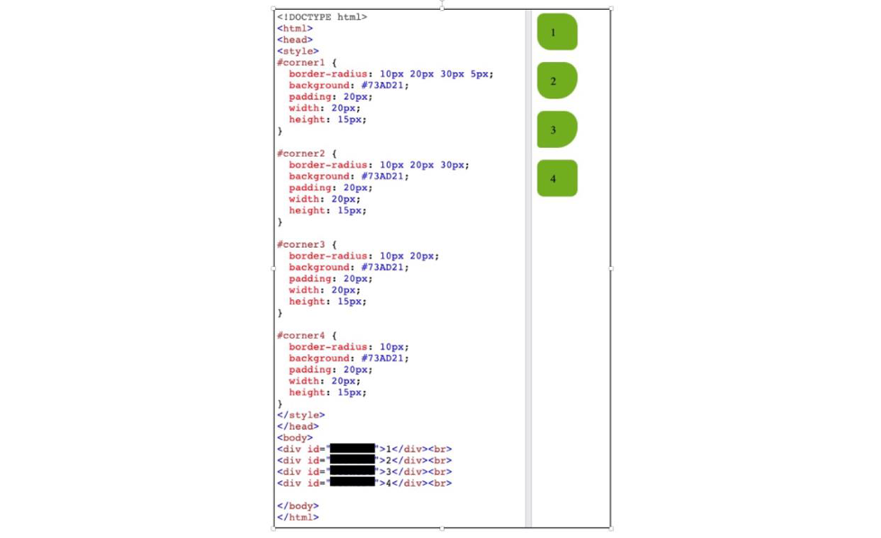
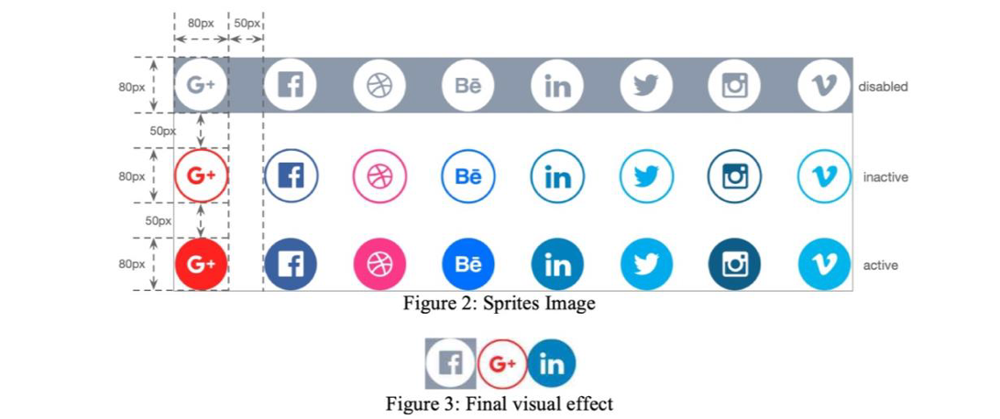

## COMP5322 In-Class Quiz2 (20 minutes)

1. What is the CSS box model? (15 marks)
2. Which of the following is the correct order of the IDs regardingthe four divisions shown on the right? (15marks)
```
(a) #corner1, #corner2, #corner3, #corner4
(b) #corner2, #corner3, #corner4, #corner1
(c) #corner4, #corner3, #corner2, #corner1
(d) #corner3, #corner2, #corner1, #corner4
```


3. Which of the following statements is TRUE about the media query below? (15 marks)
```css
@media screen and (min-width: 600px){
    div.#example {
        display: none;
    }
}
```
```
(a) The div element becomes invisible but does not affect the layout when the screen width is 600 pixels or more.

(b) The div element becomes invisible but does not affect the layout when the screen width is 600 pixels or less.

(c) Both the div element and its CSS box disappear from the page when the screen width is 600 pixels or less.

(d) Both the div element and its CSS box disappear from the page when the screen width is 600 pixels or more.
```

4. Consider the HTML snippet, what is the margin between \<h1\> and \<h2\>? (15 marks)
```
(a) 50px
(b) 70px
(c) 120px
(d) 20px
```

```html
<html>
<head>
    <style>
        h1 {
            margin: 0 0 50px 0;
        }
        h2 {
            margin: 70px 0 0 0;
        }
    </style>
</head>
<body>
    <h1>Heading 1</h1>
    <h2>Heading 2</h2>
</body>
</html>
```

5. A web page with many images takes a long time to load and generates multiple server requests. To reduce the number of server requests and save bandwidth, image sprites are used. An image sprite is a collection of images put into a single image. Figure 2 shows an image sprite (named "navsprite.png"). The sprite image contains 24 icons for 8 companies' logos in 3 states: "disabled" states (the first row), "inactive" states (the second row), and "active" states (the third row). The size of each icon is 80 pixels times 80 pixels. The size of horizontal or vertical separators between two adjacent icons is 50 pixels. Given the following HTML link snippets, please fill in the remaining CSS code to construct three link buttons, which are navigated to Facebook, Google, and Linkedin websites respectively. You are required to: 1) choose the most suitable icons for the three buttons; 2) use the "disabled" icon for Facebook, the "inactive" icon for Google, and the "active" icon for LinkedIn. Figure 3 shows the final visual effect. Notice that the gray borders of the image can be ignored. (40 marks)



```html
<!DOCTYPE html>
<html lang="en">
<head>
<style>
    #navlist {
        position: relative;
    }
    #navlist li {
        margin: 0;
        padding: 0;
        list-style: none;
        position: absolute;
        top: 0;
    }
    #navlist li, #navlist a {
        display: block;
    }
    /* You code here */
</style>
</head>
<body>
    <ul id="navlist">
        <li id="facebook"><a href="http://facebook.com"></a></li>
        <li id="google"><a href="http://google.com"></a></li>
        <li id="linkedin"><a href="http://linkedin.com"></a></li>
    </ul>
</body>
</html>
```