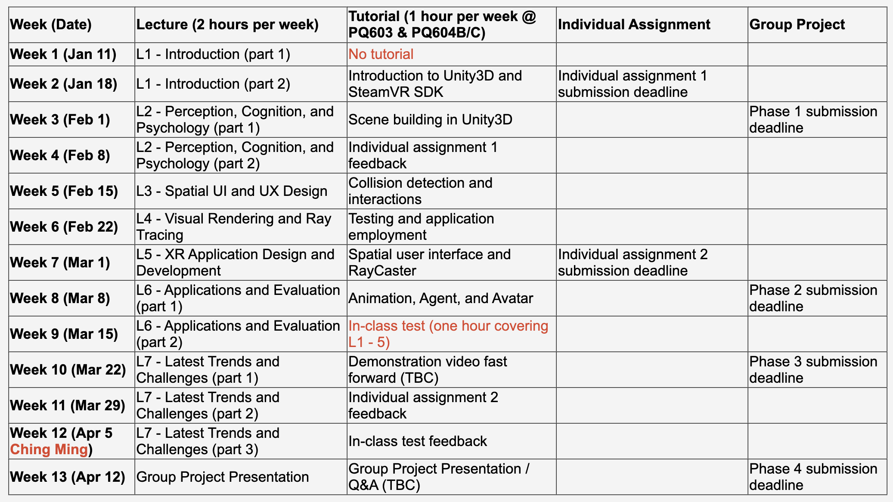

# COMP5424 Extended Reality
> Now, this course just offer to Msc in Metaverse Technology of students

Course Syllabus: [Click Here](https://www.polyu.edu.hk/comp/docdrive/tpg/subject/COMP5424.pdf)

I cannot share the project here because i did not have my groupmate agreement for public the project although many people not contribute the project. But I think I can share to you privatly for your self study. Also, the size of unity game project is too large. Github may not is a good tool for version control large object so we used the plastic scm for version control to finish the project.

