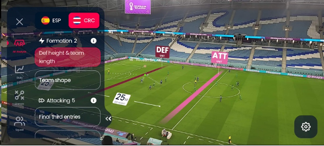
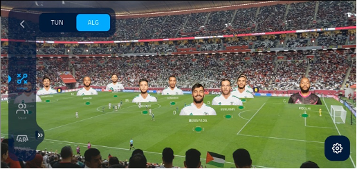

# COMP5424 Individual Assignment 1 

In this individual assignment, you need to answer five short answer questions using no more than 300 words per question.

## Q1. Use your own words to describe the differences and similarities between virtual reality, augmented reality, mixed reality, and extended reality.

Regarding the Virtual Reality, it will replace all the user fields of vision, and immersing in the virtual environment. It can provide realistic sounds, images and other senses to construct a real or imagined world via VR device. AR and VR are often confused which is the difference lies in the level of immersion. The AR enhances our vision of the real world by overlaying computer-generated. The common use case is display contextual information by processing images captured by the camera in real time via Application, It is applied in FIFA+ it shown at Figure 1. It can see the first perspective of the characters is still a real scene, and the virtual content is integrated into the real scene seen by the human eye through technical, such as the information of footballer, offside line, etc.  

<table>
<tr>
    <td></td>
    <td></td>
</tr>
<tr>
    <td colspan='2'>Figure 1, FIFA+ Stadium Experience(2022)</td>
</tr>
</table>

Moreover, about the Mixed Reality, the MR is between AR and VR. Compared with AR, it is realize that the virtual objects are directly displayed on images in the real world mainly. The MR is not make the virtual items appear in the real world as image, while integrate into the real world in a more realistic, vice versa. the users can see the real environment, and additional virtual objects are stacked, it emphasizes the mixture of reality and virtuality. 

Furthermore, as for the Extended Reality, it is a general term for a series of virtual reality interlaced fusion technologies, ranging from reality to virtual, blurring the Lines Between the Physical and Digital Worlds. Therefore, it means the XR including augmented reality (AR), virtual reality (VR), mixed reality (MR). Although all three "realities" share common functions and needs, it still has a different purpose and individual technical focus for each.

reference
```
FIFA+ stadium experience. (2022). Retrieved January 16, 2023, from https://www.fifa.com/fifaplus/en/articles/fan-experience-fifa-world-cup-qatar-2022 
```

## Q2. From the modern perspective of virtual reality, what is the most significant difference between presence and immersion? What is the relationship between presence and immersion?

In immersion of Virtual Reality, it utilize the visual effect, haptic feedback, sound effect, and other more to tricking the user feeling to let them is in elsewhere. To addressing this purpose, it needs to lead the brain of user cannot identity the difference between real and virtual. Besides, according to the Slater and Wilbur (1997), “an objective measure of the extent to the virtual environment presents” as a definition of immersion. In a nutshell, the immersion will focus on depicted and imagined environments.

In addition, the presence concentrate on user feeling and experiential in the virtual environment via interactions. The level to which the sense of presence resonates with users, will differ based on personality traits, social interactions with VR characters, etc.

I think there are not significant relationship between the presence and immersion, it is because the level of the presence is subjective depend on the different user with them background or experiences. For example, some user may like 90's game don't care about no 10.2 audio effect, high visual effect and so on. If the story or characters is really compelling, lead to you stay in there long time that your brain gets used to the graphics, and feel like real living in that world. On the other hand, if the user care the high sense of reality, it will improve the presence is to increase immersion such as Multi-sensory feedback, ray tracing, etc.

reference
```
Slater, M., & Wilbur, S. (1997). A framework for immersive virtual environments (FIVE): Speculations on the role of presence in virtual environments. Presence: Teleoperators & Virtual Environments, 6(6), 603-616. 
```

## Q3. Use your own words to describe how head-mounted displays (HMDs) work.

Generally, the HMDs including the monocular HMD, binocular HMD and optical head-mounted display(OHMD).

The classic HMD will contain one or two small display element in helmet. Some HMD using the LCD or OLED display is create the illusion of stereopsis which is presenting each eye with an almost identical but slightly offset version of the same image. But Most HMDs save on dual screen costs by using a single screen with a plastic divider. Then, viewed at a suitable distance through a special lens it will looks natural the virtual reality seamlessly replace the real world.

Also, most HMD is only can show computer-generated imagery (CGI) which means all the computing will locate at the host device such as Computer, Smart Phone, Server, and so on. Commonly the HMD will provide the HDMI input port and USB port to send the head tacking data. Also, some HMD will utilize the mirror to reflect the real world-view to the device and combine to the CGI to implement the AR or MR.

Besides, the HMD is applied in different industry such as military in F-35, Medicine in surgery, Game and so on. Therefore, the HMDs can work successful in different area.

Furthermore, as for the OHMD, it can divided two techniques to Waveguide and Curved Combiner, It will reflect the projected images and allows the user interact, it may qualifying for augmented reality (AR) technology. Well known the product is Google Glass.


## Q4. What is haptic rendering in the context of extended reality? What are the common challenges of haptic rendering? 

The physical system of the virtual environment through the simulating the Newton's law for tactile rendering, and the algorithm will calculates them in real time to control the devices , so as to present to the user various simulations of virtual phenomena, such as various virtual dynamic elements and their relationships such as collisions and synergies between them. For example, if need to simulate a handshake, the computer will determines the direction, magnitude, and location of the force your hand should feel when it interacts with another hand. The haptic rendering algorithms will combine all the information with characteristics of the haptic device, such as the properties of actuators, for send the control signal to device.

According to the Verschoor et al. (2020), haptic rendering and presentation can be divided into two categories roughly included tool-based and direct touch interactions. about the tool-based, it has dominated the research in haptic. It is utilize the mechanical resistance to let the user feel the texture. an possible device is glove nowadays. On the other hand, the second approach is using a variety of stimulation techniques to directly stimulate the skin to let the user feels.

Furthermore, Although Meta and other technology company is joined and support related area to support. The researchers solved many challenges in topic. According to the Srinivasan and Basdogan (1997), it still facing many challenges even the paper is published at 1997. Firstly, about the Haptic interfaces including the force reflecting interfaces, sophisticated tactile displays matching human perception. Secondly, regarding the Computer haptics, it need an efficient method to calculate Real-time tactile display matching human perception in accuracy and resolution. After that, VR is an immersive and interactive the medium fundamentally, but the Humans have a very limited understanding of human capabilities and limitations. Therefore, we need to know more about the human for design the device.

reference
```
Srinivasan, M. A., & Basdogan, C. (1997). Haptics in virtual environments: Taxonomy, research status, and challenges. Computers & Graphics, 21(4), 393-404.

Verschoor, M., Casas, D., & Otaduy, M. A. (2020). Tactile Rendering Based on Skin Stress Optimization. ACM Trans. Graph., 39(4). doi:10.1145/3386569.3392398
```