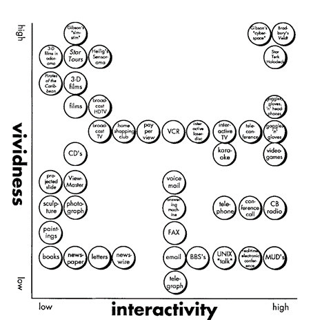
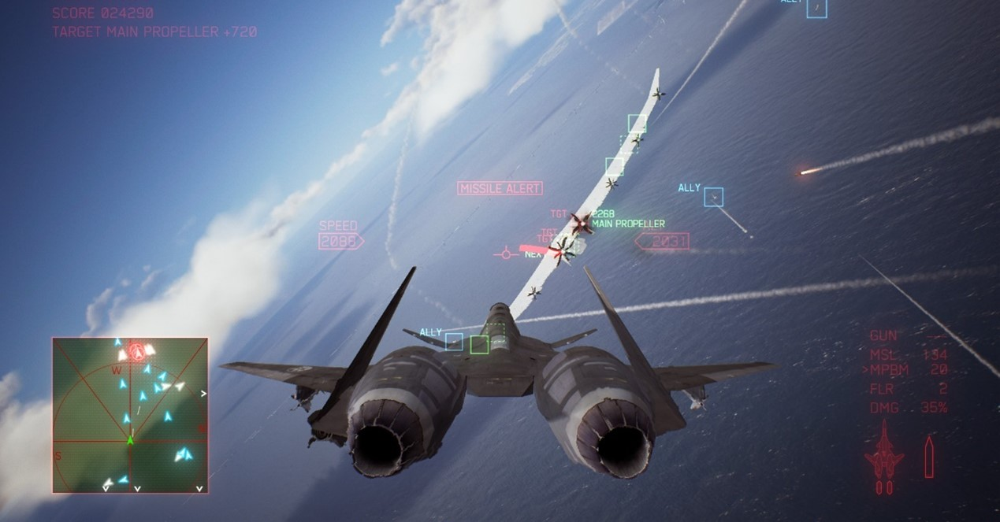
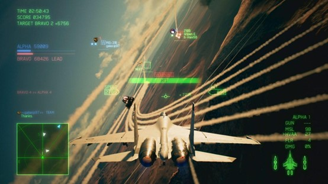
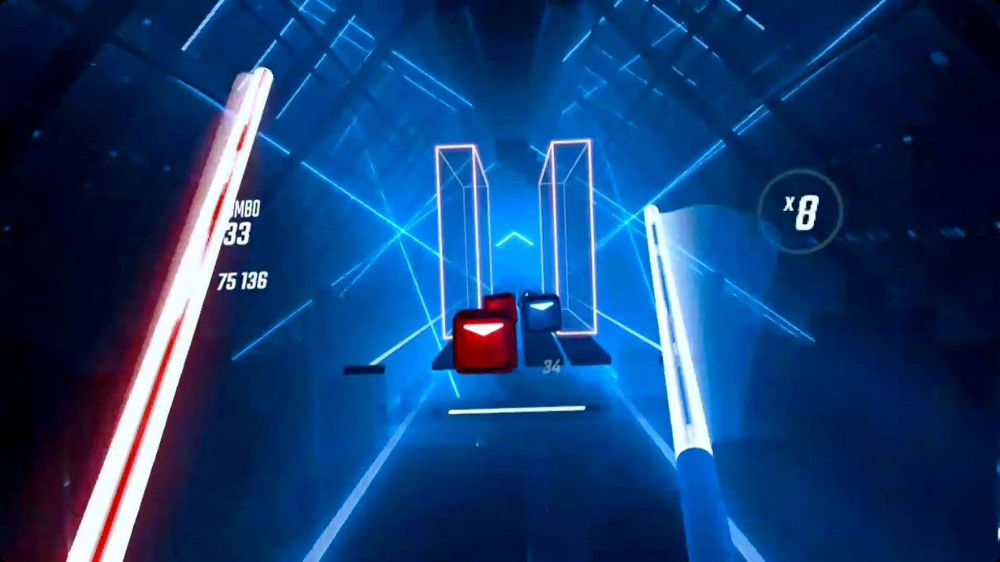
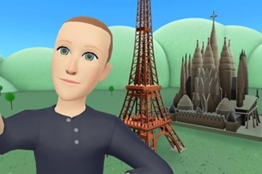
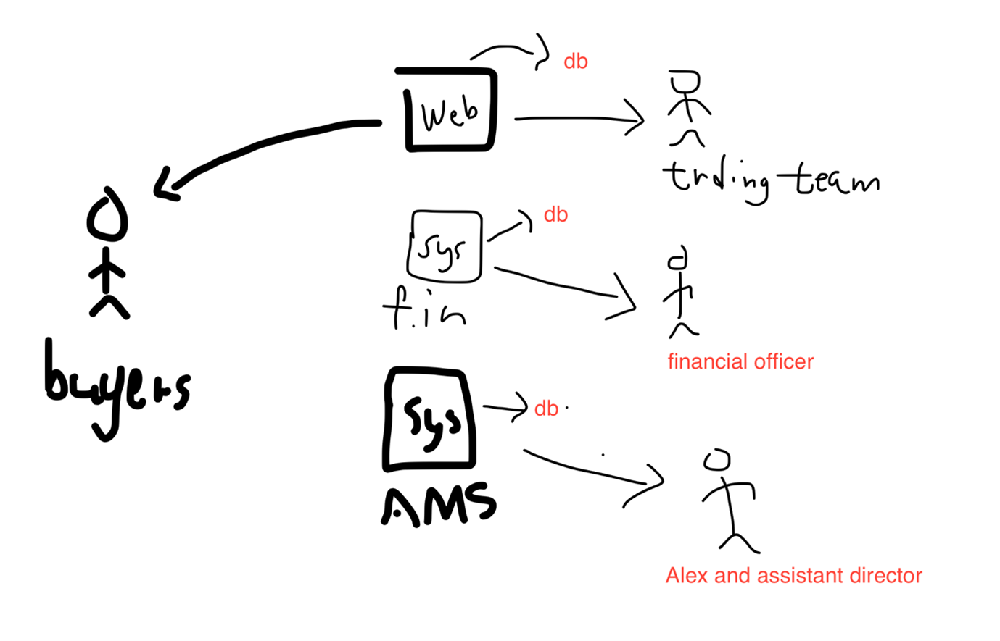

# COMP5424 Exam

## Section A – Basic Concepts of Extended Reality (25 points)
### Q1.	In the context of Extended Reality (XR) and XR research, which of the following statement(s) is(are) correct? Explain why you think other(s) is(are) incorrect. (5 points)

A.	Postural instability theory can be applied to explain motion sickness but not cybersickness.

B.	One of the shortcomings of photogrammetry is that the generated 3D geometries may be too complex to be used directly in XR applications even for today’s hardware.

C.	The sense of self-location under the umbrella of the sense of embodiment means the sense of being in a particular virtual world.

D.	An XR system that has the higher level of immersion can always provide its users higher level of presence.

E.	Foveated rendering is a rendering technique that reduces the image quality in the peripheral vision based on eye tracking to reduce the rendering workload.


### Q2.	In Steuer’s article “Defining Virtual Reality: Dimensions Determining Telepresence” published in 1992 (https://doi.org/10.1111/j.1460-2466.1992.tb00812.x), the author included a figure showing various media technologies classified by vividness and interactivity (see the figure below). Based on this figure, answer (a), (b), and (c). (10 points)



#### (a)	What do vividness and interactivity mean in this figure and in the context of virtual reality (VR)? (2 point)

#### (b)	Use your own word to describe what this figure means, given the aim of this article is to define VR. (4 points)

#### (c)	Steuer’s article is published in 1992. Interestingly, the science fiction “Snow Crash”, in which the term “Metaverse” is first coined, is also published in 1992. From today’s point of view, where should Metaverse be placed on this two-dimensional plane with vividness as the vertical axis and interactivity as the horizontal axis? Why? (4 points) 

### Q3.	Redirected walking is a locomotion technique that enables users to explore a virtual world that is considerably larger than the motion tracked physical space by redirecting users through manipulating the displayed scene. Watch this demonstration video (https://youtu.be/qyWLkedJtjw) of a redirected walking technique and answer (a) and (b) based on the information covered in the video. (10 points)

#### (a)	What are the specific designs that the researchers used to enable redirected walking in the virtual world as shown in the video? (5 points)

#### (b)	Describe a scenario in which this redirected walking technique will not work and explain why you think it will not work. (5 points)

## Section B – Perception and Psychology of Extended Reality (25 points)
### Q4.	Watch this video (https://youtu.be/ybyib5pAq7Y) made by Vox which explains virtual reality (VR) to laymen and answer (a), (b), and (c). (15 points)

#### (a)	Starting from 2:45 in the video, the narrator introduces the second most important way VR tricks our brain. Based on what you have learned during the lectures, use a theory to summarise this “second most important way” and explain why you think so. (5 points)

#### (b)	Starting from 4:55, the narrator introduces a few exemplary applications of VR other than gaming or entertainment. One particular application is called “SnowWorld”, which can help reduce pain for burn patients. Based on what you have learned during the lecture and what has been covered in the video, propose an underlying mechanism that supports the VR application’s effects on reducing pain for burn patients. (5 points)

#### (c)	Beside the information covered in the video, if you are asked to explain VR to laymen, what else information or concepts you would like to include that are very essential to VR and VR experience? (5 points)

### Q5.	Refik Anadol is a Turkish-American new media artist and designer. His projects consist of data-driven machine learning algorithms that create abstract, dream-like environments. Melting Memories is a data sculpture Anadol created. The detailed information about this artwork can be found at the artwork’s webpage (https://refikanadol.com/works/melting-memories/). The displays used for this data sculpture are not stereoscopic displays, but still viewers can have a very strong sense of “3D” when standing in the right front of the display wall. From the perspective of human sensation and perception, explain why such experience can be delivered and what tricks the artist used to deliver such experience. (10 point)

## Section C – The Design and Development Process of Extended Reality Applications (25 points) 

**BACKGROUND** – Alex is a collector of installation artworks and runs a gallery. Many of his clients buy installation artworks from him but without physically taking the artworks away due to the nature of installation artworks, the cost of shipping, and the high insurance costs. Instead, the collectors often directly consign the artworks to Alex, and Alex will find new buyers via his gallery to make money by charging his clients consignment fees. Currently, Alex’s businesses are supported by three IT systems, including a financial system, an artwork management system that records information related to the gallery’s collections, and a website of the gallery. Specifically, the financial system is only used by the financial officer and his team. The artwork management system is used by Alex and his two assistant directors, who look after the collections, curations, exhibitions, and events of the gallery. The website of the gallery is managed by the trading team, of which the staff use the website to reach oversea clients.

### Q6.	Read the background information about Alex and his businesses and draw a cooperation picture to model how the three IT systems support Alex’s businesses at the moment. You may make some reasonable assumptions, but you need to list them clearly in your answer. (5 points)

### Q7.	The manager of the trading team, Barbra, recently found the virtual reality (VR) and Metaverse technologies quite amazing. She wants to create a virtual replication of the gallery in the Metaverse to better reach potential clients, especially oversea clients. Use what you have learned during the lectures about the pros of VR and Metaverse technologies to help Barbra pitch the idea to Alex. (5 points)

### Q8.	Barbra’s idea pitching was very successful, and Alex decided to proceed with the idea of having a virtual replication of the gallery in the Metaverse. After some careful planning and surveying, Alex contracted a local studio led by COMP graduate Catherine to develop a prototype of the virtual gallery. Catherine’s team did a very good job and completed the prototype within one month. She then invited Alex and Barbra to her studio to experience the prototype. Alex and Barbra both used the Oculus Quest 2 VR headset to access the virtual gallery via customised avatars in two different rooms. In the virtual gallery, they “met” each other’s avatar and felt very excited about the experience. They then followed the well-designed in-VR help to learn how to navigate in the virtual gallery and started exploring the space using teleportation. Soon, Alex raised his concern that Barbra’s teleportation in the Metaverse caused some confusion to him. On earth, natural interaction between multiple users in the Metaverse relies on each other’s awareness of the current position of the interaction partners. This, however, cannot be warranted when users employ noncontinuous locomotion techniques, such as teleportation. Given the background and the information above, answer (a), (b), and (c). (15 points)

#### (a)	Compare the pros and cons of teleportation and artificial locomotion. (4 points)

#### (b)	Can you propose a modification to the conventional teleportation technique to address Alex’s concern? (5 points) 

#### (c)	Design a user study to verify whether the modification proposed by you can address Alex’s concern. (6 points).


## Section D – Computer Graphics and Visual Rendering (25 points) 
### Q9.	Arcade-style combat flight simulation video game is one of the killer applications in VR. Answer (a), (b), and (c). (15 points)

`Ace Combat 7: Skies Unknown`



#### (a)	What is Gimbal Lock? Why orientations of virtual camera using Euler angles will suffer from Gimbal Lock in Ace Combat 7? (5 points)

#### (b)	If quaternion is used, describe the steps involved when a jetfighter P(x, y, z) is rotated through an angle  about an axis. (5 points)

#### (c)	Apply the steps and formulas you have described in (b), illustrate how the jetfighter P is rotated 90 degree about the y-axis, i.e., from P(0,1,1) to P’(1,1,0). (5 points)


### Q10.	Beat Saber is another killer application in VR. We can enjoy this game in both HTC Vive and Oculus Quest 2. Answer (a) and (b). (10 points)

`Beat Saber`


#### (a)	HTC Vive and Oculus Quest 2 are using two different positional tracking methods. Describe the difference between these two methods. (5 points)

#### (b)	Consider about the accuracy, which on is more suitable for Beat Saber. (5 points)


## My Answer
## Q1

Option A, motion sickness and cybersickness can be explained in Postural instability theory. Based on the theory, that both types of sickness are caused by a sensory conflict between visual and vestibular systems lead to postural instability.

Option C, self-location may refers to the feeling of being located in the virtual world but , the sense of embodiment encompasses a broader range of aspects like agency, ownership, even self-location in virtual environment.

Option D, This statement is incorrect because a higher level of immersion does not necessarily guarantee a higher level of presence. For example, different people will feel different based on their experience, and other subjective experience.


## Q2
### Q2a
In the context of virtual reality (VR) and Figure 3, vividness and interactivity are two key dimensions that determine the quality and effectiveness of a virtual environment.

Vividness refers to the richness and sensory detail of a virtual environment. It is a measure of how closely the virtual environment can replicate the range of sensory experiences found in the real world. For example: visual, auditory, tactile, and other sensory information.

Interactivity refers to the extent to which users can interact with the virtual environment and with each other within that environment. It may contains responsiveness of the system to user inputs, the range of possible actions users can take, etc.

### Q2b
The figure is a classification of various media technologies based on their levels of vividness and interactivity, which are crucial dimensions in defining virtual reality (VR) experiences. In addition, the x-axis represents interactivity, which refers to the degree to which users can engage with and influence the virtual environment or interact with other users within that environment. The y-axis represents vividness, which is a measure of how rich and detailed the sensory information in the virtual environment.

Therefore, I think the figure aim to visually organizes different media technologies based on their performance on of vividness and interactivity. This classification may help to better understand the relationships and overall effectiveness of VR environments.


### Q2c
Based on figure, I believe the Metaverse would likely be placed in the upper-right quadrant of Steuer's two-dimensional plane but under than the cluster of star trek holodeck etc media works because the nowadays the Vividness level just like a simple vector graphic (figure 1 shown) and also just provide limited haptic feedback. Also, the Interactivity level may close but it can present the amount of large data like real world such as “Micro Expression”.




## Q3
### Q3a
1.	Translation gains scale the user's velocity, leading to a slow pace and smaller steps. This allows for higher curvature gains, which in turn results in a smaller radius of the circle the user walks on.
2.	The head of the user is used as an input device to allow virtual direction changes without actually turning the body. This ensures the user always remains on the optimal path around the center of the tracking space.

### Q3b
A scenario in which the redirected walking technique might not work is when the user is in a highly cluttered or confined space with numerous obstacles. Moreover, if the user movements are erratic, systme may struggle to keep the user on the optimal path.

## Q4
### Q4a
The second most important way VR tricks our brain, as introduced by the narrator, is through head tracking. This technique allows a person in VR to look and move around a virtual world in the same way they would in the real world. Therefore, our brains trust our sense of sight to a large extent, with research showing that approximately 80% of the information we perceive from our environment is based on vision. When the visual cues provided by head tracking match our physical movements, our brain is more likely to accept the virtual environment as real, leading to increased presence and immersion.

### Q4b
I believe focus on the concept of "immersive distraction" This method leverages the immersive nature of VR to divert patients' attention away from their pain by engaging them in a different environment. When burn patients are immersed in the snowy world of the VR application. the brain has limited resources for processing sensory information. their brains become occupied with the sensory input provided by the virtual environment. These cues compete with the pain signals from the burn site for the brain's attention, trying to reduce the perceived intensity of the pain.

### Q4c
I think Presence, which is the feeling of "being there" in a virtual environment. This sensation is crucial for creating an immersive VR experience. How can “being there” ? using realistic visuals, audio, and haptic feedback, etc.

Also, Haptic feedback through the handheld controllers, users can feel vibrations, force, and resistance that mimic real-world interactions with objects in the virtual environment.

Furthermore, applications and potential such as gaming, educational, therapeutic, etc.


## Q5
Lighting and shadows to showing the Layering. light projections contributes to the perception of depth by casting shadows and highlights on different layers of the artwork. This interplay of light and shadow can create an illusion of volume and spatial relationships between the elements. At the same time, By arranging these layers in a way that suggests spatial relationships, the artist can evoke a feeling of three-dimensionality. Moreover, the work is contains Movement/ animation. when the elements of artwork move, they can provide visual cues that help the viewer's brain perceive the space as three-dimensional.

## Q6
*AMS = artwork management system*

*FIN = financial system*



## Q7
we can pitch the idea of creating a virtual replication of the gallery in the Metaverse to Alex by highlighting the following pros of VR and Metaverse technologies.

VR and Metaverse technologies provide an immersive and interactive experience for users, allowing them to feel as if they are physically present in the gallery. This can make exploring the artworks more engaging and memorable. Also, A virtual gallery in the Metaverse will allow potential clients from all around the world to visit and explore the collection without the need for physical travel. It can increase the gallery's exposure and reach. As the same time, extends the business not only focus on the  gallery. It can be virtual media such as work of Q5.


## Q8
### Q8a
**Teleportation**

Pros:
1.	it allows user to quickly navigate through the virtual environment, saving time and increasing efficiency. And more accessible to users with physical limitations
2.	Less physical space is needed

Cons:
1.	It may  break immersive than natural walking.
2.	It may challenging for users to maintain awareness of their position and orientation after teleporting.

**Artificial Locomotion**

Pros:
1.	It may better awareness of their position and orientation in the virtual environment, making navigation easier.

Cons:
1.	It may need more physical effort than teleportation, which could be tiring or challenging for some users.
2.	Slower navigation
3.	Medium/ Large physical space is needed

### Q8b
Add a visual or auditory cue that indicates. For example: we can create a virtual point to point out the location will be teleport, accompanied by a sound effect

### Q8c
We can invite some diverse group of participants with varying levels of experience with XR to verify the effectiveness of the proposed modification. preare the questionnaire for the player finished the game. Teach participants how to use the VR system and the modified teleportation technique, ensuring they understand the visual and auditory cues before the game. Also, create some task for player finish in game. At the same time, I think need to divide participants into two groups. One group will use the conventional teleportation technique while the other will use the modified teleportation technique with the visual and auditory cues. After completing the task, have participants fill out a post-study questionnaire assessing their experience with the locomotion technique, including their perceptions of immersion, ease of use, and social interaction. Finally, we need to analysis the result of post-study questionnaire. 


## Q9
### Q9a
When two of the three gimbals in a three-dimensional mechanism align their axes, it results in the loss of one degree of freedom, which as Gimbal lock. It is because The Euler angle method for defining the orientation of a virtual camera uses a series of rotations around its own x, y, and z axes.

### Q9b
1. Convert the rotation axis and angle: Given a rotation axis represented by a unit vector u (x, y,z) and a rotation angle θ, we can convert this to a quaternion q as follows:
q = [cos(θ/2), u_x * sin(θ/2), u_y * sin(θ/2), u_z * sin(θ/2)]

2.  convert the point P(x, y, z) to represent the point P as a quaternion, we simply set the real part to 0

3. Calculate the conjugate of the rotation quaternion
4. To rotate the point quaternion p by the rotation quaternion q, we multiply the quaternions
5. Extract the rotated point P' from the result


### Q9c
```math
\begin{matrix} \cos(\alpha) & 0 & \sin(\alpha) \\ 0 & 1 & 0 \\  -\sin(\alpha) & 0 & \cos(\alpha) \end{matrix}
```

For a 90-degree (π/2 radians) rotation
```math
\begin{matrix}
0 & 0 & 1 \\
0 & 1 & 0 \\
-1 & 0 & 0
\end{matrix} \times \begin{matrix}
0 \\
1 \\
1
\end{matrix} = \begin{matrix}
1 \\
1 \\
0
\end{matrix}
```

## Q10
### Q10a
HTC Vive uses a method called Lighthouse tracking, which involves setting up base stations that emit infrared light to track the position of the headset and controllers

Reference:https://pcper.com/2016/04/steamvr-htc-vive-in-depth-lighthouse-tracking-system-dissected-and-explored/2/

Oculus Quest 2 uses a method called Inside-Out tracking, where cameras on the headset track the position of the controllers and the environment to determine the position of the headset.

https://www.meta.com/help/quest/articles/headsets-and-accessories/using-your-headset/turn-off-tracking/


### Q10b
I think Lighthouse tracking used by HTC Vive will more suitable because the Inside-Out tracking does not require any external setup and is more convenient, but it may not be as accurate in some situations, such as when the controllers are occluded from the headset's cameras. About the game Beat Saber contains massive movement it may occluded the tracking camera.