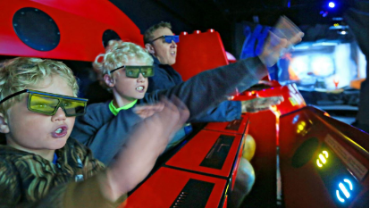
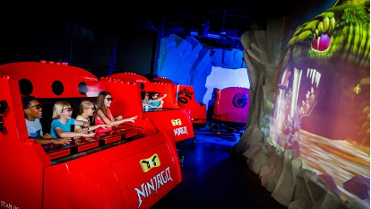
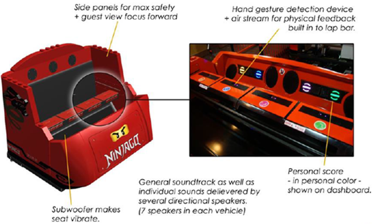

# In-class Test (10%)

You have **45 minutes** to complete the test.

This is an **open-book test**.

This test has **FOUR questions** and you need to answer **all of them**.

Q1 is a multiple answer questions (i.e., there might be more than one correct answer to the question). Besides selecting the correct answers, you are also required to write elaborations to your answers. Q2 consists of two questions. You need to watch a demonstration video of Sparse Haptic Proxy before answering these two questions. Q3 consists of two questions. For Q3b, you may use pseudocode to provide your implementation. Q4 consists of three questions. You need to read the given case of LEGO NINJAGO The Ride before answering these three questions. 

## Q1.

**In the context of extended reality (XR), which of the following statement(s) is(are) correct? (2 points)**

A.	The sense of being there in the virtual world can be called the sense of presence. The sense of presence describes a subjective experience.

B.	An XR system that has the higher level of immersion can always provide its users higher level of presence.

C.	The levels of immersion of two XR systems are always comparable. For example, a 6-DoF head-mounted display (HMD) always has a higher level of immersion than a Cave Automatic Virtual Environment (CAVE).

D.	Perception means how sensory information is detected by human sensory receptors.

E.	Perceptual illusions originate from the process of organizing, interpreting, and experiencing of sensory information in human brain.

F.	Perceptual adaptation refers to the process of getting used to certain sensory stimulation after being exposed for a while.

G.	The sense of self-location under the umbrella of the sense of embodiment means the sense of being in a particular virtual world.

H.	Cybersickness can be explained through the sensory conflict theory. But motion sickness cannot be fully explained through the sensory conflict theory.

```
(Use no more than 200 words to elaborate your answer by pointing out the problem(s) in the incorrect statement(s))
```

## Q2. 

Haptic Retargeting allows the use of a single physical prop provide passive haptics for multiple virtual objects by hacking human perception. A demo video can be seen on [YouTube](https://www.youtube.com/watch?v=v-5u0z4zA_8). Sparse Haptic Proxy is another way of simulating touch feedback by hacking human perception. Watch the demo video of Sparse Haptic Proxy on [YouTube](https://www.youtube.com/watch?v=0XBe-EBrQpc) and answer the followings questions.

a.	The rubber hand illusion is a perceptual illusion. How does the rubber hand illusion contribute to the design of Sparse Haptic Proxy theoretically? (1 point)

```
(Type your answer to Q2a below)
(Use no more than 100 words)
```

b. In the video, the authors mentioned that “we predict the target the user intends to touch using an eye-tracking head-mounted display to track the user’s gaze”. Please explain why this prediction is necessary for realising Sparse Haptic Proxy. (1 point)

```
(Type your answer to Q2b below)
(Use no more than 100 words)
```

## Q3.

Q3.	The pseudocode of Floyd-Steinberg dithering algorithm is shown below to assist you answer two sub-questions of Q3.

```
for each y from top to bottom do
    for each x from left to right do
        oldpixel := pixels[x][y]
        newpixel := find_closest_palette_color(oldpixel)
        pixels[x][y] := newpixel
        quant_error := oldpixel – newpixel
        pixels[x + 1][y ] := pixels[x + 1][y ] + quant_error × 7 / 16
        pixels[x - 1][y + 1] := pixels[x - 1][y + 1] + quant_error × 3 / 16
        pixels[x ][y + 1] := pixels[x ][y + 1] + quant_error × 5 / 16
        pixels[x + 1][y + 1] := pixels[x + 1][y + 1] + quant_error × 1 / 16 

```

a. What is the objective of Floyd-Steinberg dithering algorithm? (1 point)

```
(Type your answer to Q3a below)
(Use no more than 100 words)
```

b. In Line 4, a function find_closest_palette_color(oldpixel) was called. Please provide your simple implementation of this function given the following assumptions. (2 points)
- Colours are represented using 16 bits RGB scheme internally (i.e., 6 bits for red, 6 bits for green, and 4 bits for blue).
- The target RGB display is an 8-bit display, which uses 3 bits for red, 3 bits for green, and 2 bits for blue.

```
(Type your answer to Q3b below)
(You may use pseudocode)
```

## Q4. Read the given case of LEGO NINJAGO The Ride and answer two sub-questions of Q4.


Case (LEGO NINJAGO The Ride)

LEGO NINJAGO The Ride is a 4D interactive family ride in the Legoland Theme park. It is manufactured by Triotech, a world leader in media based interactive attractions, and features cutting-edge technology that enables guests to control the outcome of their adventure through the power of their hand gestures. Through 3D imagery, high-tech sensors and the use of hand movements in a striking motion, up to four riders per car, representing the four main NINJAGO characters, can blast animated fireballs, lightning, shockwaves and ice as they travel through dojos to master their skills before heading into battle. Riders collect points for their training and battle efforts throughout the ride and scores are displayed when their quest is completed. 4D effects such as heat, smoke, and wind are also incorporated throughout the adventure, giving guests the ultimate interactive experience.

There is 3D image projection throughout the ride (39 projectors in all) requiring the users to ear 3D glasses. The tech enables riders to virtually throw fire balls, shock waves, ice, and lightning and the tech will also adapt to each user’s playing style. Players are scored according to their performance, and this is displayed directly in front of them. The week’s best, season’s best and all-time best scores are logged on monitors at the end of the ride. The cars travel through several training rooms, and players get physical feedback by way of air streams from the ride cars (above) as well as seat rumbles from a subwoofer. There are seven speakers in each vehicle.

Children under six years of age or 1.3m must ride with a responsible person of age 14 or older or 1.3m or taller and to ensure the child’s safety.

<table>
<tr>
    <td></td>
    <td></td>
</tr>
<tr>
    <td colspan='2'>Figure 1. Screen Capture of LEGO NINJAGO The Ride</td>
</tr>
</table>

<table>
<tr>
    <td></td>
</tr>
<tr>
    <td>Figure 2. Technological Insight of LEGO NINJAGO The Ride
</td>
</tr>
</table>

Reference. 

https://www.legoland.com/california/about-us/press/press-room/legoland-california-resort-and-triotech-present-maestro-hand-gesture-technology-at-iaapa-expo-in-orlando-for-the-new-lego-ninjago-the-ride-opening-2016/ 

https://www.t3.com/features/lego-ninjago-the-ride-comes-to-legoland-windsor-complete-with-hand-gesture-tech


a. 3D glasses and projectors are used in LEGO NINJAGO The Ride. Explain the technology of stereoscopy image that adopts in LEGO NINJAGO The Ride. (1.5 point)

```
(Type your answer to Q4a below)
(Use no more than 200 words)
```

b. What is the DoF of LEGO NINJAGO The Ride? (0.5 point)
```
(Type your answer to Q4b below)
(You can only use a number to answer this question, e.g., 9)
```

c. Suppose LEGO NINJAGO The Ride will be porting to Oculus/Meta Quest 2. Explain how Oculus/Meta Quest 2 can represent a 6-DoF to the user without additional Camera. (1 points)
```
(Type your answer to Q4c below)
(Use no more than 100 words)
```