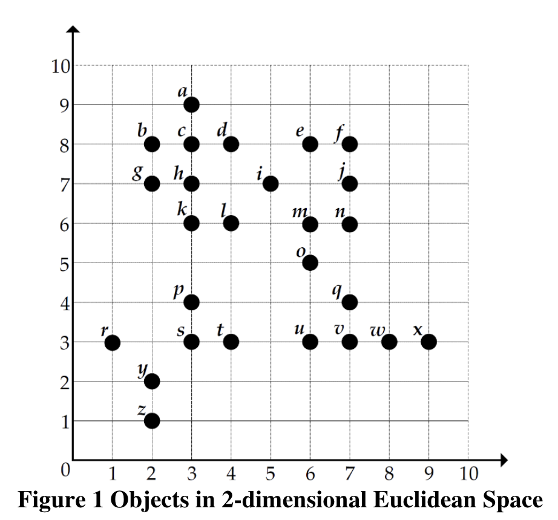
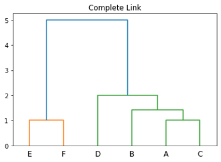

# COMP4534 Assignment 1
## Question 1 (25/100)
Given the following three documents, doc1, doc2, and doc3,conduct feature extraction based on TF-IDF definedbelowto get the feature vector of each document, and thenuse cosine similarity tofind the most similar documents to doc3 (except doc3 itself).Please show all calculation details.Keep numerical valuesin 3 decimal places.

**Definitions**: Let 𝑓𝑡,𝑑be the count of occurrence of term 𝑡in document 𝑑, and theTF (Term Frequency) of $t$ in $d$ is calculated as $0.5+0.5\times \frac{f_{t,d}}{\max_{\forall t'\in d}f_{t',d}}$. Assume that term $t$ exists in $n_t$ of all $N$ documents, and then its IDF (Inverse Document Frequency) is calculated as $\log_2(\frac{N}{1+n_t})+1$

```
doc1={stock, investment, bull, revenue, stock}
doc2={market, value, bull, revenue}
doc3={stock, bull, value, value}
```

## Question 2 (25/100)

Figure 1shows a collection of objects in a 2-dimensional Euclidean space (i.e., the distance between objects isEuclidean distance).

(a) Calculate the centroid of objects $r, p, s, t, y, z$. Keep values in 3 decimal places

(b) Calculate the centroid of object $o, q,u,v,w,x$.Keep values in 3 decimal places.

(c) Apply agglomerative hierarchical clustering over objects $a,b,c,d,e,f$, th this 2-dimensional Euclidean space, by using complete-link distancebetween clusters.Break tie arbitrarily. In the end, drawthe dendrogram.Keep values in 3 decimal places.Show all calculation details



## Question 3 (25/100)

Let the support of an itemset be the fraction of transactions that contain the itemset. Find all association rules using the *Apriori* algorithm with minimum support 0.4 and minimum confidence 70% on the transaction log below.Show your steps to find the rules.

| Transaction ID | Items in the Transaction |
| -- | -- |
| 1 | Apple, Banana, Strawberry |
| 2 | Passion fruit, Pineapple   |
| 3 | Orange |
| 4 | Apple, Passion fruit, Pineappl |
| 5 | Apple, Banana, Passion fruit, Pineapple |

## Question 4 (25/100)

Table 1 shows 8 stocks with three attributes: market value, business sector, annual report released or not. Each stock has a class label about rise or fall in a year. We have two testing stocks: Stock 09 has attribute values \<Medium, Tech, No\>, and stock 10 has attribute values \<Low, Medicine, No\>

(a) Please use Table 1 as training data to apply Naïve Bayes classifierto predict the class labels of stocks 09 and 10. Keep values in 3 decimal places.Showall calculation details.

(b) Can we *directly* apply kNN classification over Table 1to classify stock 09 and 10? If yes, please explain how. If no, please explain whyand come up with a reasonable way to preprocess the data so that kNN classification can be applied.

Table 1Training Data of Stocks

| StockID | Attribute 1 Market Value | Attribute 2 Business Sector | Attribute 3 Annual Report Released | Class Label |
| -- | -- | -- | -- | -- |
| 01 | Low | Medicine | Yes | Rise |
| 02 | High | Tech | Yes | Fall |
| 03 | Medium | Media | No | Rise |
| 04 | Low | Medicine | Yes | Rise |
| 05 | Medium | Medicine | No | Fall |
| 06 | Low | Tech | No | Fall |
| 07 | High | Media | Yes | Fall |
| 08 | Medium | Tech | Yes | Rise |

## Answer

### Q1

Frequency:
|  | stock | investmnet | bull | revenue | value | market |
| -- | -- | -- | -- | -- | -- | -- |
| Doc1 | 2 | 1 | 1 | 1 | 0 | 0 |
| Doc2 | 0 | 0 | 1 | 1 | 1 | 1 |
| Doc3 | 1 | 0 | 1 | 0 | 2 | 0 |

TF:
|  | stock | investment | bull | revenue | value | market |
| -- | -- | -- | -- | -- | -- | -- |
| Doc1 | 1 | 0.75 | 0.75 | 0.75 | 0.5 | 0.5 |
| Doc2 | 0.5 | 0.5 | 1 | 1 | 1 | 1 |
| Doc3 | 0.75 | 0.5 | 0.75 | 0.5 | 1 | 0.5 |

$IDF(stock)=\log_2(\frac{3}{2+1})+1=1$

$IDF(invest)=\log_2(\frac{3}{1+1})+1=1.585$

$IDF(bull)=\log_2(\frac{3}{3+1})+1=0.585$

$IDF(revenue)=\log_2(\frac{3}{2+1})+1=1$

$IDF(value)=\log_2(\frac{3}{2+1})+1=1$

$IDF(value)=\log_2(\frac{3}{1+1})+1=1.585$

TF-IDF:
|  | stock | investment | bull | revenue | value | market |
| -- | -- | -- | -- | -- | -- | -- |
| Doc1 | 1 | 1.189 | 0.439 | 0.75 | 0.5 | 0.793 |
| Doc2 | 0.5 | 0.793 | 0.585 | 1 | 1 | 1.585 |
| Doc3 | 0.75 | 0.793 | 0.439 | 0.5 | 1 | 0.793 |

$CosSim(doc1, doc3)=\frac{0.75+1.189\times 0.793+0.439^2+0.75\times 0.5+0.5+0.793^2}{(\sqrt{1+1.189^2+0.439^2+0.75^2+0.25+0.793^2})(\sqrt{0.75^2+0.793^2+0.439^2+0.25+1+0.793^2})}=0.933$

$CosSim(doc2, doc3)=\frac{0.75*0.5+0.793^2+0.493\times 0.585+0.5+1+0.793\times 1.585}{(\sqrt{0.25+0.793^2+0.585^2+1+1+1.585^2})(\sqrt{0.75^2+0.793^2+0.439^2+0.25+1+0.793^2})}=0.929$

$\because$ CosSim(doc1, doc3)> CosSim(doc2, doc3)

$\therefore$ doc1 is more similar to doc3

### Q2

(a)

r :(1,3) p :(3,4) s: (3,3) t: (4,3) y: (2,2) z: (2,1)

$c_1=(\frac{1+3+3+4+2+2}{6},\frac{3+4+3+3+2+1}{6}) \approx  (2.5, 2.667)$

(b)

o :(6,5) q:(7,4) u:(6,3) v:(7,3) w:(8,3) x:(9,3)
$c_2=(\frac{6+7+6+7+8+9}{6},\frac{5+4+3+3+3+3}{6}) \approx (7.167, 3.5)$

(c)
C1=a :(3,9) C2=b :(2,8) C3=c :(3,8) C4=d :(4,8) C5=e :(6,8) C6=f :(7,8)

<table>
    <tr>
        <td>Cluster</td>
        <td>C1</td>
        <td>C2</td>
        <td>C3</td>
        <td>C4</td>
        <td>C5</td>
        <td>C6</td>
    </tr>
    <tr>
        <td>C1</td>
        <td>0.000</td>
        <td>1.414</td>
        <td>1</td>
        <td>1.414</td>
        <td>3.162</td>
        <td>4.123</td>
    </tr>
    <tr>
        <td>C2</td>
        <td></td>
        <td>0.000</td>
        <td>1</td>
        <td>2</td>
        <td>4</td>
        <td>5</td>
    </tr>
    <tr>
        <td>C3</td>
        <td></td>
        <td></td>
        <td>0.000</td>
        <td>1</td>
        <td>3</td>
        <td>4</td>
    </tr>
    <tr>
        <td>C4</td>
        <td></td>
        <td></td>
        <td></td>
        <td>0.000</td>
        <td>2</td>
        <td>3</td>
    </tr>
    <tr>
        <td>C5</td>
        <td></td>
        <td></td>
        <td></td>
        <td></td>
        <td>0.000</td>
        <td>1</td>
    </tr>
    <tr>
        <td>C6</td>
        <td></td>
        <td></td>
        <td></td>
        <td></td>
        <td></td>
        <td>0.000</td>
    </tr>
</table>

Then

<table>
    <tr>
        <td>Cluster</td>
        <td>C1,3</td>
        <td>C2</td>
        <td>C4</td>
        <td>C5</td>
        <td>C6</td>
    </tr>
    <tr>
        <td>C1,3</td>
        <td>0.000</td>
        <td>1.414</td>
        <td>1.414</td>
        <td>3.162</td>
        <td>4.123</td>
    </tr>
    <tr>
        <td>C2</td>
        <td></td>
        <td>0.000</td>
        <td>2</td>
        <td>4</td>
        <td>5</td>
    </tr>
    <tr>
        <td>C4</td>
        <td></td>
        <td></td>
        <td>0.000</td>
        <td>2</td>
        <td>3</td>
    </tr>
    <tr>
        <td>C5</td>
        <td></td>
        <td></td>
        <td></td>
        <td>0.000</td>
        <td>1</td>
    </tr>
    <tr>
        <td>C6</td>
        <td></td>
        <td></td>
        <td></td>
        <td></td>
        <td>0.000</td>
    </tr>
</table>

After that,

<table>
    <tr>
        <td>Cluster</td>
        <td>C1,3</td>
        <td>C5,6</td>
        <td>C2</td>
        <td>C4</td>
    </tr>
    <tr>
        <td>C1,3</td>
        <td>0.000</td>
        <td>4.123</td>
        <td>1.414</td>
        <td>1.414</td>
    </tr>
    <tr>
        <td>C5,6</td>
        <td></td>
        <td>0.000</td>
        <td>5</td>
        <td>3</td>
    </tr>
    <tr>
        <td>C2</td>
        <td></td>
        <td></td>
        <td>0.000</td>
        <td>2</td>
    </tr>
    <tr>
        <td>C4</td>
        <td></td>
        <td></td>
        <td></td>
        <td>0.000</td>
    </tr>
</table>

Next,

<table>
    <tr>
        <td>Cluster</td>
        <td>C1,3,2</td>
        <td>C5,6</td>
        <td>C4</td>
    </tr>
    <tr>
        <td>C1,3,2</td>
        <td>0.000</td>
        <td>5</td>
        <td>2</td>
    </tr>
    <tr>
        <td>C5,6</td>
        <td></td>
        <td>0.000</td>
        <td>3</td>
    </tr>
    <tr>
        <td>C4</td>
        <td></td>
        <td></td>
        <td>0.000</td>
    </tr>
</table>

Finally,

<table>
    <tr>
        <td>Cluster</td>
        <td>C1,3,2,4</td>
        <td>C5,6</td>
    </tr>
    <tr>
        <td>C1,3,2,4</td>
        <td>0.000</td>
        <td>5</td>
    </tr>
    <tr>
        <td>C5,6</td>
        <td></td>
        <td>0.000</td>
    </tr>
</table>


```python
import numpy as np
from scipy.cluster.hierarchy import dendrogram, linkage
from scipy.spatial.distance import squareform
import matplotlib.pyplot as plt
mat = np.array([[0,1.414,1,1.414,3.162,4.123],
[1.414,0,1,2,4,5],[1,1,0,1,3,4],[1.414,2,1,0,2,3],[3.162,4,3,2,0,1],[
4.123,5,4,3,1,0]])
dists = squareform(mat)
linkage_matrix = linkage(dists, "complete")
dendrogram(linkage_matrix, labels=["A","B","C","D","E","F"])
plt.title("Complete Link")
plt.show()
```

### Q3

Minsup = 0.4 = Minimum support count / 5

Minimum support count = 2

Candidate 1-itemsets
| Itemset | sup.cnt |
| -- | -- |
| {Apple} | 3 |
| {Banana} | 2 |
| {Strawberry} | 1 |
| {Passion fruit} | 3 |
| {Pineapple} | 3 |
| {Orange} | 1 |

Frequent 1-itemsets
| Itemset | sup.cnt |
| -- | -- |
| {Apple} | 3 |
| {Banana} | 2 |
| {Passion fruit} | 3 |
| {Pineapple} | 3 |

Candidate 2-itemsets
| Itemset | sup.cnt |
| -- | -- |
| {Apple, Banana} | 2 |
| {Apple, Passion fruit } | 2 |
| {Apple, Pineapple } | 2 |
| {Banana, Passion fruit } | 1 |
| { Banana , Pineapple } | 1 |
| { Passion fruit, Pineapple} | 3 |

Frequent 2-itemsets
| Itemset | sup.cnt |
| -- | -- |
| {Apple, Banana} | 2 |
| {Apple, Passion fruit } | 2 |
| {Apple, Pineapple } | 2 |
| { Passion fruit, Pineapple} | 3 |

Candidate 3-itemsets
| Itemset | sup.cnt |
| -- | -- |
| {Apple, Banana, Passion fruit} | 1 |
| {Apple, Banana, Pineapple} | 1 |
| {Apple, Passion fruit, Pineapple } | 2 |

Frequent 3-itemsets
| Itemset | sup.cnt |
| -- | -- |
| {Apple, Passion fruit, Pineapple } | 2 |

```
C(Apple,Passion fruit → Pineapple) = 2/2 = 1 > 70%
C(Apple,Pineapple →Passion fruit) = 2/2 = 1 > 70%
C(Pineapple,Passion fruit  → Apple) = 2/3 = 0.667 < 70%
C(Pineapple →Apple,Passion fruit) = 2/3 = 0.667 < 70%
C(Passion fruit→Apple,Pineapple) = 2/3 = 0.667 < 70%
C(Apple→Pineapple,Passion fruit) = 2/3 = 0.667 < 70%
C(Apple→ Banana) = 2/3 = 0.667 < 70%
C(Banana→ Apple) = 2/2 = 1 > 70%
C(Apple→ Passion fruit) = 2/3 = 0.667 < 70%
C(Passion fruit→ Apple) = 2/3 = 0.667 < 70%
C(Apple→ Pineapple) = 2/3 = 0.667 < 70%
C(Pineapple→ Apple) = 2/3 = 0.667 < 70%
C(Pineapple→ Passion fruit) = 3/3 = 1 > 70%
C(Passion fruit→ Pineapple) = 3/3 = 1 > 70%
```

$\therefore$
```
C(Apple,Passion fruit  → Pineapple) = 2/2 = 1 > 70%
C(Apple,Pineapple →Passion fruit) = 2/2 = 1 > 70%
C(Banana→ Apple) = 2/2 = 1 > 70%
C(Pineapple→ Passion fruit) = 3/3 = 1 > 70%
C(Passion fruit→ Pineapple) = 3/3 = 1 > 70%
```

### Q4
(a)

For stock 9 \<Medium, Tech, No\>, 

$arg \max_{y, \in (Rise,Fall)}P(y_i)\times P(Maket Value=Medium|y_i)\times P(Business Sector=Tech|y_i)\times P(AnnualReportReleased=No|y_i)$

$P(Rise|stock09)=\frac{4}{8}\times\frac{2}{4}\times\frac{1}{4}\times\frac{1}{4}=0.0156$

$P(Fall|stock09)=\frac{4}{8}\times\frac{1}{4}\times\frac{2}{4}\times\frac{2}{4}=0.0313$

$\therefore$ Stock 09 is Fall.

For Stock 10 \<Low, Medicine, No\>,
$arg \max_{y, \in (Rise,Fall)}P(y_i)\times P(Maket Value=Low|y_i)\times P(Business Sector=Medicine|y_i)\times P(AnnualReportReleased=No|y_i)$

$P(Rise|stock10)=\frac{4}{8}\times\frac{2}{4}\times\frac{2}{4}\times\frac{1}{4}=0.03125$

$P(Fall|stock10)=\frac{4}{8}\times\frac{1}{4}\times\frac{1}{4}\times\frac{2}{4}=0.0156$

(b)

The k-NN classification will calculate the distance using Manhattan distance, Minkowski distance and so on for all data. I think it cannot directly apply the kNN classification over Table 1 because there are some data is a string it may need to do some pre-processing for transform non-numerical to numerical labels