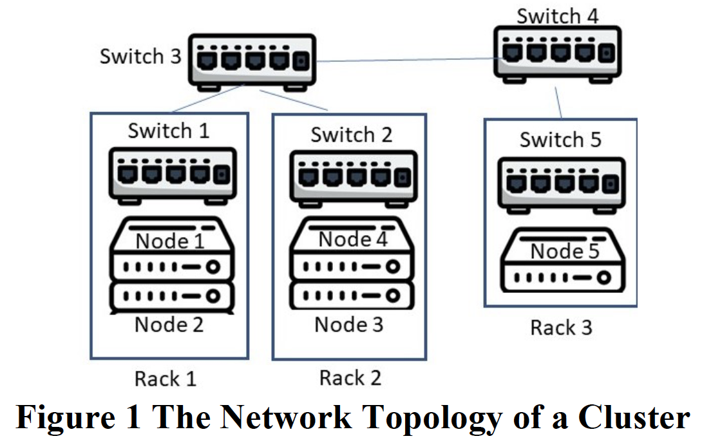
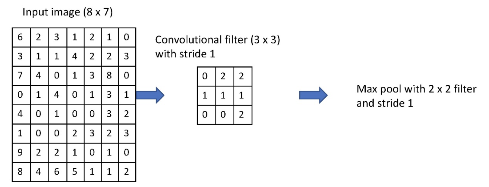
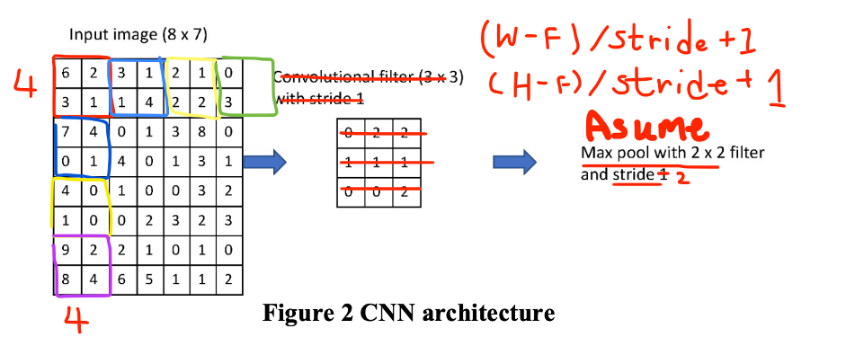

# COMP5434 Assignment 2

## Question 1 (25 points)



**Figure 1** displays a cluster with 5 nodes (i.e., servers) in 3 racks, and also the switches connecting nodes and racks.

(a) Suppose that there exists a Hadoop instance (MapReduce + HDFS) using the cluster in Figure 1, and Node 3 hosts the job tracker and name node, while the other nodes serve as task trackers and data nodes (assuming each server has only one task tracker and one data node).
1. Use the Hadoop instance to explain how to write a block of data into its HDFS, supposing that the block will be replicated on nodes 1, 4, 5.
2. Provide three different issues that directly slow down the speed (i.e., efficiency) of the Hadoop instance, and explain how Hadoop addresses the issues.

(b) Suppose that there is a distributed relational database management system (RDBMS) on nodes 1, 2, 5 that are connected via the network topology in **Figure 1**. Use the distributed database to explain why CAP theorem holds.

(c) If you want to use the distributed RDBMS in (b) above to store the social media data of Twitter that are updated frequently, explain its drawback.

## Question 2 (25 points)

**Table 1 Business Data**
| Year | Half of year | Number of New Customers | Number of Orders |
| -- | -- | -- | -- |
| 2019 | 1 (first half) | 23 | 113
|  | 2 (second half) | 28 | 236 |
| 2020 | 1 | 24 | 140 |
|  | 2 | 30 | 252 |
| 2021 | 1 | 35 | 126 |
|  | 2 | 38 | 230 |

(a) Given the new customer data in **Table 1**, use 2-period weighted moving average to forecast the number of new customers in the 1st and 2nd half of year 2020 and 2021. Assume that the period to predict is 𝑡, and then the weights of the $(t−2)$ and $(t−1)$ periods are 38%, 62% respectively. Then evaluate all your forecasts by MAPE and Standard Error. (Keep values in two decimal places. Provide all calculation details.)

(b) Deseasonalize the last column of number of orders by seasonal index. (Keep values in two decimal places. Provide all calculation details.)

## Question 3 (25 points)
Given the data in **Table 2**, predict the value of 𝑦 in testing data.

Use the **training data**, build a linear regression model $h_{\theta}(x^{(i)})={\theta}_0+{\theta}_1x_1^{(i)}+{\theta}_2x_2^{(i)}$. Initially, let ${\theta}_0=2, {\theta}_1=20, {\theta}_2=5$. The cost function is $\min_{{\theta}_0,{\theta}_1,{\theta}_2}\frac{1}{m}\sum_{i=1}^{m}(h_{\theta}(x_1^{(i)},x_2^{(i)})-y^{(i)})^2$, where 𝑚 represents the number of training samples. Use Gradient Descent to iteratively train the linear regression model. The maximum number of iterations to perform is $2$, and learning rate is $0.02$. (Present all calculation details. Approximate values in 3 decimal places.)

## Question 4 (25 points)

Given a convolutional neural network (CNN) with a convolutional layer and a pooling layer as shown in **Figure 2**, the convolutional layer is a filter of size $3\times3$ with a stride of $1$, and the pooling layer is a max pooling filter of size $2\times2$ with a stride of $1$.

**Figure 2 CNN architecture**


(a) Given an input image of size $8\times7$ as shown above, please give the output
after the convolutional layer and the output after the pooling layer.

(b) Suppose that a max pooling layer of size $F\times F$ with a stride $S$ is applied over an input image of size $W\times H$. Assume that $W\ge F, H\ge F, (W-F)\%S=0$. Please calculate the size of the output image after the max pooling layer. (Show calculation details.)

## My Answer

### Q1

(a) 1. Assume the first DataNode is 1 and the write/ replicate order based on the node number
ascending.

To write the data into HDFS, the client will interact with the NameNode it will return a list of address of DataNode. Client will write the data to the first DataNode (1) and the DataNode (1) will create the Write Pipeline as well as forwards the data to the next DataNode (4) which intern copy it to the third DataNode (5). It sends back the ACK when created the replicas of blocks. When all replicas are written, the client moves on to write the next block in file.

The commutation in each node must connected via Network which mean it may have following
workflow:

Node 1 -> Switch 1 -> Switch 3 -> Switch 2 -> Node 4
Node 4 -> Switch 2 -> Switch 3 -> Switch 4 -> Switch 5 -> Node 5

More Details about the Data Write Pipline Workflow:

1. Client send a create request on DistributedFileSystem API.
2. The NameNode will create a new file in the file system’s namespace via RPC call from DistributedFileSystem and return the FSDataOutputStream to client
3. Client start writing data. The DFSOutputStream will split to packets and enqueue to data queue. DataStreamer will require NameNode to allocate new blocks by selecting the appropriate list of DataNodes to store replicas and streams the packets to another DataNode.
4. DFSOutputStream maintain the ACK queue of packets and waiting the ACK by datanodes. It will remove the ACK from the queue when received the ACK. DataNodes will send the ACK when the replicas are created.
5. The close() will be called when client finished the data writing. It will the remaining packets to the DataNode pipeline and wait for ACK. Then NameNode to return that the file is complete


(a) 2. 

1. Imbalance workload all task allocate in one node or there have slow workers lead to significantly lengthen completion time 
 
Solution: Fine grained Map and Reduce tasks can improve the load balancing. It will refinement execution, spawn backup copies of tasks in Near end of MapReduce operation. It means Dramatically shortens job completion time

2. Bandwidth
   
Solution: HDFS optimized for Batch Processing, it can provides very high aggregate bandwidth. In addition, Map will scheduled to HDFS input block replica will on same machine or same rack. It can eliminate network bottleneck due to machines can read input at local disk speed

3. Failure
   
Solution: Failure is expected in Hadoop. It will detect failure via heathy check and reexecute completed and in-progress map tasks as well as the in-progress reduce tasks when worker failure. In addition, it will Abort computation and the master will write the checkpoints to GFS and master cab recover from checkpoint when master failure.

(b) Consistency meaning Users should be able to see the same data when system connected different node.

Partition-tolerance means the cluster will keep working despite any node of communication failures between nodes in the system. 

In the **CAP theorem** provide only two of the above three guarantees

if partitioning (P) occurs, it will trade off between availability(A) and consistency (C). 

For example: The network is down between Switch 3 and Switch 4 and replica task is occurred it will lead to different version data in Node 5 and Node 1 because the network is down cannot finish the replica. In this case, we can select disable the client access to fix the hardware problem to make the data consistency or the client can access the data but the sometime will return old data or latest data.

Therefore, it only can be CP or AP.

Reference: https://www.readfog.com/a/1643639791161544704

(c) If the using AP, the system partition failure is occurred. Client is also can access the system but sometime will get the old data or latest data. Also, if the data update is frequently which mean the disparity of the data will be larger but the system still can access by the user no down time.

On the other hand, if using CP, the system partition failure is occurred. Client will cannot access the system until the data is consistency. It is possible for long down time. In the production environment it is not allowed.

Moreover, about the Disadvantages if not consider the CP/AP, it will many operations at multiple sites require extensive computation and constant synchronization when replication. The cost will high. Besides, it is difficult to ensure that users get a unified view of the database because it is spread across multiple locations generally (Assume this is high availability architecture design). Moreover, it is difficult to maintain data integrity which is also be data redundancy

### Q2

(a)

<table>
    <tr>
        <td colspan="2"></td>
        <td>Two-Half of year Weighted Moving Averages</td>
    </tr>
    <tr>
        <td>Year</td>
        <td>Half of year</td>
        <td>Customers</td>
        <td>Orders</td>
    </tr>
    <tr>
        <td>2020</td>
        <td>1</td>
        <td>23*0.38+28*0.62=26.1</td>
        <td>113*0.38+236*0.62=189.26</td>
    </tr>
    <tr>
        <td></td>
        <td>2</td>
        <td>28*0.38+24*0.62=25.52/td>
        <td>236*0.38+140*0.62=176.48</td>
    </tr>
    <tr>
        <td>2021</td>
        <td>1</td>
        <td>24*0.38+30*0.62=27.72</td>
        <td>140*0.38+252*0.62=209.44</td>
    </tr>
    <tr>
        <td></td>
        <td>2</td>
        <td>30*0.38+35*0.62=33.1</td>
        <td>252*0.38+126*0.62=173.88</td>
    </tr>
</table>

Percent Error = $\frac{|(Actual - Forecast)|}{Actual}$

Squared Error = $(Actual-Forecast)^2$

<table>
    <tr>
        <td></td>
        <td></td>
        <td colspan="2">Forcast</td>
        <td colspan="2">Error</td>
        <td colspan="2">Percent Error</td>
        <td colspan="2">Squared Error</td>
    </tr>
    <tr>
        <td>Year</td>
        <td>Half of year</td>
        <td>Customers</td>
        <td>Orders</td>
        <td>Customers</td>
        <td>Orders</td>
        <td>Customers</td>
        <td>Orders</td>
        <td>Customers</td>
        <td>Orders</td>
    </tr>
    <tr>
        <td>2020</td>
        <td>1</td>
        <td>26.1</td>
        <td>189.26</td>
        <td>2.1</td>
        <td>49.26</td>
        <td>8.75%</td>
        <td>35.19%</td>
        <td>4.41</td>
        <td>2426.55</td>
    </tr>
    <tr>
        <td></td>
        <td>2</td>
        <td>25.52</td>
        <td>176.48</td>
        <td>-4.48</td>
        <td>-75.52</td>
        <td>14.93%</td>
        <td>29.97%</td>
        <td>20.07</td>
        <td>5703.27</td>
    </tr>
    <tr>
        <td>2021</td>
        <td>1</td>
        <td>27.72</td>
        <td>209.44</td>
        <td>-7.28</td>
        <td>83.44</td>
        <td>20.8%</td>
        <td>66.22%</td>
        <td>53.00</td>
        <td>6962.23</td>
    </tr>
    <tr>
        <td></td>
        <td>2</td>
        <td>34.96</td>
        <td>173.88</td>
        <td>-4.9</td>
        <td>-56.12</td>
        <td>12.89</td>
        <td>24.4%</td>
        <td>24.01</td>
        <td>3149.45</td>
    </tr>
    <tr>
        <td colspan="4">Average</td>
        <td>-3.17500</td>
        <td>1.06</td>
        <td>14.34%</td>
        <td>38.94%</td>
        <td>25.3722</td>
        <td>4560.3765</td>
    </tr>
    <tr>
        <td colspan="4"></td>
        <td>BIAS</td>
        <td>BIAS</td>
        <td>MAPE</td>
        <td>MAPE</td>
        <td>MSE</td>
        <td>MSE</td>
    </tr>
</table>

Standard Error (Square Root of MSE) of Number of Customers = $\sqrt{25.3722}=5.037$

Standard Error(Square Root of MSE) of Number of Orders = $\sqrt{4560.3765}=67.35$

(b)

<table>
    <tr>
        <td>Year</td>
        <td>First Half of year</td>
        <td>Second Half of year</td>
        <td>Mean Number of Order</td>
    </tr>
    <tr>
        <td>2019</td>
        <td>113</td>
        <td>236</td>
        <td>(113+236)/2=174.5</td>
    </tr>
    <tr>
        <td>2020</td>
        <td>140</td>
        <td>252</td>
        <td>(140+252)/2=196</td>
    </tr>
    <tr>
        <td>2021</td>
        <td>126</td>
        <td>230</td>
        <td>(126+230)/2=178</td>
    </tr>
</table>

<table>
    <tr>
        <td>Year</td>
        <td>First Half of year</td>
        <td>Second Half of year</td>
    </tr>
    <tr>
        <td>2019</td>
        <td>113/174.5=0.65</td>
        <td>236/174.5=1.35</td>
    </tr>
    <tr>
        <td>2020</td>
        <td>140/196=0.71</td>
        <td>252/196=1.29</td>
    </tr>
    <tr>
        <td>2021</td>
        <td>126/178=0.71</td>
        <td>230/178=1.29</td>
    </tr>
    <tr>
        <td></td>
        <td>(0.65+0.71+0.71)/3=0.69</td>
        <td>(1.35+1.29+1.29)/3=1.31</td>
    </tr>
</table>

<table>
    <tr>
        <td>Year</td>
        <td>First Half of year</td>
        <td>Second Half of year</td>
    </tr>
    <tr>
        <td>2019</td>
        <td>113/0.69=163.77</td>
        <td>236/1.31=180.15</td>
    </tr>
    <tr>
        <td>2020</td>
        <td>140/0.69=202.9</td>
        <td>252/1.31=192.37</td>
    </tr>
    <tr>
        <td>2021</td>
        <td>126/0.69=182.61</td>
        <td>230/1.31=175.57</td>
    </tr>
</table>

### Q3

Cost function = $\frac{1}{m}2\sum_{i=1}^{m}(\theta_0+\theta_1x_1+\theta_2x_2-y)$

Iteration 1:

$\theta_0=2-0.02((\frac{1}{4})(2)((2+20\times 1+5\times 3-40)+(2+20\times 2+5\times 4-48)+(2+20\times 1+5\times 5-36)+(2+20\times 2+5\times 6-52)))=1.58$

$\theta_1=20-0.02((\frac{1}{4})(2)((2+20\times 1+5\times 3-40)(1)+(2+20\times 2+5\times 4-48)(2)+(2+20\times 1+5\times 5-36)(1)+(2+20\times 2+5\times 6-52)(2)))=19.24$

$\theta_2=5-0.02((\frac{1}{4})(2)((2+20\times 1+5\times 3-40)(3)+(2+20\times 2+5\times 4-48)(4)+(2+20\times 1+5\times 5-36)(5)+(2+20\times 2+5\times 6-52)(6)))=2.78$

Iteration 2:

$\theta_0=1.58-0.02((\frac{1}{4})(2)((1.58+19.24\times 1+2.78\times 3-40)+(1.58+19.24\times 2+2.78\times 4-48)+(1.58+19.24\times 1+2.78\times 5-36)+(1.58+19.24\times 2+2.78\times 6-52)))=1.622$

$\theta_1=19.24-0.02((\frac{1}{4})(2)((1.58+19.24\times 1+2.78\times 3-40)(1)+(1.58+19.24\times 2+2.78\times 4-48)(2)+(1.58+19.24\times 1+2.78\times 5-36)(1)+(1.58+19.24\times 2+2.78\times 6-52)(2)))=19.203$

$\theta_2=2.78-0.02((\frac{1}{4})(2)((1.58+19.24\times 1+2.78\times 3-40)(3)+(1.58+19.24\times 2+2.78\times 4-48)(4)+(1.58+19.24\times 1+2.78\times 5-36)(5)+(1.58+19.24\times 2+2.78\times 6-52)(6)))=2.758$

Testing Data = $ 1.622+1\times (19.203)+8\times (2.758)=42.889$

### Q4

(a)

Convolved Feature
```python
array([
[15., 16., 19., 30., 9.],
[23., 15., 18., 26., 23.],
[15., 7., 13., 32., 25.],
[15., 13., 9., 15., 19.],
[ 7., 6., 5., 15., 18.],
[25., 19., 15., 14., 15.]])
```

MAX Pooling

```
23,19,30,30
23,18,32,32
15,13,32,32
15,13,15,19
25,19,15,18
```

(b)



For example:

According to part (a), We get the 5×6 image after convolution. We trying the above formula to calculate the size of the output after the pooling layer:

$W=(5-2)/1+1=4$
$H=(6-2)/1+1=5$

Therefore, we got the $4\times 5$ size of the output image after the max pooling layer.

Furthermore, some case will have the Padding, the following is a formula contain the Padding:

$W=\frac{W-F+2\times Padding}{S}+1$

$H=\frac{H-F+2\times Padding}{S}+1$