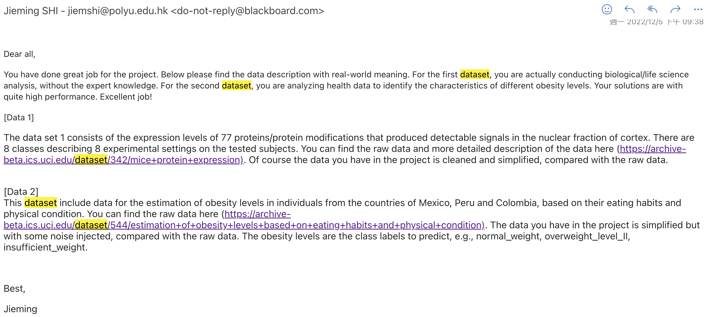

# COMP5434 Project

## Overview
There are two datasets (Data1 and Data2) in this project. For each dataset, you need to develop a solution to predict the class labels of the testing records in the dataset. A record in the datasets contains several attributes. The real-world meaning of the class labels and attributes are removed and will be explained after deadline, which will let you sense the power of big data analytics to generate accurate results without expert knowledge of a certain application domain.

## Data Description and Instructions

For each dataset, we provide its training data (training.csv), validation data (validation.csv), and testing data (test.csv).

### Data 1
Training data: *training.csv*
- Each row is a data record containing 17 attributes
- The last cell of each row is class label in integer
- Training data includes training records with ground-truth class labels
- Use the training data to train your solution
- <u>During training, do not let your solution access the following validation and testing datasets</u>

Validation data: *validation.csv*
- After training your solution, use this validation data to evaluate the performance of your solution (This validation data includes the ground-truth class labels)
- Report your evaluation metrics Micro-F1 and Macro-F1 on the Validation data in your report and presentation
  - You can use third-party libraries to calculate these evaluation metrics
  - A detailed explanation on the calculation of the metrics:
    - https://scikit-learn.org/stable/modules/model_evaluation.html#multiclass-and-multilabel-classification
  - Example: A third-party library to calculate the Micro-F1 and Macro-F1 scores:
    - https://scikit-learn.org/stable/modules/generated/sklearn.metrics.f1_score.html

Testing data: *testing.csv*
- The `class label` column in testing.csv is empty
- Use your method to get your predicted labels of the testing records in testing.csv, and input the predicted labels in the respective cells of the `class label` column in testing.csv
- After including your predicted labels in `class label` column, you need to submit it
- <u>Do not change the row order of the records in this file</u>
- We will obtain your solutions’ performance based on your predicted labels for testing data

### Data 2
Training data: *training.csv*
- Each row is a data record containing 15 attributes
- The last cell of each row is class label in integer
- Training data includes training records with ground-truth class labels
- Use the training data to train your solution
- <u>During training, do not let your solution access the following validation and testing datasets</u>

Validation data: *validation.csv* and Testing data: *testing.csv*
- Same instructions explained above in Data1 testing and validation data

## Tasks and Requirements
Develop two solutions, one for each dataset, to predict the class label of e- ach data record
- You can develop any solutions, based on *either the algorithms introduced in this subject or the methods beyond the course content*
- Micro-F1 and Macro-F1 will be used as the evaluation metrics
- Any programming language
  - Your code should be clean and well-documented (e.g., with sufficient comments)
- You can use low-level third-party packages to facilitate your implementations
- **Your implementation should involve sufficient technical details developed by yourselves**
  - DO NOT simply call ready-to-use high-level functions provided in existing packages, as a **Blackbox**, to finish the project.
    - For example, Spark provides an implementation of Naïve Bayes classifier (https://spark.apache.org/docs/latest/mllib-naive-bayes.html), which, after preparing the data, can be used to train the data with just a simple function call, as shown in the following <u>(Cases like this example will lead to point deduction)</u>
- **You can use third-parity libraries**. As long as your implementation involves reasonable algorithmic details for solving the problem, then it is fine. Unless it is too obvious, we will be very moderate when deciding if an implementation is solely based on Blackbox algorithms.
  - **i.e., let us see your effort, instead of purely calling blackbox algorithms**

## Hints
- Note that data may be unclean/dirty.
- Before running your solutions, you may need to follow the 5-step data analytical process (See Lecture 1 Slides) to prepare the data, in order to achieve higher performance.
- Try your best to improve your solutions’ performance.

## Report File
- Include your group name, your names, your student ids in the report
- Suggested report organization
  - Problem definition
  - Data Analysis and Model design
  - Solution and implementation details
    - Probably follow the major steps in the 5-step data analytical process
    - For instance
      - Your unique technical designs to improve performance
      - Improve your basic design by adopting advanced machine learning model(s)
  - Performance evaluation and discussion
    - Report your performance on the **Validation** data in your report by Micro-F1 and Macro F1
    - Report training time, testing time, memory consumption, etc
    - Analyze the experimental results, e.g., ablation studies of your techniques
    - Draw insightful conclusions
  - Summary of discoveries and future work.
  - A contribution table
    - If you have 2 students as a team, in your report, include a contribution table indicating your percentage of contributions, in total 100% (grades will be adjusted accordingly).
  - References
- Report Format:
  - Font: Times New Roman
  - Font Size: 12 point
  - Margin: 2.5 cm all round
  - Spacing: Single-line spacing
  - Do not have large figures and blank spaces in the report
    - E.g., too large blank spaces between text and figures are not a good practice
  - Format: PDF
- 5-7 pages, excluding references
  - The purpose of the report is to clearly explain your ideas, and cover your implementation details
  - Do not write too long reports (Not necessary)

## Presentation Guidelines
- 5-10 slide explaining your core ideas in the report
- Live presentation, either online or face2face
- You need to prepare a presentation video in MP4 format with proper video quality
  - Upload your video as a private video to Youtube, and attach the sharable link of your video into your report.
  - This works as a backup to play if any unexpected network issues occur during your presentation
- Each group will have about 5 minutes for presentation [presentation time to be updated].
  - Do not exceed the time requirement.

## Submission Guidelines:
- Submit all following files on blackboard
  - DEADLINE: 11:59pm, November 11th, 2022
- [Code zip file] Compress all your code together as one zip file. Follow below example to name your zip file by replacing “GroupName” to your actual group name and replacing “studentIds” to your actual student ids:
  - GroupName_code_studentIds.zip
- [Testing data zip file] Submit your prediction result on testing data
  - **For each dataset, input your prediction labels to the records in the respective testing.csv into the `class label` column of the file**
  - You need to rename testing.csv files in Data1 and Data2 as follows respectively, by replacing “GroupName” to your actual group name and replacing “studentIds” to your actual student ids.
    - GroupName_data1_studentIds.csv
    - GroupName_data2_studentIds.csv
    - <u>Then zip the above two files into GroupName_test_studentIds.zip and submit</u>
  - Note that each testing file should keep in **csv** format
    - Do not change “.csv” extension of the file name
  - **Do not change the row order of the records in testing files**
  - **NOT** validation.csv file, **NOT** training.csv file
- [Report File in PDF] Follow below example to name your PDF report file by replacing “GroupName” to your actual group name and replacing “studentIds” to your actual student ids:
  - *GroupName_report_studentIds.pdf*

## Grading Rubrics
-   Code (14%):
    - a. Code quality (7%)
    - b. Code performance (7%)
      - i. Evaluate the Micro and Macro F1 of your prediction results on the testing data
- Report (8%)
- Presentation (8%)

## Description of the Data in the Project (After the Presentation)
