# COMP5434 Project Report

## Data 1

My groupmate use another method can be improve the accuracy of the model. (~94.6%)

Based on my know, he may:
```
1. Missing value filled by mean value
2. Remove all outlier based on standard deviations
3. log transformation (threshold=0.7)
4. Ensembled model (K-Nearest Classifier and Gaussian Process Classifier)
```

## Data 2

Regarding Dataset 2 (data2.csv), the following shows the steps of data exploration, model design and the result.

First of all, we analyze the datasets with their columns. The datasets have eight floating types, seven object types, and one integer type attribute. Figure 2.1 shows details of data structures. In addition, we examined the data to see whether they contained missing values. Method “missingno.matrix()” returns the AxesSubplot. Figure 2.2 shows the missing value concerning the columns. It will display the lost data with a white line, and the right-hand side will show a sparkline indicating the least complete record. In this case, the dataset did not include the missing value.

| Figure 2.1 shows the data2.csv details of the data structure. | Figure 2.2, Data visualization of Missing Value | 
| -- | -- |
| 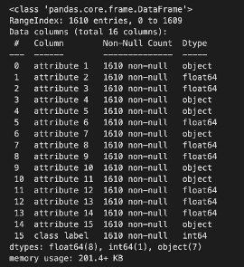 | 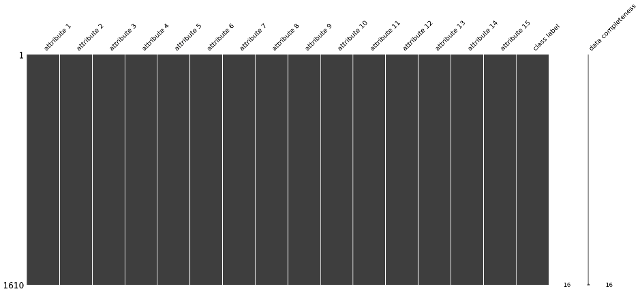|

### Univariate Analysis
Next, we explore all the numeric data using the Histogram, summarizing them as discrete or continuous data and graphically representing their frequency distribution. According to Figure 2.3, data in attribute 13 and attribute 14 may follow a normal distribution. Also, attribute 12 may require normalization to normalize the distribution. Besides, attribute 12 includes some outliers, as displayed in Figure 2.4. The rest of the other qualities contain at least one frequent value, which makes the distribution abnormal. As a result, we may need to transform the data.

| Figure 2.3 Histogram of numeric data | Figure 2.4 Boxplot of attribute 12 and attributes 13 | 
| -- | -- |
| 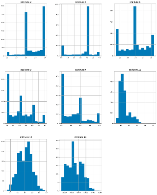 | |


Regarding the feature distributions, if the data in the columns follow a normal distribution, the results of the blue dots in Probplot will lie on the solid red line. Specifically, we explore the skewness of the distribution in attributes 12,13 and 14, respectively. In short, attributes 13 and 14 are normally distributed. However, we cannot normalize attribute 12 using the log function, boxcox function, etc.

<table>
<tr>
    <td>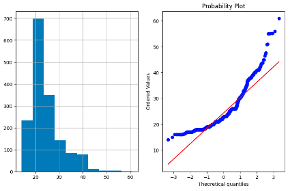</td>
    <td>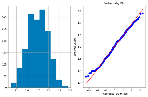</td>
    <td>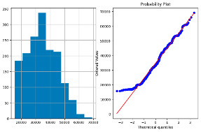</td>
</tr>
<tr>
    <td colspan='3'>Figure 2.5, Histogram and Problpot for attributes 12, 13 and 14</td>
</tr>
</table>

### Data Cleaning
As far as the object type data are concerned, they contain string data in the dataset. There is some abnormal value in attribute 4. Thus, it dropped accordingly, as shown in Figure 2.6. In addition, we need to encode string values by the pd. factorize() function since the model does not allow the string values contained in features.

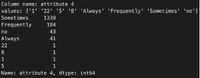

### Feature Selection
In this stage, Correlation Heatmap is used as a reference shown in Fig 2.7. The Correlation Heatmap will display the statistical measurement representing the strength of the relationship between any two variables.

<table>
<tr>
    <td>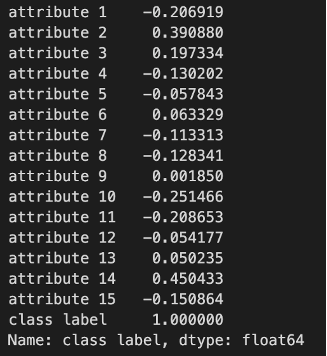</td>
    <td>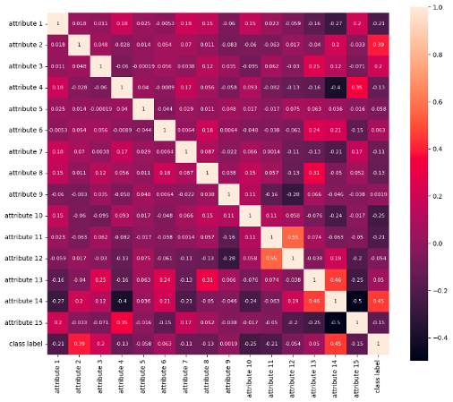</td>
</tr>
<tr>
    <td colspan='2'>Figure 2.7, Correlation relationship based on the class label and Correlation Heatmap</td>
</tr>
</table>

### Model Training
Based on the above references, we will use the co-relationship, which has a value higher than 0.06, as input features. Also, Radom Forest Classifier has been chosen to be the model algorithm. At first, we assumed outliers do not influence the prediction result since the algorithm handles linear and non-linear relationships well. The model was implemented by random forest, but it takes time because it only uses one threading. The prediction returns a low accuracy of around 0.63 on the validation dataset.

As a result, we redesign the model from the analysis steps. We revisited our assumption and tuned the models with different combinations of hyperparameters. Finally, we investigated all imbalanced attributes which might affect the model performance. Specifically, we removed all of them while attributes 6, 8, 13, and 14 remained in the training and validation. The model gives an accuracy of 0.98 on the validation dataset. Figure 2.8 shows the details of the prediction in the confusion matrix.

## Conclusion
To summarize, we achieved a model using Random Forest Classifier with accuracy as well as F-1 scores at 0.98 on the validation dataset. Since prediction accuracy is considerably high, we can perform modelling ensembling as in Data 1. Moreover, the model gives good recall and precision in predicting the labels. Therefore, this model could predict the datasets accurately.

As far as the running time are resources are concerned, the program runs on a virtual machine on Kaggle with 29s for the whole program without GPU. At the same time, the peak usages for CPU and RAM are 100% (1 vCPU) and 574MB, respectively.

Moreover, we examined the accuracy of using a self-made Random Forest Classifier and a Scikit-learn Random Forest Classifier. Although our self-made model could give a fair result in predicting that data, the building time is different from the scikit-learn one, as reflected in Figure 2.9. It is because the scikit-learn classifier uses algorithms with other concepts and exploits machine resources well. In the future, we could improve our models by using different Classifiers like XGBoost and LightGBM, which utilize hyper-threading and Gradient Boosting algorithms.

<table>
<tr>
    <td>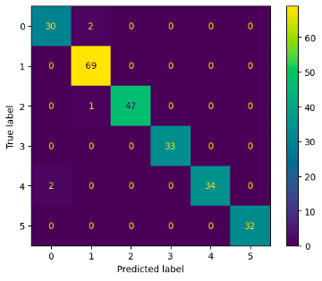</td>
    <td>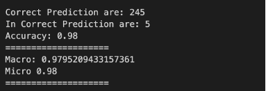</td>
</tr>
<tr>
    <td colspan='2'>Figure 2.8 The accuracy and F1 score of the model displayed by the Confusion Matrix</td>
</tr>
</table>

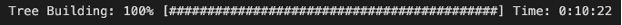
Figure 2.9 Self-made Tree Building Time of Radom Forest 

