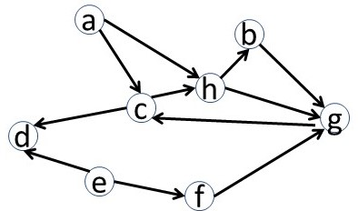
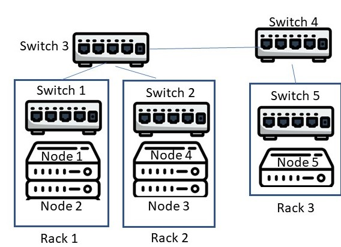
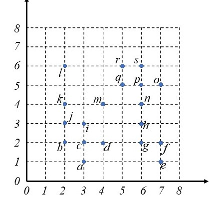

# COMP5434 Quiz 1

## Question 1 (8 points)
You are preprocessing the data in the table below. Explain all data cleaning issues existing in the table:

| Driver | License | Age in Years | Occipation | Monthly Salary |
| -- | -- |-- | -- | -- |
| 123 | 24 | driver | 10000 | 
| 512 | 268 | teacher | 8000 | 
| 345 | 34 | lawyes | 20000 | 
| 41 | 10 | assistant | 12000 |
| 623 | 54 |  | 9500 |
| 345 | 42 | banker | 16000 |

## Question 2 (8 points)

Calculate the closeness centrality of node h in the graph. (in 4 decimal places)

## Question 3 (6 points)

Find all strongly connected components in the graph below:

## Question 4 (5 points)

Given a collection of documents, which of the following about TF-IDF are true?

(A) TF of a word is the count of its occurrence in the collection.

(B) TF-IDF is the best way to assign weights to the words in the collection.

(C) The TF-IDF of a word describes the importance of the word in the document and document collection.

(D) A word with small IDF is not rare in the collection

## Question 5 (6 points)
	
The figure displays a cluster with 5 nodes (i.e., servers) in 3 racks, and also the switches connecting nodes and racks. Provide the shortest network path from Node 3 to Node 5.

## Question 6 (5 points)
Which of the following problems can be solved by regression technique?

(A) Resolving deadlock in parallel computing

(B) Density-based clustering of users in a social network

(C) Predicting the GPA score of a student

(D) Spam email detection

## Question 7 (6 points)

Explain two aspects of Velocity, using at most two sentences.

## Question 8 (9 points)
Apply DBSCAN with Eps=1.45 and MinPts=5 to following objects in the 2-dimensional Euclidean space.

The core points are?

The border points are? 

The outlier points are? 

## Question 9 (8 points)

Given a query vector [6, 2, 8, 7], and a vector [5.5, 3, 12, 2], calculate the cosine similarity between the two vectors. (Provide your result with 3 decimal places)

## Question 10 (5 points)

1. Explain why kNN classification is supervised?

2. Choose if the main computation cost of kNN classification is in training or testing?

## Question 11 (5 points)

Which of the following statements are true?

(A) Given a specific training dataset, only one decision tree structure can be constructed.

(B) kNN classification is sensitive to parameter k.

(C) kNN classification is designed for binary classificaiton.

(D) Naive Bayes classification cannot handle multi-class classification.

## Question 12 (6 points)

1. In your computer, there are 5 disks, each with failure rate 1.4%. Then the probability that all disks in the computer work well is (in 3 decimal place)?

2. In a distributed cluster, there are 150 disks, each with failure rate 0.9%. Then the probability that at least 1 disk is down in the cluster is (in 3 decimal place)?

## Question 13 (10 points)

| Attribute A | Attribute B | Attribute C | Class Label |
| -- | -- | -- | -- |
| 1 | 2 | 2 | 2 |
| 1 | 1 | 2 | 1 |
| 2 | 1 | 1 | 2 |
| 2 | 2 | 3 | 2 |
| 2 | 3 | 2 | 1 |
| 2 | 2 | 1 | 2 |

Use the entropy formula introduced in our slides, with the logarithm to base 2.

1. Calculate the entropy of Class Label (in 3 decimal place)?

2. Calculate the information gain of Attribute A, if Attribute A is chosen as the root of a decision tree (in 3 decimal place)?

## Question 14 (8 points)

Given an attribute with four values 24, 29, 42, 120, you are only interested in values no greater than 60, and then apply z-score normalization  $x ' = (x-\mu)/\sigma$, where $\mu$ is thet mean  and $\sigma$ is the standard deviation, for normalization. Please provide the normalized value of 29. Keep values in 3 decimal places.

## Question 15 (5 points)

Given a database for association rule mining, explain why Apriori principle can help save computational cost when finding frequent itemsets..

## Answer
### Q1
1. Column Occupation have a missing value. If people not occupation should be set to Null or other meaningful value
2. Column Age in Years, it is impossible of 268 as a value in Age in Years. Therefore, it may define valid output.
3. Column Driver License, the id is duplicates which is 345 in row 3 and row 6.
4. Age 10 should not have license nor work

### Q2
0.0909

### Q3
a; b,g,c,h;d;e;f

### Q4
(C) The TF-IDF of a word describes the importance of the word in the document and document collection.

(D) A word with small IDF is not rare in the collection.

### Q5
Node 3 -> Switch 2 -> Switch 3 -> Switch 4 -> Switch 5 -> Node 5

### Q6
(C) Predicting the GPA score of a student

(D) Spam email detection

### Q7
1. Data need to be processed fast
2. Fast data generation

### Q8
The core points are: b, c, i, j, n, p, q, s
The border points are: 	a, d, h, k, m, o, r
The outlier points are: e, f, g, l

### Q9
0.88

### Q10
1. Eusing [labels of training data] for classification.
2. testing

### Q11
(B) kNN classification is sensitive to parameter k.

### Q12
1. 0.932
2. 0.742
   
### Q13
1. 0.918
2. 0.0441

### Q14
-0.352

### Q15
It can prune candidate itemsets efficiently without scanning database that is expensive.