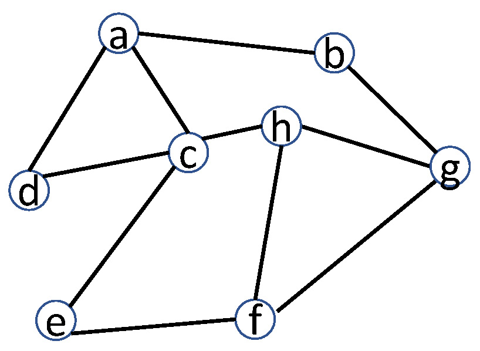

# COMP5434 Quiz 2

## Question 1 (7 points)
Given three documents with feature vectors [3, 8, 4], [2, 6, 9], and [8, 4, 1], the centroid of the three feature vectors is ?

## Question 2 (7 points)
1. Given an image of a mountain, is the image structured data (Y/N)?
2. Explain why?
   
## Question 3 (7 points)
	
Which of the following is true?

A. Underfitting is an issue only existing in classifcation.

B. Overfitting means that a model fits training data too well.

C. With the same training data, simple models are easier to suffer from overfitting, compared with complex models.

D. Underfitting can be eased by regularization techniques.

## Question 4 (7 points)
Which of the following is false?

A. NameNode is a master to distribute job tasks.

B. Heartbeat is a mechanism to detect failure.

C. TaskTracker operates map and reduce operations

D. Machines across racks connect to each other via switches.

## Question 5 (7 points)
Given all the frequent 1-itemsets: {H}, {I}, {J}, {K}, {L} and all the frequent 2-itemsets: {H, I}, {I, J}, {J, K}, {K, L}, {I, K}, {J, L}, {H, J}

choose the 3-itemset that must be infrequent:

A. {J, K, L}

B. {H, I, J}

C. {I, J, K}

D. {I, J, L}

## Question 6 (7 points)
Let $\alpha$ be the smoothing constant in simple exponential smoothing with the forecast at time period t calculated as: 

Forecast at t = $\alpha$(Actual value at t-1) + (1- $\alpha$)(Forecast at t-1)

Explain in one sentence, why a smaller $\alpha $ produces more stable forecast instead of responsive forecast.

## Question 7 (7 points)
Suppose that a program has 25% fraction of its entire execution not parallelizable, and the remaining 75% fraction is parallelizable. If your computer has 6 threads and you parallelize the program on your computer, the highest speedup ratio you can get is (keep values in three decimal places):


## Question 8 (7 points)
Calculate the jaccard similarity between nodes a and c. (in 3 decimal places)



## Question 9 (9 points)
Given the following input 4-dimensional data, suppose that you want to use PCA to reduce it to 2-dimensional data. 

| x1 | x2 | x3 | x4 | 
| -- | -- | -- | -- |
| 12 | 32 | 33 | 23 | 
| 14.5 | 33 | 22 | 22 |
| 11 | 31 | 11 | 22.5 |
| 17 | 25 | 12 | 24 |

Assume that the eigenvalues and the corresponding eigenvectors of the covariance matrix of the data are given as follows

(you do not need to calculate the eigenvalues and eigenvectors, and just use them): 

| Eigenvalue | Corresponding Eigenvector | 
| -- | -- | 
| 2.234 | [0.86; 0.3; 0.33; 0.248] |
| 1.92 | [0.712; 0.21; 0.3; 0.599] |
| 1.68 | [0.623; 0.21; 0.712; 0.247] |
| 1.45 | [0.56; 0.482; 0.49; 0.463] |

Please provide the 2-dimensional new data after PCA, in a table of 4 rows and 2 columns (keep values in 2 decimal places).

## Question 10 (7 points)

1. Calculate the sample variance of $x_1$
2. the sample variance of $x_2$
3. Which dimension is more important/informative($x_1$ or $x_2$)?

| x1 | x2 |
| -- | -- |
| 12 | 38.7 |
| 22 | 35 |
| 15 | 40 |
| 26 | 32.3 |

## Question 11 (7 points)
Which of the following is true?

A. Scatter plot shows the distribution of a single variable.

B. If two datasets have the same boxplot representation, they also have the same histogram representation.

C. If two datasets have the same minimum, maximum, median, 25th percentile, 75th percentile values, then the datasets have the same histgram representation.

D. Quantile plot shows the quantile information of a variable.

## Question 12 (7 points)
Calculate the local clustering coefficient of node c in the graph. (in 4 decimal places)


## Question 13 (7 points)

1. Given the following neural network with the sigmoid activation function,  if $x_1=1, x_2=1$, the final output of the neural network is (round result to the nearest integer)?
2. if $x_1=1, x_2=0,$ the final output of the neural network is (round result to the nearest integer)?


## Question 14 (7 points)

In a generative adversarial network, explain what the discriminator and generator can do in two sentences.

## Answer
### Q1
D. [4.33, 6, 4.67]

### Q2
1. N
2. data is hard to be understood by machines but humans

### Q3
B. Overfitting means that a model fits training data too well.

### Q4
A. NameNode is a master to distribute job tasks.

### Q5
D. {I, J, L}

### Q6
if the alpha is small which mean that have small weighted of (Actual value at t-1) it will more smoother forecast

### Q7
2.667

### Q8
0.167

### Q9
```
Select 2.243, [0.86; 0.3; 0.33; 0.248] and 1.92 [0.712; 0.21; 0.3; 0.599]

36.51 38.94
34.91 37.03
27.97 31.12
32.03 35.33
```

### Q10
1. 40.917
2. 12.327
3. 1

### Q11
D. Quantile plot shows the quantile information of a variable.

### Q12
0.1667
   
### Q13
1. 1
2. 0
   
### Q14
	
The generator takes random noise and returns fake images

The discriminator accepts both real and fake images and returns probabilities, 1 for real and 0 for fake