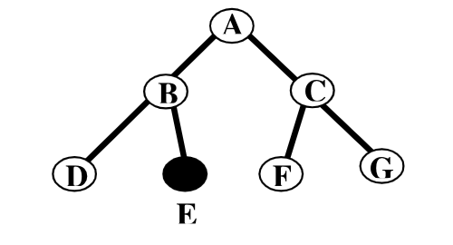
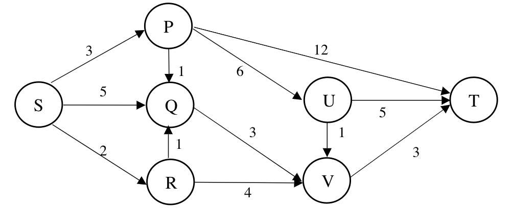
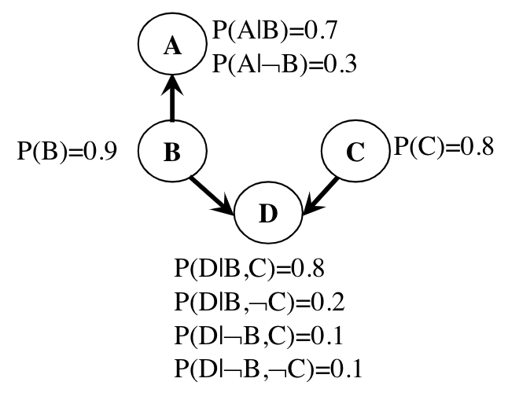
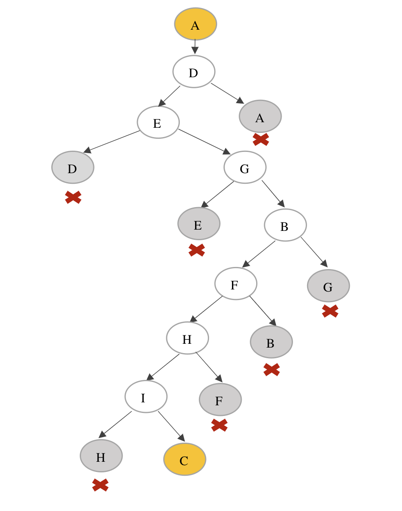
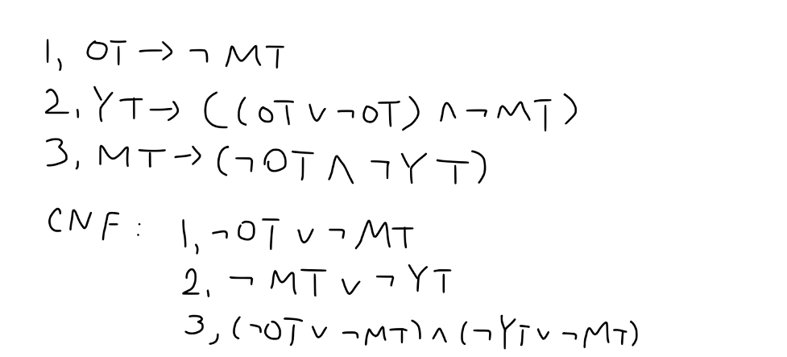

# COMP5511 Assignment

## Part A. Choices (7 points, 1 point each question)
**Each of the following questions hasonecorrect answer.**

### Q1 

Best-first search is neither complete nor optimal is? 

A. True

B. False

### Q2

We have the following searching tree. **Node A** is the start state and **Node E** is the goal state.



By using breadth-first search, whatis the **order** of the nodes **visited**?

A. A-B-E

B. A-C-B-G-F-E

C. A-B-D-E

D. A-B-C-D-E

E. A-C-B-E

### Q3

In the above question, by using depth-first search, whatis **solution** path?  

A. A-B-E

B. A-C-B-G-F-E

C. A-B-D-E

D. A-B-C-D-E

E. A-C-G-F-B-E 

### Q4

For the $3\times 3$ Tic-Tac-Toeproblem, by using the symmetry heuristic information, how many moves do we need to consider in the first step?

A. 2

B. 3

C. 4

D. 5

E. 7

F. 9

### Q5

If asentence is true for some interpretations, then it is

A. Satisfiable

B. Valid

C. Unsatisfiable

D. None of the above. 

### Q6

Sentence "$P\cap\neg Q\cup R$" is same as

A. $P\cap ((\neg Q)\cup R)$

B. $P\cap(\neg(Q\cup R))$

C. $P\cap(\neg Q)\cap (\neg R)$

D. $(P\cap(\neg Q))\cup R$

### Q7

What is the Modus Ponens rule?  

A. $\frac{a, a\to b}{b}$

B. $\frac{a, a\to b}{a}$

C. $\frac{a\cap b}{a}$

D. $\frac{\neg(a\cap b)}{\neg a \cup\neg b}$

E. $\frac{a \to b}{\neg a\cup b}$

## Part B. Short Answers(23 points)

### Q8
What are the motivations that we employ heuristics in solving AI problems?

### Q9
How can we call a search algorithm admissible?

### Q10
There is an island where every islander either always tells the truth or always lies. You visit the island and meets two islanders, say A and B. Islander Asays “at least one of us is a liar”. Please representthe knowledge base by using propositional logic.

### Q11
For a searching tree, assume thatthe branch factor is b=10, the storage cost is 1000bytes/node and the searching speed is 10,000 nodes/second. Withbreadth-firstsearch,what is the required storage space at depth 4?

### Q12
Please represent “only one of Tomand John is a liar” into Propositional Logic.

### Q13

Translate the following sentences into First Order Logic format.

1. John’s ID number is the same as Tom’s.(3 points
2. Everybody’s ID number has 8 digits.(3 points)

### Q14

Convert $P\leftrightarrow (Q\cap R)$ into CNF. (6 points)

## Part C. Long answers (70 points)
### Q15 Towers of Hanoi(20 points)

TheTowers of Hanoi is a famous problem for studying recursion in computer science and recurrence equations in discrete mathematics. We start with N discs of varying sizes on a peg (stacked in order according to size), and two empty pegs. We are allowed to move a disc from one peg to another, but we are never allowed to move a larger disc on top of a smaller disc. The goal is to move all the discs to the rightmost peg (see figure). In this problem, we will formulate the Towers of Hanoi as a search problem.

(a). Propose a state representation for the problem.(3points)

(b). What is the start state?What is the goal state?(2 points)

(c). Please list all the stateswhen N=2, and the legal actions of eachstate?(5points)

(d). When N=2, please use the Depth-first search and Breadth-first search to achieve the goal state.(6 points)

### Q16 Shortest PathProblem(15 points)


Using the A* algorithm to find the shortest path from S to T in the above graph.

### Q17 Bayesian belief network. (15 points)
Considering the following Bayesian belief network, where A, B, Cand Dare Boolean variables.



(a). What is the value of $P(A, B, C), P(A, C)$? (5 points)

(b). What is the value of $P(D|B)$?

(c). What is the value of $P(B|D)$ and $P(B|\neg D)$?

### Q18 Propositional Logic(20 points)
Johntravelled to a strange island during his summer vacation. The inhabitants of the island are divided into three ethnic groups, namely honest people, liars and mortals. The honest people always tell the truth, the liars always tell lies, the mortal people sometimestell the truth and sometimes lie. Johnmetan old man, a middle-aged man and a young man on the island.They belonged to 3 different ethnic groups.They have the following conversation:

1. John asked the old man: doesmiddle-agedbelong tohonest people?
   1. The old man answered: Yes.
2. Johnasked the young man: Is what he said just now the truth?
   1. The young man said: No, middle-aged people are liars.
3. Johnasked the middle-aged man: Which ethnic group are you from?
   1. The middle-aged man said: I am a mortal.

What conclusion can we draw?Please use the Propositional Logic(PL) to give the answer.

(a) Please set atomic propositions to this problem.(4 points)

(b) Please list the three propositions of the above three statements in the conversationwith the atomic propositionsyou defined,respectively. (8 points)

## Solution

## Part A
1. A
2. D
3. C
4. B
5. A
6. D
7. A

## Part B

### Q8
1. A problem may not have an exact solution because of ambiguities in problem statement or available data. 
2. A problem may have an exact solution, but the computational cost of finding it may be prohibitive. 

### Q9
A search algorithm is admissibleif it is guaranteed to find a minimal path to a solution whenever such a path exists.

### Q10

AL: "A is a liar"

BL: "B is a liar"

$P=(AL\to\neg(AL\cup BL))\cap (\neg AL\to (AL\cup BL))$

### Q11
At depth 4, the number of created nodes is 111,111, and thus the storage space is 111,111*1000=111,111K bytes.


### Q12

TL: "Tom is a liar"

JL: "John is a liar"

$(TL\cap\neg JL)\cup(\neg TL\cap JL)$

### Q13

1. $\exist n ID\_Number(John, n)\cap ID\_Number(Tom,n) $
2. $\forall x,n Person(x)\cap ID\_Number(x,n)\to Digit(n,8)$

### Q14

$P\to (Q\cap R) \equiv \neg P\cup (Q\cap R)\equiv (\neg P\cup Q)\cap (\neg P\cup R)$

$Q\cap R\to P\equiv\neg (Q\cap R)\cup P\equiv \neg Q\cup \neg R \cup P$

### Q15

(a). {[1,2,...,N],[],[]},  {[2,...,N],[1],[]},

(b). The start stateis {[1,2,...,N],[],[]}; The end stateis {[],[] ,[1,2,...,N] };

(c). 
```
A: {[1,2],[],[]}
B: {[], [1, 2], []}
C: {[], [], [1, 2]}
D: {[2], [1], []}
E: {[2], [], [1]}
F: {[1], [2], []}
G: {[], [2], [1]}
H: {[1], [], [2]}
I: {[], [1],[2]}
```

Legal actions: 
```
{[1,2],[],[]}→{[2],[1],[]}
{[], [1,2],[]}→{[1], [2],[]};{[], [1, 2], []}→{[], [2], [1]}
{[], [], [1, 2]}→{[], [1], [2]}
{[2], [1], []}→{[1, 2], [], []};{[2], [1], []}→{[2],[],[1]}
{[2], [], [1]}→{[2], [1], []};{[2], [], [1]}→{[], [2], [1]};
{[1], [2], []} →{[1], [], [2]}; {[1], [2], []} →{[], [1, 2], []}; 
{[], [2], [1]}→{[2], [], [1]}; {[], [2], [1]}→{[], [1, 2], []};
{[1], [], [2]}→{[], [1], [2]};{[1], [], [2]}→{[1], [2], []};
{[], [1], [2]}→{[1], [], [2]};{[], [1], [2]}→{[], [], [1, 2]}
```

(d). The start stateis A: {[1, 2], [], []} and the end stateis C: {[], [], [1, 2]};



BFS: A, D, E, G, B, F, H, I, C  

DFS: A, D, E, G, B, F, H, I, C 

(e).
```
Start state: [[1,2,3], [], []]
Step 1: [[2,3], [1], []]
Step 2: [[3], [1], [2]]
Step 3: [[1,3], [2], []]
Step 4: [[3], [1, 2], []]
Step 5: [[],[1,2], [3]]
Step 6: [[1], [2], [3]]
Step 7: [[1], [], [2, 3]]
Step 8: [[], [], [1,2,3]]
```

### Q16

```
Step 1:
g(A)=3, h(A)=min{1,6,12}=1,  f(A)=3+1=4
g(B)=5, h(B)=min{3}=3,  f(B)=5+3=8
g(C)=2, h(B)=min{4,1}=1,  f(C)=2+1=3

Step 2:
g(D)=3, h(D)=min{3}=3,  f(D)=3+3=6
g(E)=6, h(E)=min{3}=3,  f(B)=6+3=9

Step 3:
g(F)=4, h(F)=min{3}=3,  f(F)=4+3=7
g(G)=9, h(G)=min{1}=1,  f(G)=9+1=10
g(H)=15, h(H)=min{0}=0,  f(H)=15

Step 4:
g(I)=6, h(I)=min{3}=3,  f(I)=6+3=9

Step 5:
g(J)=7, h(J)=min{3}=3,  f(J)=7+3=10

Step 6:
g(K)=8, h(K)=min{3}=3,  f(K)=8+3=11

Step 7:
g(L)=9, h(L)=min{0}=0,  f(L)=9

Step 8:
g(M)=9, h(M)=min{0}=0,  f(M)=9

The shortest path is the S->R->V->T, and  S->R->Q->V->T,
```

### Q17

(a). 
$P(A, B, C, D)=P(A, D, B, C)$

$P(A|B,D,C)P(D|B,C)P(B|C)P(C)$

$P(A|B)P(D|B,C)P(B)P(C)$

$0.7\times 0.8\times 0.9\times 0.8=0.4032$


$P(A,B,C,\neg D)=P(A,\neg D, B,C)$

$P(A|B,\neg D, C)P(\neg D|B, C)P(B|C)P(C)$

$P(A|B)P(\neg D|B,C)P(B)P(C)$

$=0.7\times(1-0.8)\times 0.9\times 0.8=0.1008$


$P(A, B, C)=P(A, B, C, D)+ P(A, B, C,\neg D)$

$=0.4032+0.1008=0.504$


$P(A, \neg B, C, D)=P(A, D,\neg B, C)$

$= P(A| \neg B, D, C)P(D|\neg B, C)P(\neg B|C)P(C)$

$=P(A|\neg B)P(D|\neg B,C)P(\neg )P(C)$

$0.3\times 0.1\times (1-0.9)\times 0.8=0.0024$


$P(A, \neg B, C,\neg D)=P(A,\neg D,\neg B, C)$

$=P(A|\neg B, \neg D, C)P(\neg D|\neg B, C)P(\neg B|C)P(C)$

$=P(A|\neg B)P(\neg D|\neg B,C)P(\neg B)P(C)$

$0.3\times (1-0.1)\times (1-0.9)\times 0.8=0.0216$ 


$P(A, \neg B, C)= P(A,\neg B, C, D)+ P(A,\neg B, C,\neg D)$

$=0.0024+0.0216=0.024$

$P(A, C)= P(A, B, C)+P(A,\neg B, C)=0.504+0.024=0.528$


(b).

$P(D|B)=P(D,C|B)+P(D,\neg C|B)$

$=P(D|C,B)P(C|B)+P(D|\neg C,B)P(\neg C|B)$

$=P(D|C,B)P(C)+P(D|\neg C,B)P(\neg C)$

$=0.8\times 0.8+0.2\times 0.2=0.64+0.04=0.68$


(c).

$P(D|\neg B) =P(D,C|\neg B)+P(D,\neg C|\neg B)$

$=P(D|C,\neg B)P(C|\neg B)+P(D|\neg C,\neg B)P(\neg C|\neg B)$

$=P(D|C,\neg B)P(C)+P(D|\neg C,\neg B)P(\neg C)$

$=0.1\times 0.8+0.1\times 0.2=0.1$


$P(D)=P(D|B)P(B)+P(D|\neg B)P(\neg B)$

$=0.68\times 0.9+0.1\times 0.1=0.622$


$P(B|D)= P(D|B) P(B)/P(D)$

$= 0.68\times 0.9/0.622=0.984$


$P(B|\neg D) = P(\neg D|B) P(B)/ P(\neg D)$

$=(1-P(D|B)) P(B)/(1-P(D))$

$=(1-0.68)\times 0.9/(1-0.622)=0.762$

### Q18

(a). 
```
OT: “Old mean is tell truth”
YT: “Young man is tell truth”
MT: “Middle-aged is tell truth”
```

(b). 


(c). 

honest people always tell the truth, the liars always tell lies, the mortal people sometimes tell the truth and sometimes lie

In (b), 3 propositions is contractiction because there are only liar or mortal will lie.

| Mortal | Honest | Liars |  |
| -- | -- | -- | -- |
| middle-aged | young man | middle-aged | F |
| middle-aged | middle-aged | young man | F |

```
MtOtYt │  MT → (¬OT ∧ ¬YT)
───────┼──────────────────
1 1 1  │  0 ✖
1 1 0  │  0 ✖
1 0 1  │  0 ✖
1 0 0  │  1 ✖


MtOtYt │  (OT → ¬MT) ∧ (YT → ((¬OT ∨ OT) ∧ ¬MT))
───────┼────────────────────────────────────────
1 1 1  │  0 ✖
1 1 0  │  0 ✖
1 0 1  │  0 ✖
1 0 0  │  1 ✖
0 1 1  │  1
0 1 0  │  1 ✖
0 0 1  │  1 
0 0 0  │  1 ✖
```

$\therefore$ Young man is a honest, Middle-aged man is liars and Old man is mortal.