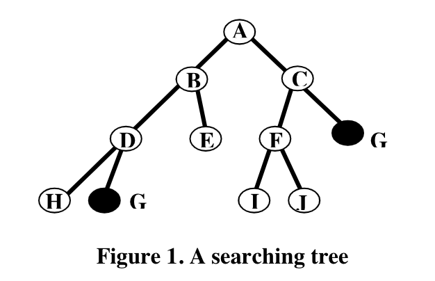
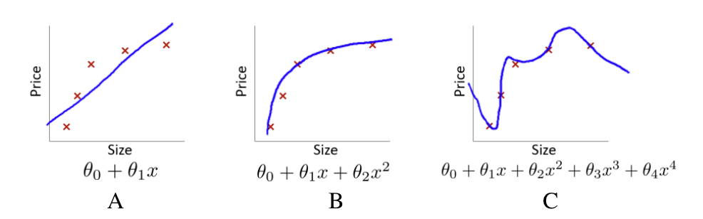
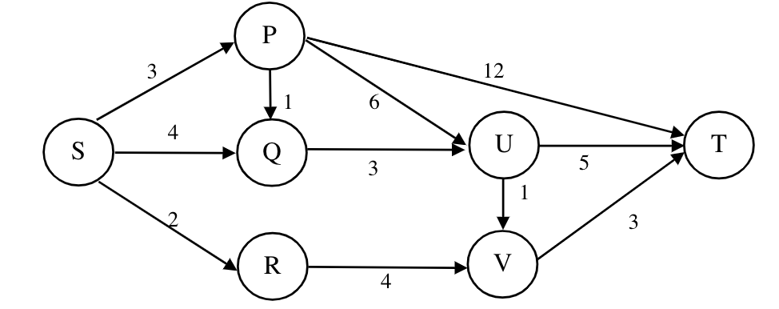
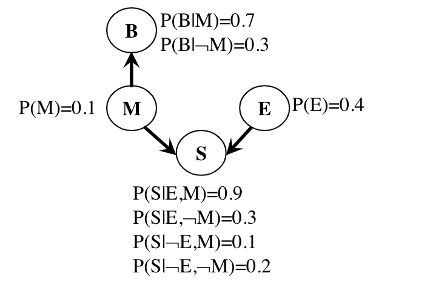
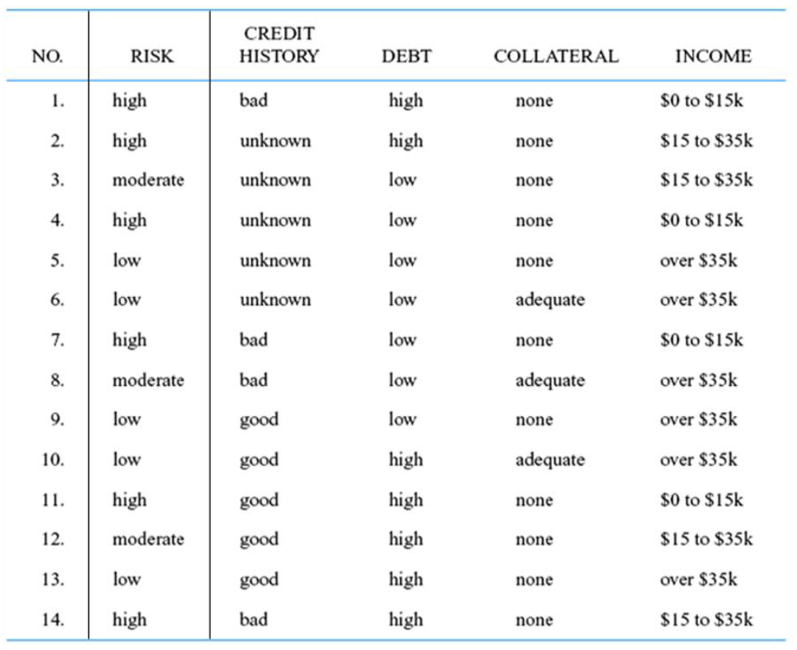

# COMP5511 Midterm

## Part A. True / False (10points, 1 points each)

1. Ifthe search space contains very deepbranches without solution, breadth-first search will be a better choice than depth-first search. 
2. Absolute independenceof two random variablesisvery common in real world.
3. A Bayesian Belief Net consists of a graph and some local conditional probabilities. 
4. Forward chaining in first order logic is a goal-driven algorithm. 
5. For any propositional sentences a, b and c, $((\neg a\cap \neg b)\cup c)$ is equivalent to $(a\to c)\cap (b\to c)$.
6. $\forall x\forall y$ is the same as $\forall y\forall x$
7. In propositional logic, if sentence S1 is $\neg a\cup b$ and sentence S2 is $a\cup c$, then from S1 and S2 we can infer that $b\cap c$.
8. For a linear regression model, if we find the training error is very small but the testing error is very large, then we should increase the model complexity.
9. f  a  machine  learning  model  or  algorithm  is  suffering  from  high  bias,  getting  more training data would be helpful. 
10. Unsupervised  learningexplores  the  underlying  structures  or  correlations  in  the  data  to separate the inputs into different clusters.

## Part B. Multiple choices (20points, 2 points each)

**Notes: each questionhas at least onecorrect answer.**

1. Suppose we have a searching tree with depth9 and branching factor3. The goal state is in the 6thdepth. If we use breadth-first search,what is the time complexity?

A. $O(3^6)$

B. $O(3^7)$

C. $O(3^9)$

D. $O(6*3)$

E. $O(7*3)$

F. $O(9^6)$

F. $O(9^7)$

G. $O(10^6)$

2. Whichone(s)of the following search methods is(are)informedones?

A. Hill-climbingsearch

B. Depth-first search

C. Breadth-first search

D. A* algorithm

E. Generate and test

F. Best-first

3. In the searching tree shown in Fig. 1, the two black nodesare goal states. By using depth-first searching(the  order is from left  to  right), which is the order of the  nodes that are visited?



A. A-B-D-H-G

B. A-C-G

C. A-B-C-D-E-F-G

D. A-B-D-G

E. A-B-C-D-G

F. A-C-B-G

4. Sentence $P\cap\neg Q\cup R$ is the same as

A. $P\cap ((\neg Q)\cup R)$

B. $P\cap (\neg (Q\cup R))$

C. $P\cap(\neg Q)\cap (\neg R)$

D. $(P\cap(\neg Q))\cup R$

5. What is the Modus Ponens rule?  

A. $\frac{a, a\to b}{b}$

B. $\frac{a, a\to b}{a}$

C. $\frac{a\cap b}{a}$

D. $\frac{\neg(a\cap b)}{\neg a \cup\neg b}$

E. $\frac{a \to b}{\neg a\cup b}$

6. We represent “Tom is a student” as “TS” and “Jim is a student” as “JS”. In propositional logic, sentence “Noneof Tom and Jim is a student” is

A. $TS \cup JS$

B. $TS \cap JS$

C. $\neg TS \cap\neg JS$

D. $\neg JS \cup \neg TS$

7. “Every customer loves tea or coffee” can be translated into FOL as

A. $\forall x Customer(x)\to Loves(x, Tea)\cup Loves(x, Coffee)$

B. $\exists x Customer(x)\cap \{Loves(x,Tea)\cap Loves(x, Coffee)\}$

C. $\forall x Customer(x)\cap \{Loves(x,Tea)\cup Loves(x, Coffee)\}$

D. $\forall x \neg Customer(x)\cup Loves(x, Tea)\cup Loces(x, Coffee)$

8. $\exists x Study(x, AI)$ is the same as

A. $\neg\exists x\neg Study(x, AI)$

B. $\neg\forall x\neg Study(x, AI)$

C. $\neg\forall x Study(x, AI)$

D. $\forall x\neg Study(x, AI)$

9. The probability of event “Tom studies hard” is 0.5; the probability of event “Tom will get an A+” is 0.6; the probability of event“If Tom studies hard, then he will get an A+” is 0.8. What is the probability of event "If Tom gets an A+, he must study hard" ?

A. $3/4$

B. $1/3$

C. $2/3$

D. $3/8$

10. The following modelsare three linear regression models for housing price v.s. size on training data, which model is best?



## Part C. Short answers(30 points)

1. Please give two possible admissible heuristic functions forthe 8-puzzle problem. (2 points)**(Notes: 2points for each one of the 2 answers.)**

2. What are the shortcomings of hill climbing searching? (3 points)**(Notes: 3pointsfor 3 answers; 2pointsfor 2 answersand 1point for 1 answer.)**

3. For  a  searching  tree, assume  thatthe branch  factor is b=10,  the  storage  cost  is1000bytes/node and the searching speed is 10,000 nodes/second. Withbreadth-firstsearch,what is the required storagespace at depth 4? (3 points)
4. Please represent “*only one of Tomand John is a liar*” into Propositional Logic. (3 points)
5. Convert $P\leftrightarrow \neg (Q\cap R)$ into CNF. (5 points)
6. Suppose we have the following symbols in first order logic:
C(x,y): x is a child of y.
D(x,y): x is a daughter of y.
S(x,y): x is a son of y.
M(x): x is a male.

Translate the following sentences into first order logic:

a). A son is a male child of a person. (3 points)

b). Everyone is either a son or a daughter of someone. (3 points)

7. Please list any two classical machine learning methods for classification, and give a short illustration for them. (4 points)
8. x is theindependent variable and y is the dependent variable,and we have obtained some data pairs in the following table. Wewant to use a linear regression model to formula their relationship, which is 
```math
h_\theta (x)= \theta_0 +\theta_1 x
```

If we want to use Gradient Descent to optimize the parameters $\theta_0$ and $\theta_1$, and we start from value 0 and 1 for $\theta_0$ and $\theta_1$, what is the value of $\theta_0$ and $\theta_1$, after one gradient descent stepwith a learning rate of 0.1 under the Mean Squared Error function? (4 points)

| x | y |
| -- | -- |
| 1.5 | 2 |
| 2 | 5 |
| 3 | 6 |

## Part D. Long answers(40 points)

1. Shortest Path Problem (10 points)

Using the A* algorithm to find the shortest path from S to T in the above graph.

2. Bayesian belief network (10 points)

A smell of sulphur (S) can be caused either by rotten eggs (E) or as a sign of the doom brought by the Mayan Apocalypse (M). The Mayan Apocalypse also causes the oceans to boil (B). The Bayesian network and corresponding conditional probability tables for this situation are shown below. For each part, you should give either a numerical answer (e.g. 0.81) or an arithmetic expression in terms of numbers from the tables below (e.g. 0.9 · 0.9). Note: be careful of doing unnecessary computation here.



a) Please compute the following entry from the joint distribution? (2 points)

$P(S, E, M, B) ; P(\neg S, E, M, B)$

b) What is the probability that the oceans boil? (2 points)

$P(B)$

c) What is the probability that the Mayan Apocalypse is occurring, given that the oceans are boiling? (3 points)

$P(M|B)$

d) What  is  the  probability  that  the  Mayan  Apocalypse  is  occurring,  given  that  there  is  a smell of sulphur, the oceans are boiling, and there are rotten eggs?

$P(M|S,B,E)$

3. Resolution (10 points)

We have the following knowledge:
```
1). If John has a trip, he will climb mountains or go to the beach. 
2). If John does not have a girl friend, he won’t go to the beach.
3). If John climbs mountains, he has a girl friend.
4). John has no girl friend
```

We use the following symbols:
```
t: John has a trip;
m: John climbs mountains;
b:  John goes to beach;
g: John has a girl friend.
```

A. Please represent the KB by using PL. (2 points)

B. Convert the KB into conjunctive normal form (CNF). (2 points)

C Prove: John doesn’t have a trip. (6 points)


4. Decision tree.(10 points)
We have the following data of 14 individuals:



The attributes are credit history, debt, collateral and income, and we are going to estimate an individual’s credit risk based on these attributes. The decision tree is a good candidate to this end. **(Note that you should show the detailed calculation process.)**

a) Please determine the best tree for the first levelwith ID3 algorithm. (3 points)

b) Please determine the best tree for the second levelwith ID3 algorithm. (7 points)

## Solution
### Part A
1. T
2. F
3. T
4. F
5. T
6. T
7. F
8. F
9. F
10. T

### Part B
1. B
2. A, D, F
3. A
4. D
5. A
6. C
7. A,D
8. B
9. C
10. B

### Part C

1. The number of tiles out of place; The sum of distances of the tiles out of plac
2. Keep no history, local maxima, plateaus and ridges.
3. At depth 4, the number of created nodes is 1+10+100+1000+10000=111,11, and thus the storage space is 111,11*1000=11,111K bytes.
4. TL: Tom is a liar; JL: John is a liar. $(TL\cap \neg JL)\cup (\neg TL \cap JL)$
   
5. 
We have
$P\to\neg (Q\cap R)$

$\equiv P\to \neg Q\cup \neg R$

$\equiv \neg P \cup \neg Q\cup\neg R$

And

$\neg (Q\cap R)\to P$

$\equiv \neg\neg (Q\cap R)\cup P$

$(Q\cap R)\cup P$

$(Q\cup P)\cap (R\cup P)$

$\therefore (\neg P\cup\neg Q \cup\neg R)\cap (Q\cup P)\cap (R\cup P)$

6. 

a) $\forall x,y S(x,y)\leftrightarrow M(x)\cap C(x,y)$

b) $\forall x\exists yS(x,y)\cup D(x,y)$

7. KNN,  Naive Bayes,  SVM,  Logistic regression, and so on.
8. 

The loss function is $l(\theta_0,\theta_1) = \frac{1}{2\times 3}\sum_{i=1}^{3}(\theta_0+\theta_1 x_i-y_i)^2$

The gradient of parameters are

$\frac{\partial (\theta_0,\theta_1)}{\partial \theta_0}=\frac{1}{3}(-0.5-3-3)=-2.1667$

$\frac{\partial (\theta_0,\theta_1)}{\partial \theta_1}=\frac{1}{3}(-0.5\times 1.5-3\times 2-3\times 3)=-5.25$

$\theta_0=0-0.1\times (-2.1667)=0.21667$

$\theta_1=1-0.1\times(-5.25)=1.525$

### Part D

1.
```
Step 1
g(A)=3, h(A)=min{1,6,12}=1, f(A)=3+1=4
g(B)=4, h(B)=min{3}=3, f(B)=4+3=7
g(C)=2, h(B)=min{4}=4, f(C)=2+4=6

Step 2
g(D)=3+1=4, h(D)=min{3}=3, f(D)=4+3=7
g(E)=3+6=9, h(E)=min{1,5}=1, f(E)=9+1=10
g(F)=3+12=15, h(F)=min{0}=0, f(F)=15+0=15

Step 3
g(G)=2+4=6, h(G)=min{3}=3, f(G)=6+3=9

Step 4
g(H)=3+1+3=7, h(H)=min{1,5}=1, f(H)=7+1=8
g(I)=4+3=7, h(I)=min{1,5}=1, f(I)=7+1=8

Step 5
g(J)=3+1+3+1=8, h(J)=min{3}=3, f(J)=7+1=11
g(K)=3+1+3+5=13, h(K)=0, f(K)=13+0=13
g(J)=4+3+1=8, h(J)=min{3}=3, f(J)=7+1=11
g(K)=4+3+5=13, h(K)=0, f(K)=13+0=13

Step 6
g(N)=2+4+3=9, h(N)=0, f(N)=9+0=0

The shortest path is the S->R->V->T.
```

2.

a). 
$P(S,E,M,B)=P(S|M,E)P(B|M)P(E)P(M)=0.9\times 0.7\times 0.4\times 0.1=0.0252$

$P(\neg S,E,M,B)=P(\neg S|M,E)P(B|M)P(E)P(M)=(1-0.9)\times 0.7\times 0.4\times 0.1=0.0028$

b). $P(B)=P(B,M)+P(B,\neg M)=P(B|M)P(M)+P(B|\neg M)P(\neg M)=0.7\times 0.1+0.3\times (1-0.1)=0.34$

c). $P(M|B)=P(M,B)/P(B)=P(B|M)/P(B)=0.7\times 0.1/0.34=0.2059$

d). $P(M|S,B,E)=P(M,S,B,E)/P(S,B,E)=P(M,S,B,E)/(P(M,S,B,E)+P(\neg M,S,B,E))=P(S | M, E)P(B | M) P(E)P(M)/(P(S | M, E)P(B | M) P(E)P(M)+P(S |\neg M, E)P(B |\neg M)P(E)P(\neg M))=0.9\times 0.7\times 0.4\times 0.1/(0.9 \times 0.7\times 0.4\times 0.1+0.3\times 0.3\times 0.4\times 0.9)=0.0252/(0.0252+0.0324)=0.4375$

3.

a).
$t\to (m\cup b)$

$\neg g\to \neg b$

$m\to g$

$\neg g$

b).

$\neg t \cup m\cup b$

$g\cup\neg b$

$\neg m \cup g$

$\neg g$

c).

1. $\neg t \cup m\cup b$
2. $g\cup\neg b$
3. $\neg m\cup g
4. $\neg g$
5. $t$

From (2) and (4), we have $\neg b$ (6)

From (3) and (4), we have $\neg m$ (7)

From (1) and (6), we have $\neg t\cup m$ (8)

From (7) and (8), we have $\neg t$ (9)

From (5) and (9), we have a null

$\therefore$ goal is proved

4. 

**First level,**

$E(history)=\frac{4}{14}\times 0.811+\frac{5}{14}\times 1.522+\frac{5}{14}\times 1.371=1.265$

$E(debt)=\frac{7}{14}\times 1.379+\frac{7}{14}\times 1.557=1.468$

$E(collateral)=\frac{11}{14}\times 1.435+\frac{3}{14}\times 0.918=1.325$

$E(income)=\frac{4}{14}\times 0 +\frac{4}{14}\times 1+\frac{6}{14}\times 0.65=0.564$

$\therefore$ we can know the root is income

**Second level,**

**Data: {1,4,7,11}** are all same class label so dont need to branching.

**Data: {2,3,12,14}**

$E(history)=\frac{1}{4}\times 0+\frac{2}{4}\times 1+\frac{1}{4}\times 0=0.5$

$E(debt)=\frac{3}{4}\times 0.918+\frac{1}{4}\times 0 =0.689$

$E(collateral)=1$

$E(income)=1$

**Data: {5,6,7,8,10,13}**

$E(history)=0$

$E(debt)=\frac{4}{6}\times 0.811=0.541$

$E(collateral)=\frac{3}{6}\times 0.918=0.459$

$E(income)=0.650$

$\therefore$ “history” is the lowest, the root node of this branch is “history”.