# COMP5517 40% Project (1 group project)
- 5-6 students each group
- task: to write a Project Report on a specific topic in HCI
- no specific group leader; everyone in the group can be the leader
- feedback will be given, and views will be exchanged through in-class discussion       students can revise their work
- it is expected that students can experience a self-regulated learning process through the design and development of the group project
- part of the marking depends on the quality of the final project report (70% of Project total); and part of it depends on the project presentation (30% of Project total)

> The following content just included my finsihed part

## 3 Experiment
Hand gesture recognition using Deep learning has shown promising results in this field. In the following, we will explore using deep learning models to recognize American Sign Language (ASL) hand gestures. We also developed an application that uses OpenCV and Mediapipe to track hand gestures in real-time.

### Dataset
To train our models, we used the public ASL Alphabet dataset from Kaggle. This dataset contains images of hands showing the letters A to Z in American Sign Language and three classes of SPACE, DELETE and NOTHING divided into 29 classes. The images are a video frame captured using a web camera of 200x200 pixels and contain 87,000 images, with each class representing a letter of the alphabet and three different hand gestures. We divided the dataset into 80% for training, 4% for validation and 16% for testing.
 
| Dataset Name |  Repository |
| - | - |
| ASL Alphabet | https://www.kaggle.com/datasets/grassknoted/asl-alphabet |

### Models
We experimented with three different models to recognize hand gestures, including the simple CNN, Transfer Learning, and Autoencoder with CNN models. For each model, we trained it using the training dataset, validated it using the validation dataset, and tested it using the testing dataset. We used the categorical cross-entropy loss function and the Adam optimizer to train the models for 50 epochs with a batch size of 128 and utilize the early stopping to prevent overfitting.

#### Simple CNN model

<table>
<tr>
    <td>We define a simple convolutional neural network (CNN) for hand gesture recognition, which takes a 64x64 RGB image as input. It has three convolutional layers with a ReLU activation function, each followed by a max pooling layer with a pool size of (2,2) and a final softmax output layer with 29 classes (hand gestures). Figure 3.1 shows the training accuracy and loss. Figure 3.2 shows the details of the model architecture.</td>
    <td rowspan=2>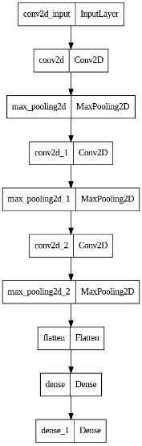</td>
</tr>
<tr>
    <td>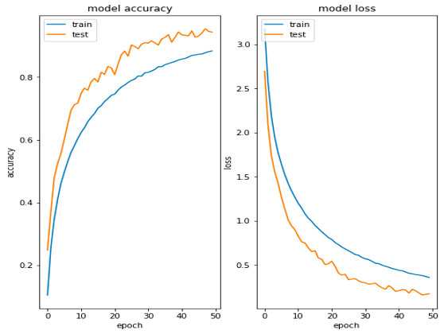</td>
</tr>
<tr>
    <td>Figure 3.1. Training result of the simple CNN</td>
    <td>Figure 3.2. Simple CNN architecture</td>
</tr>
</table>

##### Visualizing Feature maps
We are trying to visualize the intermediate representation of a CNN using the letter Y as an input image. A CNN extracts features of an input image by applying convolutional filters to the input image, producing a set of feature maps as output. Each feature map represents a different aspect of the input image, such as edges, shape, or texture. By visualizing these feature maps, we can gain insight into what features the CNN is learning and how it processes the input image. Figure 3.3 shows the input image and the Feature map of all the convolutional and max pool layers. For some examples, the first conv2d layer learn the edges and simple textures of the hand image, and the last layer learns to gives features of different parts of an object. For the middle layers they trend to learn more complex texture and patterns.

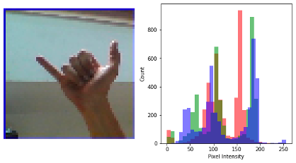
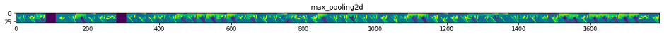

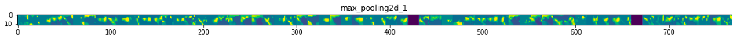
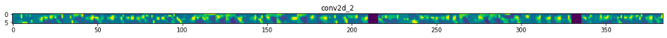

Figure 3.3. Input image and Feature map of all the convolutional layers and the max pool layers

#### Transfer Learning Model

<table>
<tr>
    <td>The model takes a 64x64 RGB image as input and uses the pre-trained ResNet50V2 model trained on the ImageNet dataset as a feature extractor, a deep convolutional neural network architecture to address the issues about the vanishing gradients in deep neural networks. The RestNet50V2 is not allowed to train the weights, but the rest of the model is trainable. (He, Zhang, Ren, & Sun, 2016) The output of the ResNet50V2 model through two fully connected layers with 1024 and 64 neurons, respectively. A dropout layer is applied to the first fully connected layer to reduce overfitting, and both fully connected layers use ReLU activation functions. The output layer is 29 classes and is active by softmax. This transfer learning model provided a deeper layer for improved large dataset accuracy. Figure 3.4 shows the model architecture, and Figure 3.5 shows the model training result.</td>
    <td rowspan=2>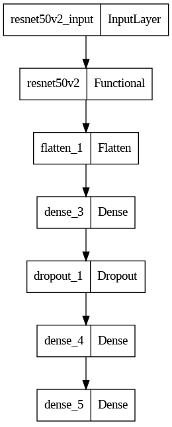</td>
</tr>
<tr>
    <td>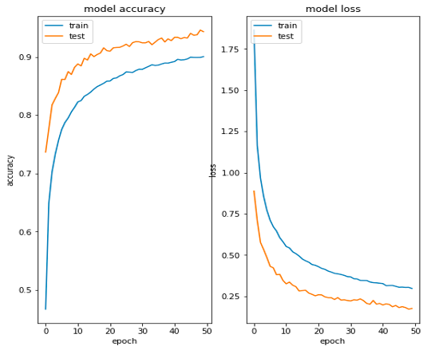</td>
</tr>
<tr>
    <td>Figure 3.5. Training result of Transfer learning Model</td>
    <td>Figure 3.4. Transfer learning model architecture</td>
</tr>
</table>

#### Autoencoder with CNN model
An autoencoder model with convolutional neural network architecture. It consists of an encoder, a decoder, and a fully connected layer. The encoder part has four convolutional layers followed by batch normalization and max pooling. The decoder part has four convolutional layers followed by batch normalization and up-sampling. The encoder and decoder parts are connected to create the autoencoder. The autoencoder is trained to minimize the mean squared error between the input and reconstructed images. The encoder output will pass to a fully connected layer with ReLU activation and a softmax output layer to perform classification. The autoencoder is first trained with the encoder and decoder layers, then the fully connected layer is added. The encoder layers' weights are frozen, and the model is trained only on the fully connected layer for classification. One of the reasons autoencoder is used is to reduce the noise of input data, hopefully makes the model more robust to different real world image input that are noisy. Figure 3.6 shows overall structure. Figure 3.7 shows the training result of the encoder and decoder and added the fully connected layer.

<table>
<tr>
    <td>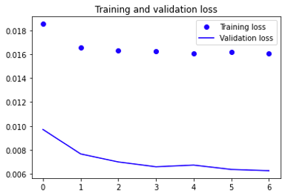</td>
    <td>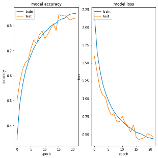</td>
</tr>
<tr>
    <td>Figure 3.7. Training result of encoder as well as decoder, and added the fully connected layer of Autoencoder with CNN</td>
<tr>
</table>

The model converges to the 0.0161 loss after training the encoder and the decoder. Let us look at the reconstructed image of hand gestures. We get the first ten images from the test dataset and use the autoencoder to predict them. The result is shown in Figure 3.8. We can see that some finger in an image is not reconstructed very clearly, which may not predict some hand gestures that emphasize the position of the fingers.

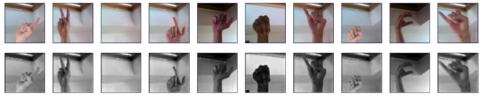
Figure 3.8. Reconstruction of first 10 testing data

### Result of models
| | Simple CNN | Transfer Learning model using ResNet50v2 | Autoencoder with CNN |
| -- | -- | -- | -- |
| Epoch| **50/50** | **50/50**| 7/7 (encoder and decoder) + 22/50
| train_loss| **0.3780** | 0.4963 | 0.5308| 
| train_accuracy| **0.8775** |0.8393 | 0.8215| 
| val_loss| **0.1592** | 0.3161 | 0.4569| 
| val_accuracy| **0.9540** | 0.9434 | 0.8454| 
| test_accuracy| **0.95** | 0.94 | 0.84| 
| Training Time (seconds)*	| 7532s| 	**8450s**	| 1246s + 3806s = 5052s| 
| Time pre-epoch| 	**150.64s/epoch**| 	169s/epoch| 	174.21s/epoch| 
*Training is used the Google Colab with Tesla T4 GPU

In our result, we can see the simple CNN has the fastest training speed, for 150.64s/epoch, which means that ResNet50v2 needs around 12% and autoencoder with CNN need around 15.6% more time to train pre-epoch. This is expected as the CNN has the simplest structure when compared to the other two.

Furthermore, the accuracy and loss of simple CNN are better than the other two models.  For example, the test accuracy of simple CNN is 1% better than ResNet and 11% better than Autoencoder with CNN. And validation loss of simple CNN is almost half of that of ResNet and almost 1/3 of Autoencoder with CNN. This is not expected by us in the beginning, as we think ResNet which is a deeper CNN should perform better, and the autoencoder can bring a denoising effect, which leads to high accuracy.  

Such unexpected results can be explained by the size of the dataset is small. As ResNet is a deep network, it requires a large amount of dataset to allow it to work better than simple CNN. In our case, the small dataset can make the ResNet not at its full potential, thus the performance is lower than that of simple CNN, as it works at its full potential. Not at all, to show the good performance of ResNet over simple CNN, the complexity of the dataset must also be high, if the dataset complexity is low, a deeper ResNet can show no advantage to simple CNN. In our case only detecting hand sign language maybe too simple for ResNet to show its true power. That also contributed to such results.

On the autoencoder with CNN, in our case, the benefits of the denoising effect may not be obvious and thus have almost no impact on the result. It is because in our dataset, the image is clear and almost noise free. And the application of autoencoder before CNN can lead to the features of the gesture inside image loss, such as the hand shape becoming more blurred, less clear, and harder to identify than the original one, which makes the CNN detection accuracy decrease.

## 4 Real-time Hand Gesture Recognition

We developed a Python application that uses OpenCV and Mediapipe to track hand gestures in real time. The application can detect 24 ASL sign language gestures, except J and Z, because they are contained in the movements. In the first phase of the application, we combined the simple CNN model presented above with the Algorithm to classify the ASL sign language, but the accuracy was too low. We believe the impact of the skin tone colour reduces the accuracy. As a result, we built another model based on the hand key point.

### Dataset
The application contains two modes, including normal and data collection. In the data collection model, the user needs to press "/" to enter and press one class between A to Z as classes. The screen will show "MODE: Logging Key Point" and "Classes: {Your pressed key}". The Mediapipe library proposed by Google (Zhang et al., 2020) helps us to detect the hand key point. The application will collect the position of the hand landmark of the hand gesture on the screen. The index of landmarks is shown in Figure 4.1. The program will normalize the position for all key points. It will set the wrist as (0,0). Other key points will convert to relative coordinates from the wrist and saved to the CSV file. After that, we collected 6290 rows as the dataset. Figure 4.2 show the process of data collection.

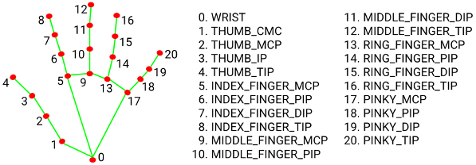
Figure 4.1. 21 Hand landmarks returned by Mediapipe Hand (Zhang et al., 2020)

<table>
<tr>
    <td>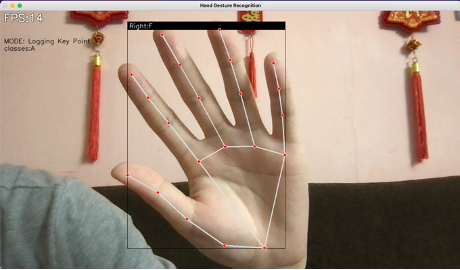</td>
    <td>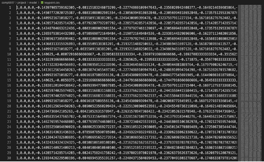</td>
</tr>
<tr>
    <td colspan=2>Figure 4.2. Python program for data collection and collected .csv file</td>
</tr>
</table>

### Modelling
We split a dataset into 75% for training and 25% for testing and created a neural network model with four fully connected layers. The first layer takes an input shape of 21*2 features and applies dropout regularization to avoid overfitting. Then, it has two hidden layers of 1024 and 128 neurons, respectively, with ReLU activation functions and dropout regularization. The next layer has ten neurons with ReLU activation, and the output layer has 24 classes with softmax activation. The model is compiled with an Adam optimizer, sparse categorical cross-entropy loss function, and the early stop function. Figure 4.3 shows the confusion matrix and classification report of the model.
<table>
<tr>
    <td>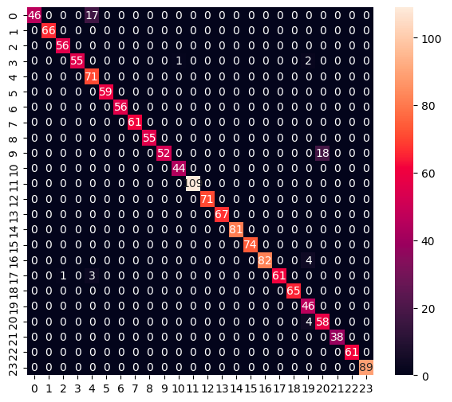</td>
    <td></td>
</tr>
<tr>
    <td colspan=2>Figure 4.3. Confusion matrix and classification report of DNN.</td>
</tr>
</table>

### Result and further work
we have developed a real-time hand gesture recognition application that can detect 24 ASL sign language gestures in real-time using OpenCV and Mediapipe. We collected a dataset of 6290 hand key point positions normalized concerning the wrist. This method can ignore the limitation of skin tone colour. Achieving an accuracy of 97% on the test set. Figure 4.4 shows our system of Real-time Hand Gesture Recognition.

In future work on this application, we could also expand the dataset to include more hand gestures, including J and Z, which were excluded in this project and support two or above hand recognition. Besides, it can record the hand gestures sequence to translate the ASL sign language. In addition, it is possible to extend the system to support other sign languages, such as Hong Kong Sign Language, British Sign Language, and Australian Sign Language. We look forward to exploring these possibilities in future work.

<table>
<tr>
    <td>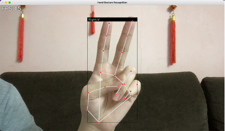</td>
    <td>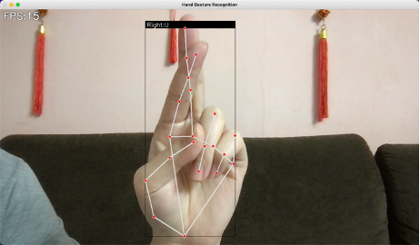</td>
</tr>
<tr>
    <td colspan=2>Figure 4.4. Real-time Hand Gesture Recognition</td>
</tr>
</table>

[Demo Video Click Here (Youtube)](https://youtu.be/EIZqgPNweJM)