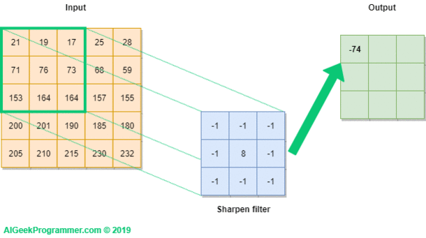
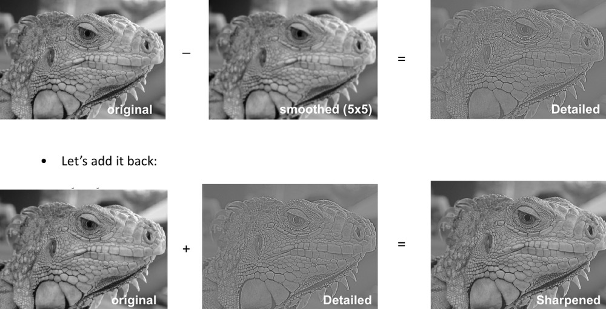
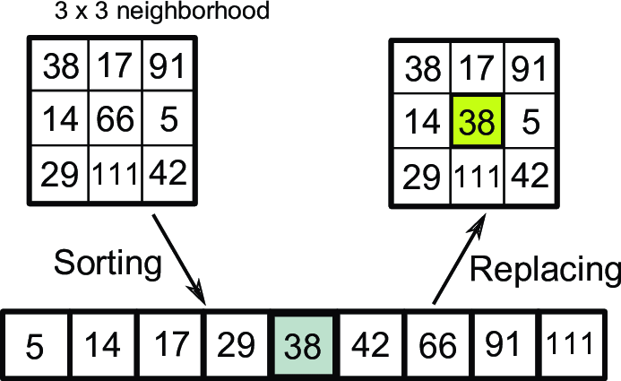
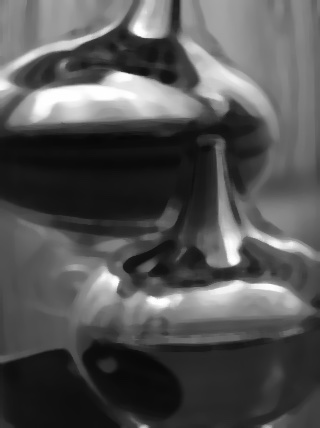
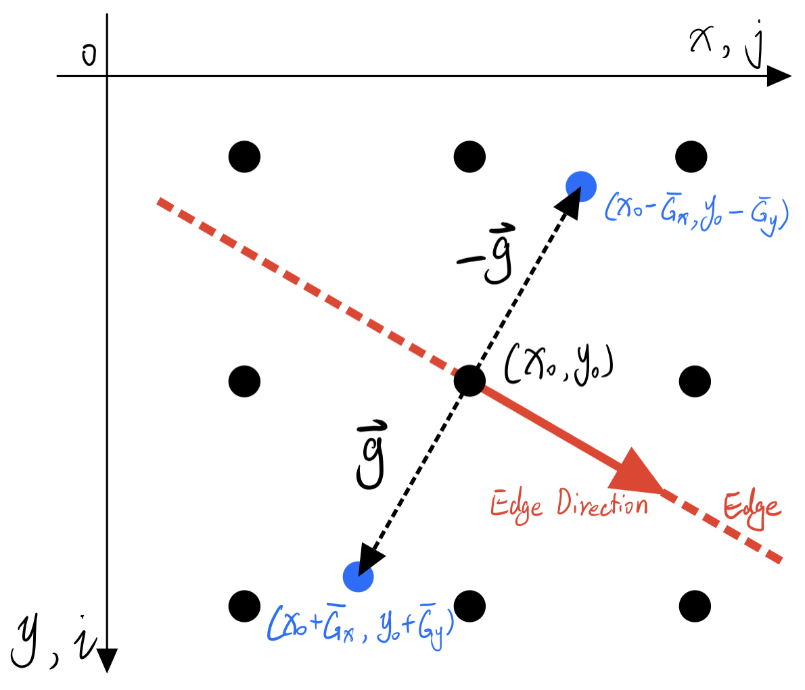
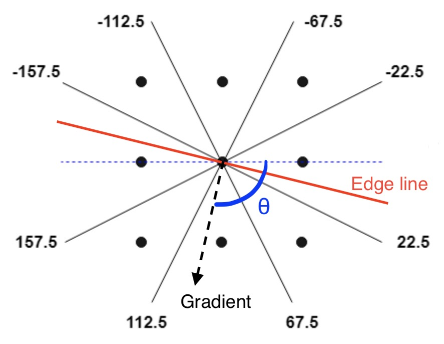
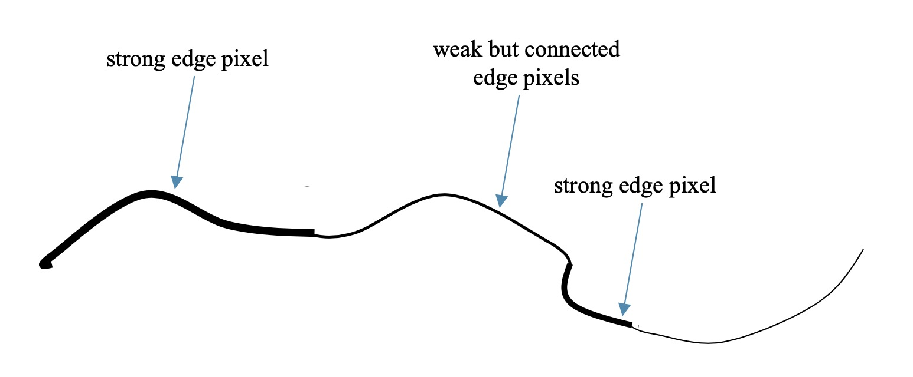
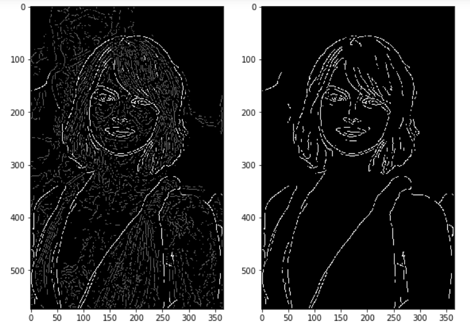
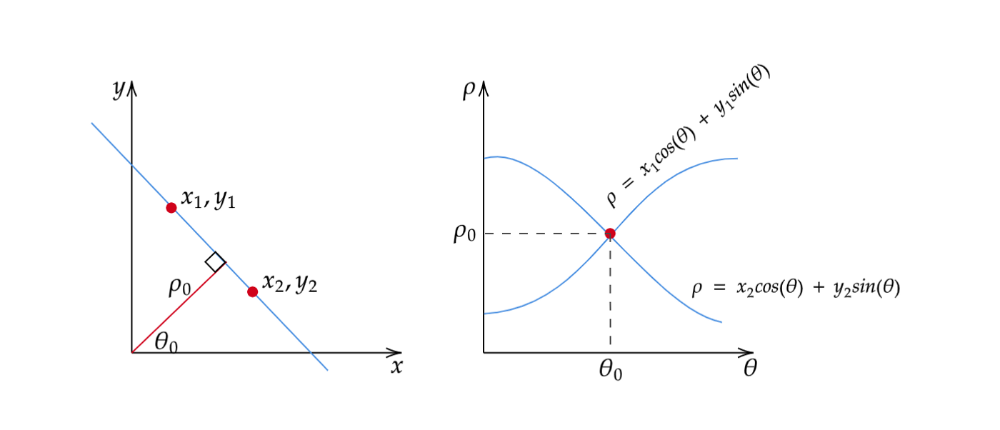
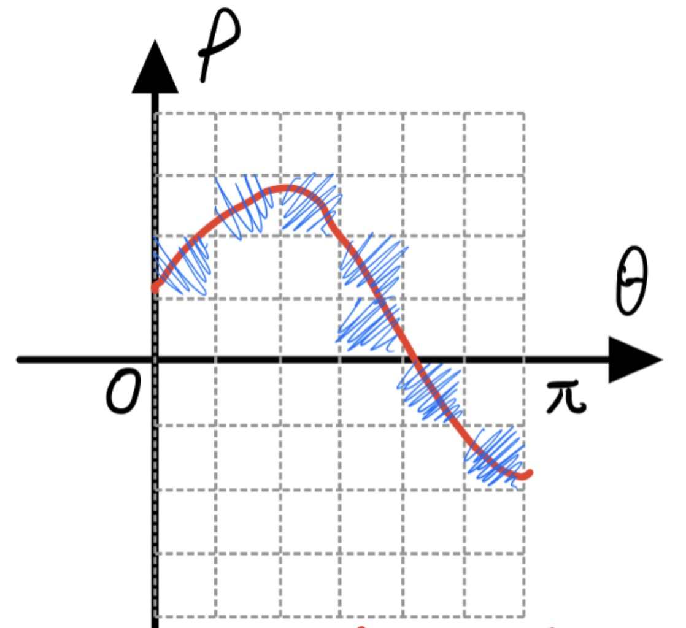

Please read this [setup](SetupPython.html) instruction before getting started.

<!-- ## Read & Write Image
[Pillow](https://pillow.readthedocs.io/en/stable/handbook/tutorial.html) (PIL) provides basic functions for image read & write. We can read/display/write image by `open`, `show` and `save` like this:

```python
# load image
from PIL import Image
import numpy as np
img = Image.open('road.jpeg')

# display the image
img.show()

# save to file
img.save('road2.jpeg')
``` -->
# Image and Ndarray

In digital computer, colour images are represented as 3-d arrays. Each element of the array is a 8-bit integer, with the range of [0, 255]. The three dimensions are height, width, and channels respectively. The shape of the array is
$$(Height \times Width \times Channels).$$

<center>

</center>

NumPy is a standard library of ndarray arithmetic in python. Images can be represented as `numpy.ndarray` object. `PIL.image` is used for reading/writing image files. Here is an example for loading/processing/saving an image:

```python
from PIL import Image # pillow package
import numpy as np

img = Image.open('a.jpg')               # read image file
arr = np.asarray(img, dtype=np.float64) # convert to np.ndarray

# process the array here, e.g.
arr = arr/2

arr = arr.astype(np.uint8) # make sure dtype is uint8
img = Image.fromarray(arr) # convert back to PIL.image object
img.save('b.jpg')          # save to file
```

Three useful functions to help you read/write/show ndarrays are provided in `code/filter.py` and `code/edge.py`:

- `read_img_as_array(file)`
- `save_array_as_img(arr, file)`
- `show_array_as_img(arr)`

# Manipulate Ndarrays
NumPy provides nearly all operation for processing arrays, including

- arithmetic operation
    - addition, subtraction, multiplication, and division,
    - sin/cos/tan/exp/power/log,
- indexing, slicing, stacking, concatenation, and shape manipulation
- matrix multiplication.

This official [NumPy tutorial](https://numpy.org/devdocs/user/quickstart.html) will give you a quick overview of NumPy. Make sure you are familiar with these operators. Here, I will show you several important parts of this tutorial that are closely related to our assignment.

## Array attributes
Every ndarray has following three attributes -- `dtype`, `shape` and `ndim`.

- `dtype` indicates the data type of each element. e.g, int32 or float64.
- `shape` indicates the shape of the ndarray., e.g, the number of rows and columns of matrix, the length of a vector, etc. A color image usually has shape $(H, W, C)$.
- `ndim`  the dimension of the array.
    - `ndim==0`: scalar,
    - `ndim==1`: vector,
    - `ndim==2`: matrix.
    - `ndim>=3`: multi-dimensional array, or say, tensor.

```python
# Create array from list
a = np.array([[1, 2],
              [5, 6]])

a.shape # (2,2)
a.dtype # int64 -- 64-bit integer
a.ndim  # 2, means it is a matrix.
```
## Array creation
Create an all one matrix of shape 2x3:
```python
a = np.ones([2,3])  # all one matrix of shape 2x3
# array([[1., 1., 1.],
#        [1., 1., 1.]])
```
The default dtype is `float64` (double), you can specify other dtype:
```python
a = np.ones([2,3], dtype=np.int32)  # all one matrix of 32-bit integers
# array([[1, 1, 1],
#        [1, 1, 1]], dtype=int32)
```

Create all zero matrix of shape 3x2:
```python
a = np.zeros([3,2]) # all zero matrix of shape 3x2
# array([[0., 0.],
#        [0., 0.],
#        [0., 0.]])
```
Create matrix of shape 2x2 with unknown value:
```python
a = np.empty([2,2]) # matrix of shape 2x2 with unknown value
# e.g.
# array([[2.31584178e+077, 2.31584178e+077],
#        [2.96439388e-323, 6.93989086e-310]])
```
Create an array from 0 to 5, (6 elements in total):
```python
a = np.arange(6)
# array([0, 1, 2, 3, 4, 5])
```
## Arithmetic operation
Add by a number --- all elements will be added that number:

```python
a = np.array([[1, 2],
              [5, 6]])

a + 1   # addition
# result:
# array([[2, 3],
#        [6, 7]])

# subtraction, multiplication, and division are same.
a - 1.5 # subtraction
a * 5   # multiplication
a / 3   # division
```

Add by a row/column vector -- all rows/columns will be added with the vector. Subtraction, multiplication, and division are same.
```python
# row vector
a + [2, 100]
# array([[  3, 102],
#        [  7, 106]])

# column vector
b = [[  2],
     [100]]
a + b
# array([[  3,   4],
#        [105, 106]])
```

Add by an array with the same shape. The addition will be performed elementwise. Subtraction, multiplication, and division are same.
```python
b = np.array([[10, 30],
              [20, 40]])
a + b   # element-wise addition
# array([[11, 32],
#        [25, 46]])
```

Take sin/square/sqrt/power/exponiential/logarithm of each element:
```python
np.sin(a)      # a_ij = sin(a_ij), sine
np.square(a)   # a_ij = (a_ij)^2, square
np.sqrt(a)     # a_ij = √(a_ij), square root
np.power(a, 5) # a_ij = (a_ij)^5, arbitrary power
np.exp(a)      # a_ij = e^(a_ij), exponiential
np.log(a)      # a_ij = log(a_ij), logarithm
```

## Reshaping / indexing / slicing
You can change an array's shape via `reshape`:
```python
a = np.arange(9)
# array([0, 1, 2, 3, 4, 5, 6, 7, 8])

a = a.reshape(3,3)
# array([[0, 1, 2],
#        [3, 4, 5],
#        [6, 7, 8]])
```

Access one element (indexing):
```python
a[0,1]     # zeroth row, first column

a[0,0] = 5 # assignment: a_00 = 5
```

Access a block (slicing):
```python
# select first two rows and first two columns
a[0:2, 0:2]
# array([[0, 1],
#        [3, 4]])

a[0, :] # zeroth row, colon means all.
a[:, 2] # second column

# select a single channel
R = arr[:, :, 0] # red channel
G = arr[:, :, 1] # green channel
B = arr[:, :, 2] # blue channel

# horizontal derivative calculation
diff = R[:, 1:] - R[:, :-1]
```

# Filter Basics

## Convolutional filters

__Convolution__ via [`ndimage.convolve`](https://docs.scipy.org/doc/scipy/reference/generated/scipy.ndimage.convolve.html). Gaussian smooth and sobel involves convolution. Here is an example:
$$\begin{bmatrix}
-1 & 1 \\
-1 & 1
\end{bmatrix} * gray$$
```python
from scipy import ndimage
weights = [[-1, 1],     # kernel / filter
           [-1, 1]]
diff = ndimage.convolve(gray, weights)
```
<center>

</center>

### Gaussian filter
You may manually define your own gaussian kernel and apply it by `ndimage.convolve`. You can also use [`scipy.ndimage.gaussian_filter`](https://docs.scipy.org/doc/scipy/reference/generated/scipy.ndimage.gaussian_filter.html) provided by SciPy directly. The parameter `sigma` controls how blur the resulted image is. The greater `sigma` is chosen, the blurrer resulted image is.

A 3x3 Gaussian filter:
$$\text{Gaussian}=\frac{1}{16} \times
\begin{bmatrix}
1 & 2 & 1 \\
2 & 4 & 2 \\
1 & 2 & 1
\end{bmatrix} =
\begin{bmatrix}
\frac{1}{16} & \frac{1}{8} & \frac{1}{16} \\
\frac{1}{8} & \frac{1}{4} & \frac{1}{8} \\
\frac{1}{16} & \frac{1}{8} & \frac{1}{16}
\end{bmatrix}$$

```python
# define the gaussian kernel by hand
gauss = np.array([[1, 2, 1],
                  [2, 4, 2],
                  [1, 2, 1]])
gauss = gauss/gauss.sum() # normalize the sum to be 1
out = ndimage.convolve(gray, gauss)

# or use 'ndimage.gaussian_filter' function
# the bigger sigma is, the smoother output is.
from scipy import ndimage
out = ndimage.gaussian_filter(gray, sigma=3)

# for color image, we need to specify sigma for each dimension.
# Especially, the sigma for channel should be zero.
rain = read_img_as_array('rain.jpeg')
print(rain.shape) # (H,W,C) = (1706, 1279, 3)
out = ndimage.gaussian_filter(rain, sigma=[3,3,0])
```
### Sharpening

We can use convolution to sharpen images. Sharpening images means enhancing the details of the image.

Sharpening formular:
$$\begin{equation}
\text{Detailed} = \text{Original} - \text{Blurred} \ \ \ \ (1)
\end{equation}$$
$$\begin{equation}
\text{Sharpened} = \text{Original} + \alpha * \text{Detailed} \ \ \ \ (2)
\end{equation}$$

In image sharpening, we have two parameters. One is the parameter `sigma` of Gaussian filter, the other one is $\alpha$, which controls how much details you want to add back. The greater the $\alpha$ is, the sharper the output will be.

The sharpened image obtained from eq. (2) may contain values that are larger than 255 or smaller than 0. They are not valid pixel value, and we need to truncate them into [0,255]:
```python
# the code for sharpening the image ...
sharpened = ...

# make sure all values in 'sharpened' falls into [0,255]
sharpened[sharpened < 0] = 0
sharpened[sharpened > 255] = 255
```

<center>

</center>

## Median filter
There are also non-convolutional filters. A classic one is median filter, which replace each pixel by the median of its neighbourhood. Median filter is very good at eliminating __salt-and-pepper noise__ (a.k.a. impulse noise), which cannot be handled by Gaussian filters. There is only one parameter for median filter, that is the neighbourhood size. Larger neighbourhood size usually eliminates noise more completely, but also corrupted the image heavier.

For color images, we need to perform the median filter on each channel separately.
<center>




<p>From left to right: (a) original. (b) denoised by 3x3 filter. (c) denoised by 9x9 filter.</p>
</center>


# Edge Detection via Canny Edge Detector
As you have learnt, Canny edge detector contains following steps:

1. Gaussian Smoothing
2. Sobel Operator
3. Non-maximum suppression
4. Thresholding

__RGB to Greyscale__.
For simplicity, we only discuss grayscale image here. First, we need to convert colour image to grayscale image. A common used rgb-to-gray formula is:
$$Y = 0.2989 \; R + 0.5870 \; G + 0.1140 \; B $$
```python
# you may use 'rgb2gray' function in 'edge.py' directly.
R = arr[:, :, 0] # red channel
G = arr[:, :, 1] # green channel
B = arr[:, :, 2] # blue channel
gray = 0.2989*R + 0.5870*G + 0.1140*B
```

## Sobel operator

Given an image $A$ of shape $(H, W)$, Sobel operator computes magnitude of gradient of $A$ as follow:
$$
G_x = A*\begin{bmatrix}
+1 & 0 & -1 \\
+2 & 0 & -2 \\
+1 & 0 & -1
\end{bmatrix}
\qquad\qquad
G_y = A*\begin{bmatrix}
+1 & +2 & +1 \\
 0 &  0 &  0 \\
-1 & -2 & -1
\end{bmatrix}
$$

$$G = \sqrt{G_x^2 + G_y^2}$$

You need to finish the implement yourself (competing the `sobel` function in file `code/edge.py`). You may need `np.square` and  `np.sqrt` to calculate squares and square roots.

## Non-maximum suppression


The output of Sobel operator has poor localization. Edges trigger response in multiple adjacent pixels, which makes it difficult to decide the precise location of edges. Intuitively, edge occurs where gradient reaches a maxima, so we need to suppress all non-maximum values in $G$, i.e., set them to 0.

<center>



</center>

We need to compare each gradient with its neighbours along perpendicular direction of edges, which is just the gradient direction. We first obtain the angle between gradient (<span style="color:black">__black arrow__</span>) and x-axis.


$$\theta = \arctan\left(\frac{Gy}{Gx}\right), \text{where } \theta \in [-180^\circ, 180^\circ].$$
```python
Gx = 1
Gy = 1
theta = np.arctan2(Gy, Gx) * 180 / np.pi
# 45.0
```
Then we decide which two neighbours $N_1$ and $N_2$ we need to compare, according to theta.

- If $\theta \in [-22.5,+22.5] \cup [157.5, 180] \cup [-157.5, -180]$ then
$$ N_1 = G[i][j+1], \quad N_2 = G[i][j-1].$$
- If $\theta \in [22.5,67.5] \cup [-112.5,-157.5]$ then
$$ N_1 = G[i+1][j+1], \quad
N_2 = G[i-1][j-1].$$
- If $\theta \in [67.5,112.5] \cup [-67.5,-112.5]$ then
$$ N_1 = G[i+1][j], \quad
N_2 = G[i-1][j].$$
- If $\theta \in [112.5,157.5] \cup [-22.5, -67.5]$ then
$$ N_1 = G[i-1][j+1], \quad
N_2 = G[i+1][j-1].$$


Finally, all non-maximum edge points are set to 0.


$$ G[i, j] := \left\{\begin{array}{l}
    0, & \text{if}\; G[i, j] < N_1; \\
    0, & \text{if}\; G[i, j] < N_2; \\
    G[i,j], & \text{elsewise.}
\end{array} \right. $$

## Hysteresis thresholding (double threshold)
After finishing non-maximum suppression, next step is to binarize the gradient magnitude. In standard Canny edge detector, binarization involves two-level thresholding and connectivity analysis. Since gradient magnitude ranged range from 0 to $255\sqrt{2}\approx361$, you can choose a proper threshold in [0, 361]. For example:
```python
# threshold
low_thr= 180

# binarize G
G[G<=low_thr] = 0
```

If a pixel gradient has gradient greater than high threshold, it is a strong edge pixel. If the gradient is greater than low threshold, it is a week edge pixel.
The final edgemap contains two kinds of pixels:

1. all strong edge pixels, and
2. the week edge pixels that are connected to some strong edge pixels.

<center>

</center>

<center>

</center>


# Hough Transform
After getting the edge image, now we want to recognize geometric shapes, such as straight lines, circles, ellipses, from the edge map. A classical method to do so is Hough Transform. In this section, we demonstrate how to recognize straight lines by Hough transform.

## The Hough Space and the Mapping of Edge Points onto the Hough Space
A line on an edge image is represented in the form of $y = ax + b$ (Hough, 1962). One line on the edge image produces a point on the Hough Space since a line is characterized by its slope $a$ and intercept $b$. 
<center>

</center>

## An Alternate Way to Represent a Line
There is one flaw with representing lines in the form of $y = ax + b$ and the Hough Space with the slope and intercept. In this form, the algorithm won’t be able to detect vertical lines because the slope $a$ is undefined/infinity for vertical lines (Leavers, 1992). 

To avoid this issue, a straight line is instead represented by a line called the normal line: $$\rho = cos(\theta)\;x + sin(\theta)\;y,$$ where $\rho$ is the length of the normal line and $\theta$ is the angle between the normal line and the x axis. The range of $\theta$ is $[0, \pi]$; and range of $\rho$ is $[-D, +D]$, where $D=\sqrt{H^2+W^2}$ is the length of the diagonal of the image.
<center>

</center>

Given a point $(x_1, y_1)$, the parameters of all straight lines passing through this point satisfy equation
$$\rho = cos(\theta)\;x_1 + sin(\theta)\;y_1,$$ which is a cosine curve in the Hough Space instead of a straight line (Leavers, 1992).
<!--
For a straight line with parameters $(\rho_0, \theta_0)$, if $n$ points $(x_1, y_1), (x_2, y_2), ..., (x_n, y_n)$ are all on this line, then the corresponding $n$ function curves in $\rho$-$\theta$ space
$$
\begin{matrix}
\rho = cos(\theta)\;x_1 + sin(\theta)\;y_1, \\
\vdots \\
\rho = cos(\theta)\;x_n + sin(\theta)\;y_n,
\end{matrix}
$$
intersect at point $(\rho_0, \theta_0)$.-->

## The Algorithm
Now we can design a voting procedure to elect the most possible straight lines as follows:

1. Discretize $\rho$-$\theta$ space into a grid of cells, so that there are finite number of possible candidates. A proper discretization for $\theta$ may be dividing $[0, \pi]$ into 100-1000 parts. For $\rho$, 1 should be a proper cell length.
<center>

</center>

2. Create a 2D array called the accumulator representing the Hough Space with dimension (num_rhos, num_thetas) and initialize all its values to zero.
3. For each edge pixel $(x, y)$, loop through all possible values of $\theta$, calculate the corresponding $\rho$ using function function $\rho = cos(\theta)\;x + sin(\theta)\;y$, find the $\theta$ and $\rho$ index in the accumulator, and increment the accumulator base on those index pairs.
4. Find local maximum. Find the top $n$ cells in the accumulator, return the corresponding $n$ pairs of $(\rho, \theta)$.
<center>

</center>


# Assignment

## Part I: Filter basics
Sharpen `data/rain.jpeg` and eliminate rain drops in it by median filter.

1. Implement your sharpening filter and perform it on `data/rain.jpeg`. Save your results as `data/1.1_sharpened.jpg`. To get an obvious result, you may choose a relatively large $\alpha$. (2 points)

2. Implement your own median filter and perform it on `data/rain.jpeg` to eliminate rain drops. Save results to `data/1.2_derained.jpg`. To get a good deraining result, the filter size should be as small as possible but large enough to eliminate rain drops. (2 points)


## Part II: Canny edge detector

Implement Canny edge detector to detect edges in `data/road.jpeg`. Your program should contain following steps:

1. Convert colour image into grayscale image, and save as `data/2.1_gray.jpg`. (1 point)
2. Choose a proper `sigma` to perform Gaussian smoothing, save the result as `data/2.2_gauss.jpg`. Discuss how `sigma` affects final edge detection results. (2 points)
3. Apply sobel operator, save the x-gradient $G_x$, y-gradient $G_y$ and magnitude $G$ as `data/2.3_G_x.jpg`, `data/2.3_G_y.jpg` and `data/2.3_G.jpg`. (3 points)
4. Do the non-maximum value suppression. Save the suppression result to `data/2.4_supress.jpg`. (3 points)
5. Do the hysteresis thresholding. Choose two proper threshold -- low and high, then binarize your suppression result via Hysteresis thresholding. Save binarization result by lower threshold as `data/2.5_edgemap_low.jpg`, result by high threshold as `data/2.5_edgemap_high.jpg`. Save the final result by Hysteresis thresholding as `data/2.5_edgemap.jpg`. Discuss how different thresholds affect the final edgemap. (2 points, one point for `edgemap_low.jpg` and `edgemap_high.jpg`, one for `edgemap.jpg`)

## Bonus: Hough transform

This part follows part II Canny edge detector to recognize straight lines in `data/2.5_edgemap.jpg`.

6. Hough Transform. Save the "voting" result (the accumulator) as `data/2.6_hough.jpg`. (2 points)
7. Find out several most possible straight lines. Draw them on original image, then save as `data/2.7_detection_result.jpg`. To draw lines on image, see [this example](https://stackoverflow.com/questions/13053443/drawing-a-line-on-an-image-with-pil). (1 points)

## Submission Instruction

OpenCV package `cv2` is __NOT__ allowed in this assignment.

Your submission should contain:

1. All intermediate results (images `data/*.jpg` you are asked to save) and the two discussions in Part II step 2 and step 5 (saved in `discussion.pdf`).
2. Runnable programs `code/edge.py` and `code/filter.py` that can reproduce your results.

Please submit the results before __23:59 on March 15 (Wednesday)__. You may submit as many times as you want, but only your latest submission before the deadline will be graded.

# How to contact us

Feel free to contact us via MS teams or by email:
`Zhong, Yongfeng7(yongfeng7.zhong@connect.polyu.hk)`, 
`Fan, Lu(complu.fan@connect.polyu.hk)`,
`Feng, Yujie(yujie.feng@connect.polyu.hk)`.
