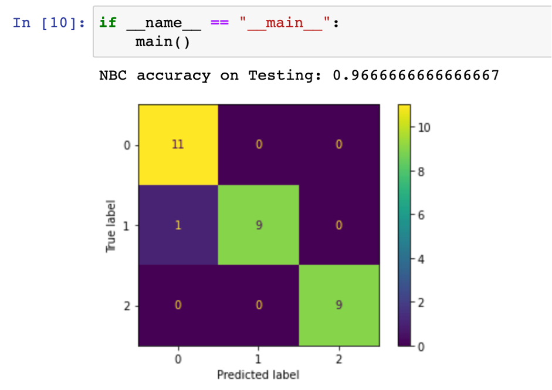

# COMP5541 Assignment 1

## Linear Regression (30 marks)

Suppose that $x_0, x_1, ..., x_t, x_{t+1},...,$ denote the (daily) share prices of a particular stock over time. Answer the following questions (you should add a bias term):

1. Write a linear model to predict $x_{t+1}$ using the share prices on the two preceeding days, i.e., $x_t$ and $x_{t-1}$. (6 marks)
2. Thr more usefule quantity to predict is $\triangle_{t+1}:=x_{t+1}-x_t$ (the '$:=$' means is defined to be), the change in share value.  Write a linear model to predict $\triangle_{t+1}$ using $x_t$, and $x_{t-1}$. (6 marks)
3. Write a linear model to predict $\triangle_{t+1}$ using $\triangle_t$. (6 marks)
4. Write a linear model to predict $\triangle_{t+1}$ using $\triangle_t$ and $x_t$. (6 marks)
5.  Which of the above four models, if any, are equivalent?  Justify your answer briefly. (6 marks)
   
Note:  This example is for illustrative purposes to help you understand linear regression.It  is  not  recommended  that  you  use  this  for  actual  share  price  prediction.   For  question1-4, you only need to write down the mathematical relationship between input and output.There is no need to solve the models.

## Nearest Neighbour and Linear Classification (30 marks)

We have studied a linear classifier Logistic Regression $y=\sigma (wx+w_0)$. If $z>=0, \sigma(z)>=0.5$ and $y$ can be regarded as class ‘1’,  and otherwise ‘0’ if $z<0$. The parameters to belearnt are $w$ and $w_0$. he “Nearest neighbour classifier” (NN) is a different approach tolearning from data.  Suppose we are given $N$ points $(x_1,y_1),...,(x_N,y_N)$ where $y_i \in \{0,1\}$; for a parameter $k$ and given a new point $x^∗$, the k-NN approach does the following:  find $x_{j1},...,x_{jk}$ the *k*-closest points to $x^*$, then output $\widehat{y}^{*}$ as the majority label from the set $\{y_{j1},...,y_{jk}\}$, i.e., the most commonly occurring label among thek-nearest neighbours.

1. What advantage(s) does the $k$-NN approach offer over a linear classifier like the logisticregression?  (10 marks)
2. What  advantage(s)  does  the  logistic  regression  offer  over  thek-NN  approach?   (10marks)
3.  What is the computational cost of predicting the label $\widehat{y}^{*}$ ? (10 marks)

**Remark:**  You do not have to write precise numbers or even mathematical expressions forthe answers above.  Make sure you understand the behaviour qualitatively.

## Naive Bayes Classifier (40 marks)
You need to implement NBC on the Iris dataset.  You can obtain this dataset as follows:

```python
from sklearn.datasets import loadiris
iris = loadiris()
X, y = iris[‘data’], iris[‘target’]
```

There are three classes denoted by 0, 1, 2, which stand for Setosa, Versicolour and Virginica,three varieties of Iris.  There are four features, all real-valued, measurements of sepal lengthand width, and petal length and width.

#### Experiment

1) You need to shuffle the dataset, put 20% aside for testing.

```python
N, D = X.shape
Ntrain = int(0.8 * N)
shuffler = np.random.permutation(N)
Xtrain = X[shuffler[:Ntrain]]
ytrain = y[shuffler[:Ntrain]]
Xtest = X[shuffler[Ntrain:]]
ytest = y[shuffler[Ntrain:]]
```

2) Train a Naive Bayes Classifier and report the training and testing errors.
   
3) Submit your code (a single .py file) and results (included in PDF).

**Note**: You should implement a Na ̈ıve Bayes Classifier directly in python.  Using the NBC fromexisting packages is not allowed.  To keep your code tidy, we recommend implementing it as a class.  The data has 4 different real-valued features, and there are 3 classes.  Write animplementation that you can initialise as follows:

```python
nbc = NBC(featuretypes=[‘r’, ‘r’, ‘r’, ‘r’], numclasses=3)
```

You need to implement two more functions,fitandpredict.  The fit function should esti-mate all the parameters of the NBC. You should model all real-valued features as univariate Gaussians.

You also need to estimate the class probabilities, $\pi_c=p(y=c)$. The *predict* function shouldcompute the class conditional probabilities for the new inputs on all classes, and then returnthe class that has the largest one.

#### Implementation Issues
- Remember  to  do  all  the  calculations  in  log  space,  to  avoid  running  into  underflow issues.
- As far as possible, use matrix operations.  So assume that Xtrain, ytrain, Xtest will all be numpy arrays.  Try and minimise your use of python loops.  (In general, loopingover classes is OK, but looping over data is probably not a good idea.)
- he variance parameter for Gaussian distributions should never be exactly 0,  so incase your calculated variance is 0, you may want to set it to a small value such as 1e-6.Note that this is essential to ensure that your code never encounters division by zeroor taking logarithms of 0 errors.

For training data Xtrain, ytrain and test data Xtest, ytest you should be able to run:

```python
nbc.fit(Xtrain, ytrain)
yhat = nbc.predict(Xtest)
test_accuracy = np.mean(yhat == ytest)
```

#### Evaluation Criteria
- Can load dataset successfully.  (5 marks)
- Can correctly split train and test sets.  (5 marks)
- For implementation of function *fit*, can correctly compute $\pi_{c}$.  (5 marks)
- For implementation of function *fit*, can correctly compute all conditionally distributions of four features.  (10 marks)
- For implementation of function *predict*,  can successfully obtain the prediction of allXtest points.  (10 marks)
- Can correctly compute the final training and testing accuracy.  (5 marks)

## My Answer

### 1 Linear Regression
1. $x_{t+1}=b+w_0x_t+w_1x_{t-1}$
2. $\triangle_{t+1}=b+w_0x_t+x_{t-1}$
3. $\triangle_{t+1}=b+w_0\triangle_{t}$
4. $\triangle_{t+1}=b+w_0\triangle_{t}+w_1x_t$
5. $y=b+\sum(w_ix_i)$
   The models in parts (1), (2), (4), there are all using 2 features to get a y, which are equivalent if only focus on the number of the predictor variables (features). But the bias and weight will be different based on the training data. Conversely, the Part (3) is using only one feature to get y, which is more restrictive.

### 2 Nearest Neighbour and Linear Classification

1. The k-NN approach will calculate the distance, and find the k nearest data to predict the classification. It is a Non-parametric learning model which means it don’t make any assumption in model generating process. It does not really involve any training. Contrastingly, regarding the linear classifier, it is makes some assumptions such as the relationship between the y and each continuous independent variable is linear, No strongly influential outliers, etc. It will be not expected if the assumption is not satisfied.

    The k-NN classifier is faster to training because of it does not need to estimate the features, it can fit the flexible models for classification and regression.

2. The logistic resgression is a parametric model and like a linear regression but it used a logistic function to build the binary output model. The output will be a probability (0 ≤ x ≤ 1), whereas k-NN only output the labels. In addition, it can clearly to know the weight of each feature on the output, which is described the direction and importance of the independent variable relative to the dependent variable. The amount of computational cost is small than k-NN such as the calculation, memory resource, etc.

3. In the k-NN approach, there are two parameters which is k and the distance function such as Manhattan ditance, Hamming Distance, etc.

    Assume,
    k = number of neighbors,
    n = number of data,
    d = number of dimensions of the data

    $O(d)$ to calculate the distance to one data
    $O(nd)$ find one nearest neighbor
    $O(ndk)$ find k closest data point

    Thus, the Computational Complexity is $O(knd)$, but it can using some techniques to improve such as the quickselect algorithm to compute the $k$ smallest distance in $O(n)$, and so on. Also, Space Complexity will be $O(nd)$.

### 3 Naive Bayes Classifier
