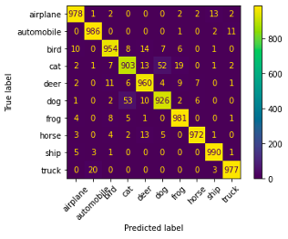
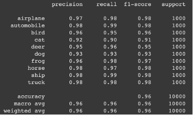
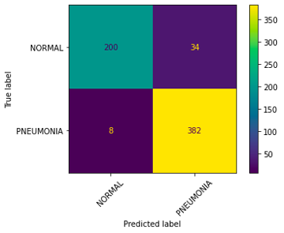
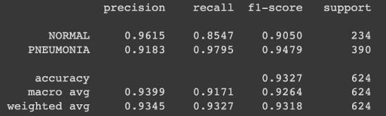

# COMP5541 Group Project Reprot

Semester One 2022/23

**Topic: An Image is Worth 16x16 Words: Transformers for Image Recognition at Scale, ICLR’21**

### Introduction
Convolution Neural Networks (CNNs) have been used for computer vision since the ‘80s. CNN wasn’t among the leading until 2012, when AlexNet appeared. (Neil & Dirk, 2020). But it holds inductive biases based on the architecture of CNNs, such as associating the neighbouring pixels in an image and others. Therefore, the researcher tried to apply the transformation technique to image classification inspired by the success of Transformer scaling in NLP (Natural Language Processing). It showed an input image as a pattern for image patches like the word embedding applied when using transformers in text and forecasts the image class labels. The Vision Transformer (ViT) showed exemplary performance when trained on adequate data, surpassing the comparable current CNNs, and quadruple fewer computational resources.

### Background and method
Vision Transformer (ViT) (Dosovitskiy et al., 2020) followed the original Transformer (Vaswani et al., 2017), which was a self-attention-based architecture which was a popular choice in natural language processing (NLP). Dosovitskiy et al. applied a standard Transformer with minimal modifications directly to images. (Dosovitskiy et al., 2020). Regarding the genetic architecture of the ViT model, an input image will split into various patches with fixed sizes (16x16 patches) named image patches. The image patches will be flattened and embedded in the Lower-dimensional linear. In addition, the Positional embeddings will be included. After that, processed image patches will pass to the transformer encoder, as Vaswani et al. (2017) proposed but changed the number of transformer blocks, which contains three primary blocks: Layer Norm (LN), Multi-head self-Attention (MSP), and Multi-Layer Perceptron (MLP). The LN will be added to each block before, which can stable forward input distribution to speed up convergence, and it does not contain any dependencies related to training images. Also, the MSP layer linearly connects all attention outputs, allowing the model to focus on different features. Moreover, MLP included two layers with a GELU non-linearity (Dosovitskiy et al., 2020) to implement the classification.

### Experiment
#### Fine tuning
We used the model of “google/vit-base-patch16-224-in21k" pre-trained on ImageNet-21k to fine-tune the CIFAR-10 public dataset. To improve accuracy, we tried two methods in data preprocessing and changing the parameters for model training. In addition, we utilize dataset of Chest X-Rays in Patients with Pneumonia from Kaggle to fine-tune the model.

##### CIFAR-10
The dataset contains 50000 training data and 10000 test data in 10 classes. 10 percent of the training data will be used as validation data. The following table shows the details of the training arguments and data preprocessing in our design.

<table>
    <tr>
        <td></td>
        <td>Method 1</td>
        <td>Method 2</td>
        <td>Method 3</td>
    </tr>
    <tr>
        <td>Epoch</td>
        <td>6</td>
        <td>14.2 (5000times)</td>
        <td>6</td>
    </tr>
    <tr>
        <td>Learning Rate</td>
        <td>2e-5</td>
        <td>2e-5</td>
        <td>2e-5</td>
    </tr>
    <tr>
        <td>Image Size</td>
        <td>224 x 224</td>
        <td>224 x 224</td>
        <td>32 x 32</td>
    </tr>
    <tr>
        <td>Batch size</td>
        <td>10</td>
        <td>64</td>
        <td>10</td>
    </tr>
    <tr>
        <td>Weight decay</td>
        <td>0.01</td>
        <td>0.00</td>
        <td>0.01</td>
    </tr>
    <tr>
        <td>Data Transforms (training)</td>
        <td><code>RandomResizedCrop, RandomHorizontalFl-ip,
            Normalize(mean=0.5, std=0.5)</code></td>
        <td><code>RandomResizedCrop(scale=(0.08, 1)),
            RandomHorizontalFlip,
            RandAugment(0, 9),
            Normalize(mean=0.5, std=0.5)</code></td>
        <td><code>RandomResizedCrop, RandomHorizontalFl-ip,
            Normalize(mean=0.5, std=0.5)
            </code></td>
    </tr>
    <tr>
        <td>Data Transforms
            (Testing and validation
            </td>
        <td><code>Resize,
            CenterCrop,
            Normalize(mean=0.5, std=0.5)</code>
            </td>
        <td><code>Resize,
            CenterCrop,
            Normalize(mean=0.5, std=0.5)</code>
            </td>
        <td><code>Resize,
            CenterCrop,
            Normalize(mean=0.5, std=0.5)</code>
            </td>
    </tr>
    <tr>
        <td>Training Time</td>
        <td>1:43:50</td>
        <td>2:18:23</td>
        <td>0:47:01</td>
    </tr>
    <tr>
        <td>Test Accuracy</td>
        <td><b>0.9627</b></td>
        <td>0.9548</td>
        <td>0.5237</td>
    </tr>
</table>

<table>
    <tr>
        <td></td>
        <td></td>
    </tr>
    <tr>
        <td colspan='2'>Figure 1.1 Method 1 of Confusion matrix and Classification report in CIFAR-10</td>
    </tr>
</table>

As a result, the three methods contain different image sizes and data transformations. The impact of the image size is tremendous. It may be related to the image feature extraction because the ViT will present the image to the sequences of 16x16 patches, leading to the feature extract will be reduced if the image size is small. Besides, it is small impact of data transforms it may because ViT is applied the dynamically reweight the importance of features based on context and multi-headed self-attention.

Moreover, regarding improving the accuracy, it can select other variants of ViT directly which contains more layers, hidden size, MLP size and so on. Focus on vit-base-patch16, it can use another larger dataset to pre-train the model because it is affected by dataset size. ViT pre-trained on JFT-300M, the Google internal dataset, and the result is 99.00% accuracy for the CIFAR-10 dataset (Dosovitskiy et al., 2020). In addition, according to Tseng et al (2022), it can apply other optimizers. The paper proposed a new optimizer named Perturbated Unit Gradient Descent, it expanded the gradient operation to avoid stationary on gradient normalization and remains the error to approximately constant. The accuracy is 99.13%. Furthermore, we refer to another research paper using the ViT with other public datasets, providing some ideas related to resize the image's resolution to improve accuracy. But computing resources are limited. Jupyter Notebook is crashed when training starts because the GPU RAM or RAM is insufficient.

##### Chest X-Rays in Patients with Pneumonia

We utilize a dataset of Chest X-Rays to try to detect Pneumonia from Kaggle. It is provided by Kermany et al. (2018). It contained two types of images of Normal and Pneumonia. It was split into three datasets for training, validation and testing, but the validation dataset only contains 16 images. Therefore, we will resplit 10% for each class label in training data as a validation dataset. Furthermore, we chose the same as Data Transforms as well as the image size of Method 1 in CIFAR-10 to this dataset and set the epoch to be 10. It can get the satisfying result which is 93.27%. Therefore, the ViT is easy to handle the computer vision task and gives high accuracy if pretrained on adequate data. Figure 1.2 shows details of the model prediction.


<table>
    <tr>
        <td></td>
        <td></td>
    </tr>
    <tr>
        <td colspan='2'>Figure 1.2 Confusion matrix and Classification report in Chest X-Rays</td>
    </tr>
</table>

### Discussion

```
This part is written by my groupmate. I cannot share it if I did not get a agree for him. If you want more information for your study please let me know.
```

### Reference
Asia, M. R. L.-. (2021). Five reasons to embrace Transformer in computer vision.  https://www.microsoft.com/en-us/research/lab/microsoft-research-asia/articles/five-reasons-to-embrace-transformer-in-computer-vision/

Dosovitskiy, A., Beyer, L., Kolesnikov, A., Weissenborn, D., Zhai, X., Unterthiner, T., ... & Houlsby, N. (2020). An image is worth 16x16 words: Transformers for image recognition at scale. arXiv preprint arXiv:2010.11929.

Kermany, D., Zhang, K., Goldbaum, M. (2018), “Labeled Optical Coherence Tomography (OCT) and Chest X-Ray Images for Classification”, Mendeley Data, V2, doi: 10.17632/rscbjbr9sj.2

Neil Houlsby, & Dirk Weissenborn, (2020). Transformers for Image Recognition at Scale. Research Scientists, Google Research: Retrieved from: https://ai.googleblog.com/2020/12/transformers-for-image-recognition-at.html

Tseng, C. H., Liu, H. C., Lee, S. J., & Zeng, X. (2022, July). Perturbed Gradients Updating within Unit Space for Deep Learning. In 2022 International Joint Conference on Neural Networks (IJCNN) (pp. 01-08). IEEE.

Vaswani, A., Shazeer, N., Parmar, N., Uszkoreit, J., Jones, L., Gomez, A. N., Kaiser, Ł., & Polosukhin, I. (2017). Attention is all you need. Advances in Neural Information Processing Systems, 30. 

Yao, Z., Cao, Y., Lin, Y., Liu, Z., Zhang, Z., & Hu, H. (2021). Leveraging Batch Normalization for Vision Transformers. 2021 IEEE/CVF International Conference on Computer Vision Workshops (ICCVW). https://doi.org/10.1109/iccvw54120.2021.00050
